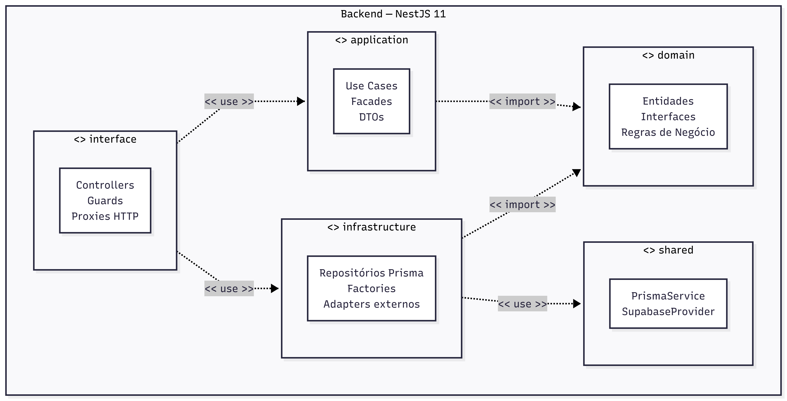
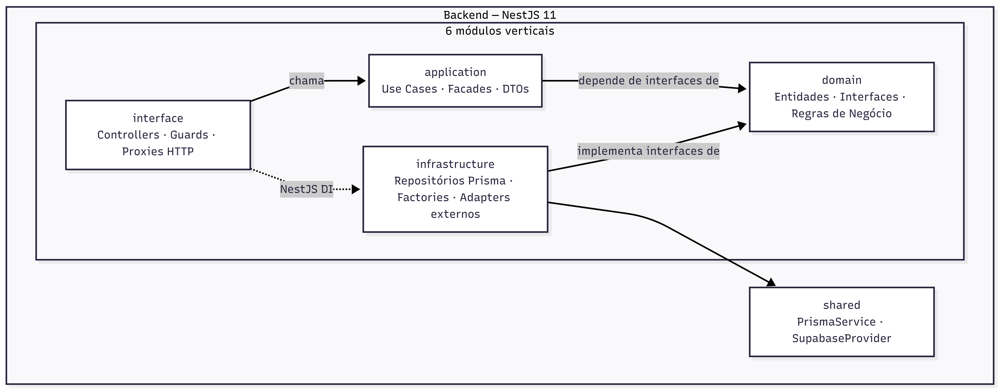
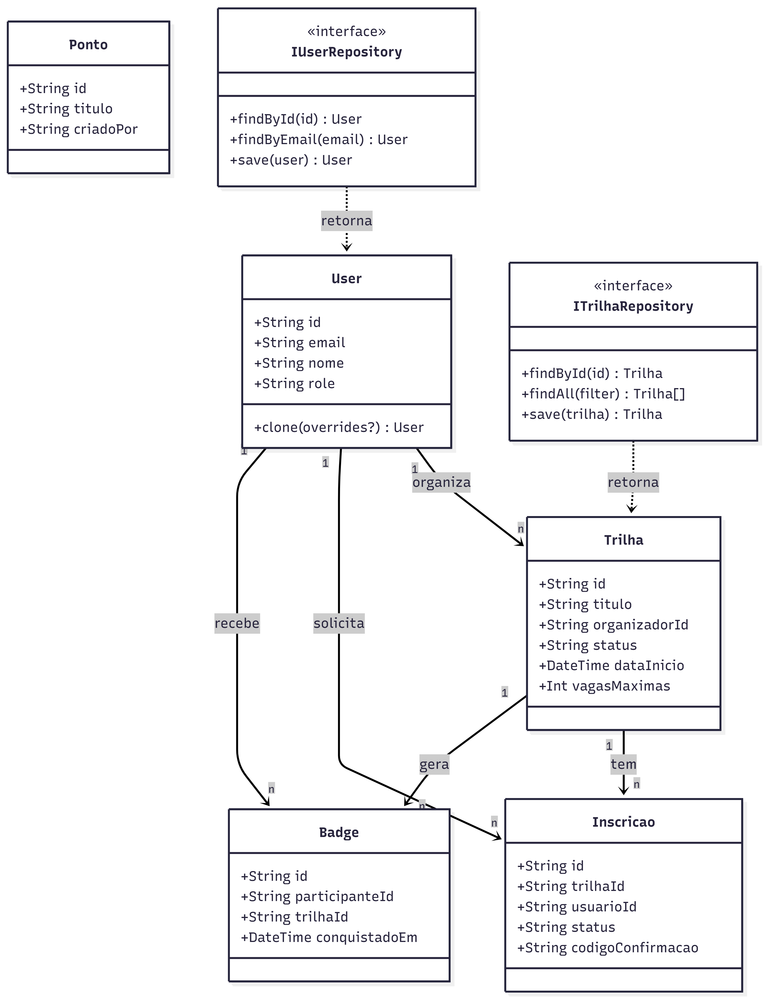

# 4.1.1. Visão Lógica

## Introdução

A Visão Lógica descreve a estrutura do sistema em termos de seus pacotes, classes e relacionamentos estáticos. No modelo 4+1, é a visão central para desenvolvedores: evidencia como o código está organizado e quais são as regras de dependência entre as partes.

---

## Estilo Arquitetural

O backend adota **monólito modular com arquitetura em camadas por módulo** (DDD tático). Cada um dos seis módulos verticais replica internamente a mesma estrutura de quatro camadas:

```
domain → application → infrastructure → interface
```

Regras de dependência (extraídas de `backend/CLAUDE.md`):

- `domain` não importa nenhuma camada abaixo dele — só conhece a si mesmo
- `application` importa interfaces de `domain` (nunca implementações concretas)
- `infrastructure` implementa as interfaces de `domain` e pode importar `application` (DTOs)
- `interface` (controllers, guards) importa `application` (facades/use cases) e `infrastructure` via injeção de dependência do NestJS
- `@prisma/client` nunca aparece fora de `infrastructure/`
- Mappers (`UserMapper`, `TrilhaMapper`, `InscricaoMapper`, `BadgeMapper`) fazem a conversão entre objeto Prisma e entidade de domínio

---

## Diagrama de Pacotes - Versão 2 (Final)



### Diagrama de Pacotes - Versão 1



---

## Módulos Verticais

| Módulo              | Responsabilidade principal                 | Padrões GoF aplicados                                                                                      |
| ------------------- | ------------------------------------------ | ---------------------------------------------------------------------------------------------------------- |
| `accounts`          | Cadastro, login, promoção de role          | Builder, Factory Method, Factory Registry, Prototype, Chain of Responsibility                              |
| `trilhas`           | CRUD de trilhas, check-in, gamificação     | Singleton, Command, Memento, Iterator, Composite, Observer, Facade, Proxy (Protection + Cache + Decorator) |
| `inscricoes`        | Solicitação, aceite, rejeição, check-in    | Facade, Visitor                                                                                            |
| `pontos-turisticos` | CRUD de pontos, feed, mediação             | Mediator, Proxy (Protection + Cache)                                                                       |
| `chat`              | Sessões de chat entre usuários             | Object Pool, Factory                                                                                       |
| `adapters`          | Integrações externas (Maps, Twilio, OAuth) | Adapter (3 adaptadores com interface comum)                                                                |

---

## Camadas e Responsabilidades

| Camada           | O que contém                                                                    | O que não deve conter                             |
| ---------------- | ------------------------------------------------------------------------------- | ------------------------------------------------- |
| `domain`         | Entidades, interfaces de repositório, regras de negócio puras, value objects    | Qualquer referência a NestJS, Prisma, HTTP        |
| `application`    | Use cases, facades, DTOs de entrada/saída                                       | Acesso direto ao banco, lógica de transporte HTTP |
| `infrastructure` | Implementações concretas de repositórios, factories, mappers, serviços externos | Regras de negócio, validação de domínio           |
| `interface`      | Controllers NestJS, guards, interceptors, proxies HTTP                          | Lógica de negócio, acesso direto a repositórios   |

---

## Diagrama de Classes — Domínio Central - Versão 2 (Final)


### Diagrama de Classes — Domínio Central - Versão 1



---

## Trechos de Código Comprobatórios

Os trechos abaixo evidenciam as regras da visão lógica no código real.

**Inversão de dependência — o use case conhece apenas a interface:**

> [`backend/src/modules/trilhas/domain/interfaces/ITrilhaRepository.ts`](https://github.com/UnBArqDsw2026-1-Turma01/2026.1-T01-_G5_BelezasNaturaisBrasileiras_Entrega_04/blob/main/backend/src/modules/trilhas/domain/interfaces/ITrilhaRepository.ts)

```typescript
import { Trilha } from "../entities/Trilha";

export interface ITrilhaRepository {
  create(trilha: Trilha): Promise<Trilha>;
  findById(id: string): Promise<Trilha | null>;
  findAll(): Promise<Trilha[]>;
  save(trilha: Trilha): Promise<Trilha>;
}
```

**Composição da cadeia de proxies — a implementação concreta é montada no módulo, fora do domínio:**

> [`backend/src/modules/trilhas/trilhas.module.ts`](https://github.com/UnBArqDsw2026-1-Turma01/2026.1-T01-_G5_BelezasNaturaisBrasileiras_Entrega_04/blob/main/backend/src/modules/trilhas/trilhas.module.ts)

```typescript
{
  provide: 'ITrilhaRepository',
  useFactory: (prisma: PrismaService, auditLog: AuditLog, context: TrilhaRequestContext) => {
    const base = new PrismaTrilhaRepository(prisma);
    const cached = new CachedTrilhaRepository(base);
    const audited = new AuditedTrilhaRepository(cached, auditLog);
    return new TrilhaProxyRepository(audited, context);
  },
  inject: [PrismaService, AuditLog, TrilhaRequestContext],
}
```

A cadeia resultante, do chamador ao banco: `TrilhaProxyRepository` (Protection Proxy) → `AuditedTrilhaRepository` (Decorator) → `CachedTrilhaRepository` (Cache Proxy) → `PrismaTrilhaRepository`.

**Prototype — clonagem de `User` com overrides, usada na promoção de role:**

> [`backend/src/modules/accounts/domain/entities/User.ts`](https://github.com/UnBArqDsw2026-1-Turma01/2026.1-T01-_G5_BelezasNaturaisBrasileiras_Entrega_04/blob/main/backend/src/modules/accounts/domain/entities/User.ts)

```typescript
clone(overrides?: Partial<User>): User {
  return new User(
    overrides?.id ?? this.id,
    overrides?.email ?? this.email,
    overrides?.nome ?? this.nome,
    overrides?.role ?? this.role,
    overrides?.fotoPerfil !== undefined ? overrides.fotoPerfil : this.fotoPerfil,
    overrides?.createdAt ?? this.createdAt,
    overrides?.updatedAt ?? this.updatedAt,
  );
}
```

---

## Catálogo de Padrões GoF

### Criacionais

| Padrão           | Classe principal                                                | Arquivo                                                                        | Propósito                                                                                                      |
| ---------------- | --------------------------------------------------------------- | ------------------------------------------------------------------------------ | -------------------------------------------------------------------------------------------------------------- |
| Singleton        | `ConfirmationCodeService`                                       | `backend/src/modules/trilhas/domain/services/ConfirmationCodeService.ts`       | Instância única para geração e revogação de códigos de check-in                                                |
| Builder          | `UserBuilder`                                                   | `backend/src/modules/accounts/domain/builders/UserBuilder.ts`                  | Construção fluente de `User` com validação encadeada                                                           |
| Factory Method   | `AdminUserFactory`, `CommonUserFactory`, `OrganizerUserFactory` | `backend/src/modules/accounts/infrastructure/factories/`                       | Criação de `User` especializado por role                                                                       |
| Factory Registry | `UserFactoryRegistry`                                           | `backend/src/modules/accounts/infrastructure/factories/UserFactoryRegistry.ts` | Mapeamento `UserRole → IUserFactory`; desacopla o cliente da factory concreta                                  |
| Prototype        | `User.clone()`                                                  | `backend/src/modules/accounts/domain/entities/User.ts`                         | Clona um `User` com campos alterados; usado em `PromoteUserUseCase`                                            |
| Object Pool      | `ChatObjectPoolService`                                         | `backend/src/modules/chat/pool/ChatObjectPoolService.ts`                       | Pool de conexões de chat; `acquire()` reutiliza ou cria via factory; `release()` retém até 50 conexões ociosas |

### Estruturais

| Padrão             | Classe principal                                          | Arquivo                                                                                                                                                           | Propósito                                                                                          |
| ------------------ | --------------------------------------------------------- | ----------------------------------------------------------------------------------------------------------------------------------------------------------------- | -------------------------------------------------------------------------------------------------- |
| Adapter            | `GoogleMapsAdapter`, `TwilioAdapter`, `GoogleAuthAdapter` | `backend/src/modules/adapters/`                                                                                                                                   | Adaptadores com interface comum (`IMapAdapter`, `INotificationAdapter`, `IAuthAdapter`)            |
| Composite          | `LocalizacaoComposita`, `LocalizacaoFolha`                | `backend/src/modules/trilhas/domain/localizacao/`                                                                                                                 | Árvore estado → cidade → pontos com `getQuantidadePontos()` recursivo                              |
| Decorator          | `AuditedTrilhaRepository`                                 | `backend/src/modules/trilhas/infrastructure/persistence/AuditedTrilhaRepository.ts`                                                                               | Intercepta operações do repositório e grava audit log                                              |
| Facade             | `TrilhaFacade`, `InscricaoFacade`                         | `backend/src/modules/trilhas/application/TrilhaFacade.ts`, `backend/src/modules/inscricoes/application/InscricaoFacade.ts`                                        | Ponto de entrada único para os controllers; esconde a coordenação entre use cases                  |
| Flyweight          | `LocalizacaoFlyweightFactory`                             | `backend/src/modules/trilhas/`                                                                                                                                    | Compartilhamento de instâncias de localização com mesmo estado                                     |
| Proxy (Protection) | `TrilhaProxyRepository`, `PontosAuthProxy`                | `backend/src/modules/trilhas/infrastructure/persistence/TrilhaProxyRepository.ts`, `backend/src/modules/pontos-turisticos/interface/proxies/PontosAuthProxy.ts`   | Verifica permissão (organizadorId via `TrilhaRequestContext`) antes de delegar ao repositório real |
| Proxy (Cache)      | `CachedTrilhaRepository`, `PontosCacheProxy`              | `backend/src/modules/trilhas/infrastructure/persistence/CachedTrilhaRepository.ts`, `backend/src/modules/pontos-turisticos/interface/proxies/PontosCacheProxy.ts` | Evita consultas repetidas ao banco em memória                                                      |

### Comportamentais

| Padrão                  | Classe principal                                                                             | Arquivo                                           | Propósito                                                                                                                        |
| ----------------------- | -------------------------------------------------------------------------------------------- | ------------------------------------------------- | -------------------------------------------------------------------------------------------------------------------------------- |
| Chain of Responsibility | `EmailUniquenessHandler`, `PasswordStrengthHandler`, `TermsAcceptanceHandler`                | `backend/src/modules/accounts/domain/validation/` | Validação encadeada no signup                                                                                                    |
| Command                 | `EditarTrilhaCommand`, `TrilhaCommandHistory`                                                | `backend/src/modules/trilhas/domain/commands/`    | Encapsula edição; `TrilhaCommandHistory` permite undo                                                                            |
| Iterator                | `TrilhaFilteredIterator`, `TrilhaPaginatedIterator`                                          | `backend/src/modules/trilhas/domain/iterators/`   | Filtragem por status e paginação sem expor a coleção interna                                                                     |
| Mediator                | `TrailLifecycleMediatorService`                                                              | `backend/src/modules/pontos-turisticos/mediator/` | Orquestra 4 handlers ao finalizar trilha: `AttendanceHandler`, `BadgeHandler`, `HistoryNotificationHandler`, `TrailStateHandler` |
| Memento                 | `TrilhaMemento`, `TrilhaCaretaker`                                                           | `backend/src/modules/trilhas/domain/memento/`     | Salva estado de `Trilha` antes de editar; `RestaurarTrilhaUseCase` faz rollback via `caretaker.restore()`                        |
| Observer                | `TrilhaEventEmitter`, `BadgeDistribuicaoObserver`, `NotificacaoObserver`                     | `backend/src/modules/trilhas/domain/observers/`   | Infraestrutura de notificação por eventos; observers inscritos no init do módulo (exercitado via testes e `GET /trilhas/status`) |
| Strategy                | `OrdenarTrilhasPorDataStrategy`, `OrdenarTrilhasPorTituloStrategy`, `TrilhaOrdenacaoContext` | `backend/src/modules/trilhas/`                    | Estratégias intercambiáveis de ordenação de trilhas                                                                              |
| Visitor                 | `BadgeDistribuicaoVisitor`, `NotificacaoInscricaoVisitor`                                    | `backend/src/modules/`                            | Percorre estruturas de inscrições para aplicar operações sem modificar as entidades                                              |

---

## Rastreabilidade

| Elemento desta visão                            | Artefato de origem                                                                                         | Fase |
| ----------------------------------------------- | ---------------------------------------------------------------------------------------------------------- | ---- |
| `User`, `Trilha`, `Inscricao`, `Badge`, `Ponto` | [Diagrama de Classes v3](../../Modelagem/2.1.ModelagemEstatica.md)                                         | 2    |
| Roles `COMMON_USER`, `ORGANIZER`, `ADMIN`       | [Diagrama de Estados VF](../../Modelagem/2.2.ModelagemDinamica.md)                                         | 2    |
| Chain of Responsibility (validação signup)      | [3.3.1. Chain of Responsibility](../../PadroesDeProjeto/GoFsComportamentais/3.3.1ChainOfResponsibility.md) | 3    |
| Observer (finalização de trilha)                | [3.3.7. Observer](../../PadroesDeProjeto/GoFsComportamentais/3.3.7Observer.md)                             | 3    |
| Proxy (proteção e cache)                        | [3.2.5. Proxy](../../PadroesDeProjeto/GoFsEstruturais/3.2.5Proxy.md)                                       | 3    |
| Adapter (integrações externas)                  | [3.2.1. Adapter](../../PadroesDeProjeto/GoFsEstruturais/3.2.1Adapter.md)                                   | 3    |
| Facade (TrilhaFacade, InscricaoFacade)          | [3.2.3. Facade](../../PadroesDeProjeto/GoFsEstruturais/3.2.3Facade.md)                                     | 3    |
| Builder (UserBuilder)                           | [3.1.5. Builder](../../PadroesDeProjeto/GoFsCriacionais/3.1.5Builder.md)                                   | 3    |

---

## Senso Crítico

**Monólito modular vs microsserviços:** o projeto foi construído como monólito modular. Para o escopo (equipe de 9 pessoas, prazo de um semestre), essa escolha reduz o overhead de orquestração, rede e observabilidade que microsserviços adicionariam. A separação em módulos verticais com interfaces explícitas preserva a opção de extração futura, caso necessário.

**Disciplina de camadas vs boilerplate:** a regra de nunca importar Prisma fora de `infrastructure` obriga a criar mappers (`UserMapper`, `TrilhaMapper`, `InscricaoMapper`, `BadgeMapper`) para cada entidade. Isso aumenta o volume de código, mas desacopla o domínio do ORM — se o banco ou o ORM mudar, o domínio e os use cases não precisam ser alterados.

**Quantidade de padrões GoF:** a implementação de 20+ padrões num sistema desta escala reflete a exigência da disciplina de demonstrar padrões, não necessariamente uma necessidade orgânica do produto. Em alguns casos (ex.: `Visitor`, `Flyweight`), a justificativa de negócio é mais fraca do que a didática. O time deve ter consciência dessa distinção ao apresentar.

**Proxy cache in-memory:** `CachedTrilhaRepository` e `PontosCacheProxy` usam cache em memória do processo NestJS. Isso funciona para uma instância única, mas não escala horizontalmente (cada instância teria seu próprio cache desatualizado). Para produção real, a solução seria um cache externo (ex.: Redis).

---

## Declaração de Uso de IA

Este documento e os diagramas foram desenvolvidos com o auxílio de IA para otimizar a estrutura, a apresentação do conteúdo e a catalogação dos padrões. Todas as decisões de design, escolhas arquiteturais e análises de trade-off foram realizadas pela equipe com senso crítico e autoridade própria.

A IA foi utilizada como ferramenta de suporte em duas frentes:

**Documentação:** estruturação da visão lógica, organização do catálogo de padrões GoF e geração de descrições baseadas no código implementado e nos arquivos do repositório.

**Diagramação:** geração de diagramas Mermaid (pacotes e classes) a partir da estrutura real do código.

Cada diagrama, tabela e decisão foi revisado e ajustado conforme as necessidades do projeto. A equipe mantém total responsabilidade pelas escolhas implementadas.

---

## Referências

> KRUCHTEN, Philippe. **The 4+1 View Model of Architecture**. IEEE Software, v. 12, n. 6, p. 42–50, nov. 1995.

> GAMMA, E. et al. **Design Patterns: Elements of Reusable Object-Oriented Software**. Addison-Wesley, 1994.

> MARTIN, Robert C. **Clean Architecture**. Prentice Hall, 2017.

> NestJS. **Documentation**. Disponível em: https://docs.nestjs.com. Acesso em: jun. 2026.

---

## Revisão Técnica

| Integrante | Revisão |
| :--------- | :------ |
| [Miguel Arthur](https://github.com/zlimaz) | O mapeamento dos módulos verticais está alinhado com o código base. A catalogação do `TrailLifecycleMediatorService` (desenvolvido por Mário Vinícius) no módulo de pontos-turísticos evidencia uma abstração correta das responsabilidades de notificação e gamificação. A documentação condiz com a implementação real de separação de domínios. |

---

## Histórico de Versões

| Versão | Data       | Descrição                                                                               | Autor                                                  | Revisor                                               | Detalhamento da Revisão                                                                               |
| :----- | :--------- | :-------------------------------------------------------------------------------------- | :----------------------------------------------------- | :---------------------------------------------------- | :---------------------------------------------------------------------------------------------------- |
| `1.0`  | 11/06/2026 | Criação da visão lógica: pacotes, classes, catálogo GoF, rastreabilidade, senso crítico | [Vitor Hoffmann](https://github.com/vitor-hoffmann) e [Ana Pfeilsticker](https://github.com/ana-pfeilsticker) | [Antonio Carvalho](https://github.com/antonioscarvalho)                       | Revisão técnica da visão lógica: a estrutura de camadas por módulo está corretamente mapeada. A cadeia de proxies e decorators no repositório de trilhas foi validada no código.               |
| `1.1`  | 13/06/2026 | Atualização técnica dos diagramas (PNG) | [Antonio Carvalho](https://github.com/antonioscarvalho) | Equipe G5 | Substituição de diagramas Mermaid por representações gráficas PNG para maior fidelidade visual e legibilidade. |
| `1.2`  | 19/06/2026 | Adição de revisão técnica por Miguel Arthur. | [Miguel Arthur](https://github.com/zlimaz) | — | — |
