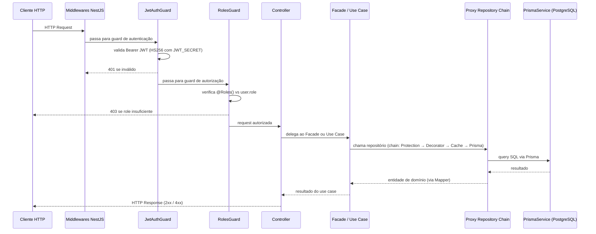
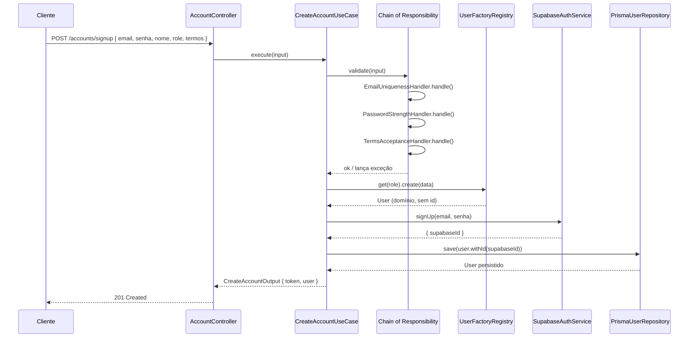
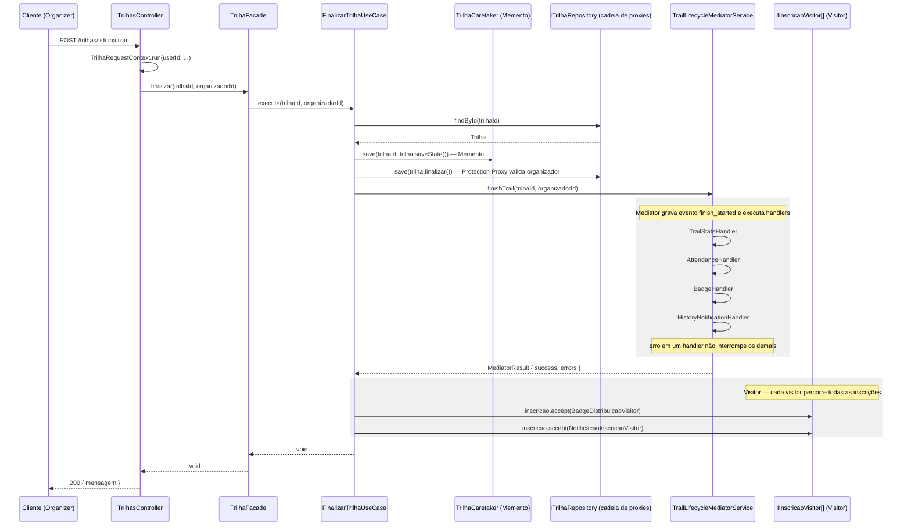
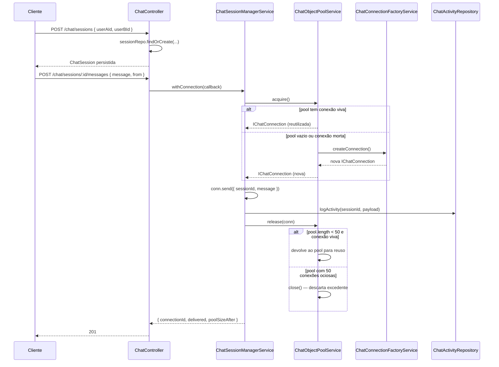
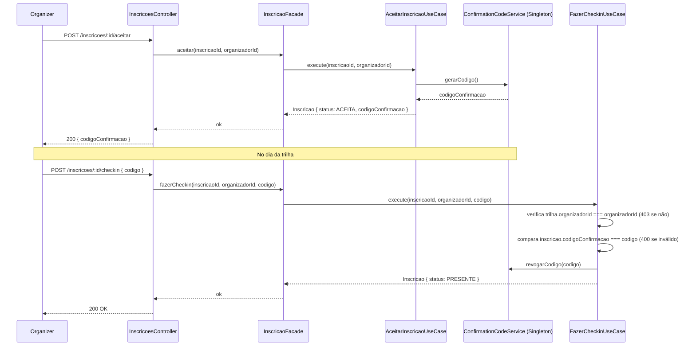

# 4.1.3. Visão de Processo

## Introdução

A Visão de Processo descreve o comportamento dinâmico do sistema: como os componentes interagem durante a execução, qual é o ciclo de vida de uma requisição e quais são os pontos de sincronização entre partes do sistema.

---

## Pipeline de Requisição — NestJS

Toda requisição HTTP ao backend percorre o seguinte pipeline antes de chegar ao handler do controller:



**Notas:**

- Rotas públicas (`GET /trilhas`, `GET /pontos-turisticos`) ignoram `JwtAuthGuard`
- A cadeia de proxy do repositório do módulo trilhas é montada por `useFactory` em [`trilhas.module.ts`](https://github.com/UnBArqDsw2026-1-Turma01/2026.1-T01-_G5_BelezasNaturaisBrasileiras_Entrega_04/blob/main/backend/src/modules/trilhas/trilhas.module.ts): `TrilhaProxyRepository (Protection) → AuditedTrilhaRepository (Decorator) → CachedTrilhaRepository (Cache) → PrismaTrilhaRepository`

---

## Fluxo — Signup (Criação de Conta)



---

## Fluxo — Finalizar Trilha

Este fluxo concentra a maior densidade de padrões comportamentais do sistema:



**Observações sobre o fluxo real:**

- A ordem dos handlers do Mediator é registrada em `onModuleInit`: `trailState → attendance → badge → historyNotification`. Falha em um handler é capturada, registrada em `errors` e os demais continuam; ao final o Mediator grava o status do evento (`completed`/`failed`) em `trail_lifecycle_events`.
- Os efeitos pós-finalização sobre inscrições (badges e notificações) são aplicados pelo padrão **Visitor** (`BadgeDistribuicaoVisitor`, `NotificacaoInscricaoVisitor`), que percorre as inscrições e despacha por status (`visitPresente`, `visitAceita`, ...).
- O **Observer** (`TrilhaEventEmitter` + `BadgeDistribuicaoObserver`/`NotificacaoObserver`) está instalado — os observers são inscritos no `onModuleInit` do `TrilhasModule` e o endpoint `GET /trilhas/status` expõe `observadoresAtivos` — mas o método `notificarFinalizacao()` não é invocado pelo fluxo de produção; ele é exercitado pelos testes unitários (`observers.spec.ts`). Ver Senso Crítico.

**Rollback disponível:** `POST /trilhas/:id/restaurar` chama `RestaurarTrilhaUseCase`, que invoca `TrilhaCaretaker.restore()` para recuperar o estado salvo pelo Memento.

---

## Fluxo — Object Pool do Chat

A aquisição e devolução de conexões do pool acontece **por mensagem enviada** (não por sessão): o `ChatSessionManagerService.withConnection()` encapsula o par `acquire()`/`release()` em torno do envio.



**Notas sobre o comportamento real do pool:**

- `acquire()` nunca recusa: se o pool está vazio (ou a conexão retirada está morta), a factory cria uma nova conexão. O limite `max = 50` é aplicado no `release()` — conexões devolvidas além de 50 são fechadas em vez de pooladas. Ou seja, o limite controla o número de conexões **ociosas retidas**, não o de conexões simultâneas.
- **Status do pool:** `GET /chat/pool/status` retorna `{ poolSize, pattern: 'Object Pool' }` sem side effects.

---

## Fluxo — Validação de Check-in (Singleton)



**Nota:** a validação do código compara o valor persistido em `inscricao.codigoConfirmacao`; o Singleton `ConfirmationCodeService` é responsável por gerar (`gerarCodigo()`) e revogar (`revogarCodigo()`) os códigos ativos.

---

## Trechos de Código Comprobatórios

**Mediator — execução tolerante a falhas dos handlers:**

> [`backend/src/modules/pontos-turisticos/mediator/trail-lifecycle-mediator.service.ts`](https://github.com/UnBArqDsw2026-1-Turma01/2026.1-T01-_G5_BelezasNaturaisBrasileiras_Entrega_04/blob/main/backend/src/modules/pontos-turisticos/mediator/trail-lifecycle-mediator.service.ts)

```typescript
async finishTrail(trailId: string, actorId: string): Promise<MediatorResult> {
  const event = { trailId, actorId, timestamp: new Date().toISOString() };
  await this.lifecycleRepo.createEvent({ trailId, eventType: 'finish_started', payload: event });

  const errors: any[] = [];
  for (const h of this.handlers) {
    try {
      await h.handler.handle(event);
    } catch (e) {
      this.logger.error(`Handler ${h.name} failed`, e);
      errors.push({ handler: h.name, error: e?.message || e });
    }
  }

  const status = errors.length ? 'failed' : 'completed';
  await this.lifecycleRepo.updateEventStatus(trailId, status);
  return { success: errors.length === 0, errors };
}
```

**Object Pool — aquisição e devolução encapsuladas por mensagem:**

> [`backend/src/modules/chat/chat-session.manager.service.ts`](https://github.com/UnBArqDsw2026-1-Turma01/2026.1-T01-_G5_BelezasNaturaisBrasileiras_Entrega_04/blob/main/backend/src/modules/chat/chat-session.manager.service.ts)

```typescript
async withConnection<T>(callback: (conn: IChatConnection) => Promise<T>): Promise<T> {
  const conn = await this.pool.acquire();
  try {
    return await callback(conn);
  } finally {
    await this.pool.release(conn);
  }
}
```

---

## Como Executar e Observar os Fluxos

| Fluxo                       | Como observar rodando                                                                                                                                                      |
| --------------------------- | -------------------------------------------------------------------------------------------------------------------------------------------------------------------------- |
| Pipeline + Guards           | `curl -X POST http://localhost:3000/trilhas` sem token → 401; com token de COMMON_USER → 403                                                                               |
| Signup (Chain + Factory)    | `curl -X POST http://localhost:3000/accounts/signup -H "Content-Type: application/json" -d '{"email":"x@x.com","senha":"fraca", ...}'` → erro do `PasswordStrengthHandler` |
| Finalizar Trilha            | `curl -X POST http://localhost:3000/trilhas/:id/finalizar -H "Authorization: Bearer <token-organizer>"` → badges em `GET /trilhas/badges/minhas`                           |
| Object Pool                 | `GET http://localhost:3000/chat/pool/status` antes e depois de enviar mensagens → `poolSize` varia                                                                         |
| Observer (status)           | `GET http://localhost:3000/trilhas/status` → `observadoresAtivos: 2`                                                                                                       |
| Testes unitários dos fluxos | `cd backend && npm run test` — `observers.spec.ts`, `chat-object-pool.spec.ts`, `confirmation-code.spec.ts`                                                                |

Roteiro completo de requisições em [`CURLS_MANUAL.md`](https://github.com/UnBArqDsw2026-1-Turma01/2026.1-T01-_G5_BelezasNaturaisBrasileiras_Entrega_04/blob/main/CURLS_MANUAL.md) e na coleção Postman [`BNB_Collection.postman_collection.json`](https://github.com/UnBArqDsw2026-1-Turma01/2026.1-T01-_G5_BelezasNaturaisBrasileiras_Entrega_04/blob/main/BNB_Collection.postman_collection.json).

---

## Senso Crítico

**Sincronia vs assincronia:** todos os fluxos são síncronos dentro da requisição HTTP — o Mediator e os Visitors executam dentro do ciclo da requisição de finalização. Não há fila de mensagens (RabbitMQ, SQS) ou worker assíncrono. Isso simplifica o código, mas significa que efeitos demorados (notificações em massa) alongam o tempo de resposta e não têm retry automático. Para produção real, esses efeitos deveriam ser publicados em uma fila.

**Mediator, Visitor e Observer sobrepostos:** o fluxo "Finalizar Trilha" aplica três padrões com responsabilidades parcialmente sobrepostas. O Mediator (handlers de estado, presença, badge e histórico) e o Visitor (badge e notificação por inscrição) executam no fluxo de produção; o `BadgeHandler` do Mediator e o `BadgeDistribuicaoVisitor` cobrem o mesmo efeito por caminhos diferentes. Já o Observer (`TrilhaEventEmitter`) está instalado e testado, mas `notificarFinalizacao()` não é chamado por nenhum fluxo de produção — apenas pelos testes unitários e exposto via `GET /trilhas/status`. Essa redundância tem origem didática (demonstrar os três padrões); em um produto real, um único mecanismo de eventos deveria concentrar os efeitos pós-finalização.

**Objeto pool em memória:** o `ChatObjectPoolService` armazena conexões em um array em memória do processo. Se o processo NestJS reiniciar, o pool é zerado e sessões de chat ativas no banco ficam com `connectionId` inválido. Para produção, o pool deveria ser externalizado (ex.: pool de conexões Redis pub/sub).

---

## Declaração de Uso de IA

Este documento e os diagramas de sequência foram desenvolvidos com o auxílio de IA para otimizar a estrutura e a apresentação do conteúdo. Os fluxos descritos foram extraídos do código real do repositório; a análise de trade-offs foi realizada pela equipe com senso crítico e autoridade própria.

A IA foi utilizada como ferramenta de suporte em duas frentes:

**Documentação:** estruturação da visão de processo e organização das seções.

**Diagramação:** geração de diagramas de sequência Mermaid a partir dos fluxos reais do código (pipeline NestJS, signup, finalizar trilha, object pool, check-in).

Cada diagrama e análise foi revisado e ajustado conforme as necessidades do projeto. A equipe mantém total responsabilidade pelas escolhas implementadas.

---

## Referências

> KRUCHTEN, Philippe. **The 4+1 View Model of Architecture**. IEEE Software, v. 12, n. 6, p. 42–50, nov. 1995.

> GAMMA, E. et al. **Design Patterns: Elements of Reusable Object-Oriented Software**. Addison-Wesley, 1994.

> NestJS. **Request lifecycle**. Disponível em: https://docs.nestjs.com/faq/request-lifecycle. Acesso em: jun. 2026.

---

## Revisão Técnica

| Integrante | Revisão |
| :--------- | :------ |
|            |         |

---

## Histórico de Versões

| Versão | Data       | Descrição                                                 | Autor                                               | Revisor | Detalhamento da Revisão |
| :----- | :--------- | :-------------------------------------------------------- | :-------------------------------------------------- | :------ | :---------------------- |
| `1.0`  | 11/06/2026 | Criação da visão de processo com 4 diagramas de sequência | [Vitor Hoffmann](https://github.com/vitor-hoffmann) | —       | —                       |
