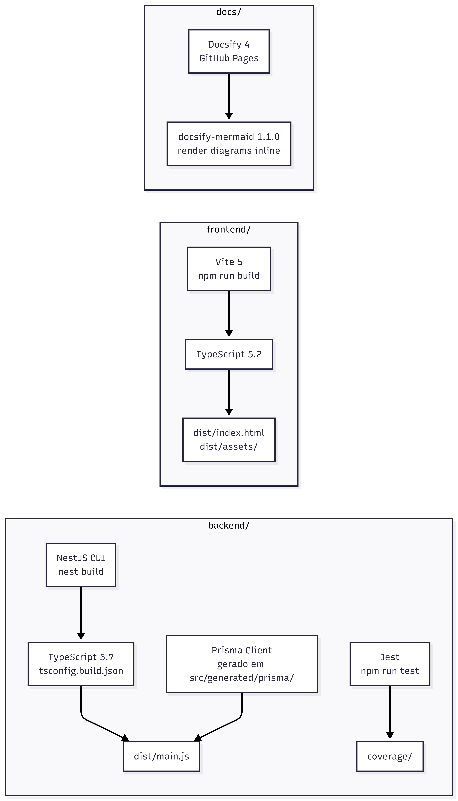

# 4.1.4. Visão de Implementação

## Introdução

A Visão de Implementação descreve a organização do código-fonte: como os arquivos estão distribuídos no repositório, quais são os componentes de build e como a equipe gerenciou contribuições e qualidade do código.

---

## Estrutura do Monorepo

O repositório é organizado como **monorepo** com três diretórios principais:

```
/
├── backend/           # API REST — NestJS 11 + Prisma 7
├── frontend/          # SPA — React 18 + Vite 5 + Tailwind 3
└── docs/              # Documentação — Docsify 4
```

Cada diretório é independente: tem seu próprio `package.json`, `tsconfig.json` e pipeline de build. Não há workspace compartilhado (ex.: Turborepo, Nx) — os três são tratados como projetos separados num mesmo repositório.

---

## Componentes de Build



---

## Estrutura do Backend

```
backend/src/
├── app.module.ts                   # Módulo raiz — importa todos os módulos verticais
├── main.ts                         # Bootstrap: ValidationPipe global, listen :3000
├── modules/
│   ├── accounts/                   # Usuários e autenticação
│   │   ├── domain/
│   │   │   ├── entities/           # User.ts (Prototype: User.clone())
│   │   │   ├── builders/           # UserBuilder.ts
│   │   │   ├── interfaces/         # IUserRepository, IUserFactory, IUserFactoryRegistry, ISupabaseAuthService
│   │   │   └── validation/         # EmailUniquenessHandler, PasswordStrengthHandler, TermsAcceptanceHandler
│   │   ├── application/
│   │   │   ├── use-cases/          # CreateAccountUseCase, LoginUseCase, PromoteUserUseCase
│   │   │   └── dtos/               # CreateAccountInput/Output, LoginInput/Output, PromoteUserInput/Output
│   │   ├── infrastructure/
│   │   │   ├── factories/          # AdminUserFactory, CommonUserFactory, OrganizerUserFactory, UserFactoryRegistry
│   │   │   ├── mappers/            # UserMapper (toDomain / toPersistence)
│   │   │   ├── persistence/        # PrismaUserRepository
│   │   │   └── services/           # SupabaseAuthService
│   │   ├── interface/
│   │   │   └── controllers/        # AccountController
│   │   └── auth/                   # JwtAuthGuard, RolesGuard, JwtStrategy, @Roles(), role.enum
│   │
│   ├── trilhas/                    # Trilhas ecológicas
│   │   ├── domain/
│   │   │   ├── entities/           # Trilha.ts, Badge.ts
│   │   │   ├── commands/           # EditarTrilhaCommand, TrilhaCommandHistory
│   │   │   ├── iterators/          # TrilhaFilteredIterator, TrilhaPaginatedIterator
│   │   │   ├── localizacao/        # LocalizacaoComposita, LocalizacaoFolha, LocalizacaoFlyweightFactory
│   │   │   ├── memento/            # TrilhaMemento, TrilhaCaretaker
│   │   │   ├── observers/          # TrilhaEventEmitter, BadgeDistribuicaoObserver, NotificacaoObserver
│   │   │   └── services/           # ConfirmationCodeService (Singleton), TrilhaRequestContext, AuditLog
│   │   ├── application/
│   │   │   ├── TrilhaFacade.ts
│   │   │   └── use-cases/          # CriarTrilhaUseCase, ListarTrilhasUseCase, EditarTrilhaUseCase,
│   │   │                           # FinalizarTrilhaUseCase, RestaurarTrilhaUseCase
│   │   ├── infrastructure/
│   │   │   └── persistence/        # PrismaTrilhaRepository, TrilhaProxyRepository,
│   │   │                           # AuditedTrilhaRepository, CachedTrilhaRepository, TrilhaMapper, BadgeMapper
│   │   └── interface/
│   │       └── controllers/        # TrilhasController
│   │
│   ├── inscricoes/                 # Inscrições e check-in
│   │   ├── domain/entities/        # Inscricao.ts
│   │   ├── application/
│   │   │   ├── InscricaoFacade.ts
│   │   │   └── use-cases/          # SolicitarInscricaoUseCase, AceitarInscricaoUseCase,
│   │   │                           # RejeitarInscricaoUseCase, FazerCheckinUseCase, ListarInscricoesUseCase
│   │   └── interface/controllers/  # InscricoesController
│   │
│   ├── pontos-turisticos/          # Pontos turísticos
│   │   ├── application/            # PontosTuristicosService, BuscarFeedUseCase, CriarPontoUseCase,
│   │   │                           # EditarPontoUseCase, DeletarPontoUseCase
│   │   ├── interface/
│   │   │   ├── controllers/        # PontosTuristicosController
│   │   │   └── proxies/            # PontosAuthProxy, PontosCacheProxy
│   │   └── mediator/               # TrailLifecycleMediatorService
│   │                               # AttendanceHandler, BadgeHandler, HistoryNotificationHandler, TrailStateHandler
│   │
│   ├── chat/                       # Chat entre usuários
│   │   ├── pool/                   # ChatObjectPoolService, ChatConnectionFactoryService
│   │   └── repositories/           # ChatSessionRepository, ChatActivityRepository
│   │
│   └── adapters/                   # Integrações externas
│       ├── auth/                   # AuthAdapterService, GoogleAuthAdapter, LocalAuthAdapter
│       ├── map/                    # MapAdapterService, GoogleMapsAdapter
│       ├── notify/                 # NotificationAdapterService, TwilioAdapter, LoggerNotificationChannel
│       └── repositories/           # ExternalProviderConfigRepository, GeolocationCacheRepository, NotificationLogRepository
│
└── shared/
    └── infrastructure/
        ├── prisma/                 # PrismaService (injeção global)
        └── supabase/               # supabase.provider.ts
```

---

## Estrutura do Frontend

```
frontend/src/
├── api/            # Clientes axios por domínio (auth, trilhas, pontos, inscricoes, chat, adapters)
├── components/     # Navbar.tsx, ProtectedRoute.tsx
├── contexts/       # AuthContext.tsx (estado global de autenticação)
├── hooks/          # jwtDecode.ts
└── pages/          # Login, Cadastro, Home, TrilhaDetail, CriarTrilha,
                    # PainelOrganizador, PontoDetail, CriarPonto, Chat, Perfil, PainelAdmin
```

**Rotas (react-router-dom v6):**

| Rota                  | Acesso           | Componente          |
| --------------------- | ---------------- | ------------------- |
| `/`                   | Público          | `Home`              |
| `/login`              | Público          | `Login`             |
| `/cadastro`           | Público          | `Cadastro`          |
| `/trilhas/:id`        | Público          | `TrilhaDetail`      |
| `/pontos/:id`         | Público          | `PontoDetail`       |
| `/perfil`             | Autenticado      | `Perfil`            |
| `/chat`               | Autenticado      | `Chat`              |
| `/trilhas/criar`      | ORGANIZER, ADMIN | `CriarTrilha`       |
| `/trilhas/:id/painel` | ORGANIZER, ADMIN | `PainelOrganizador` |
| `/pontos/criar`       | Autenticado      | `CriarPonto`        |
| `/admin`              | ADMIN            | `PainelAdmin`       |

Rotas protegidas usam `ProtectedRoute`, que lê o role do JWT (via `jwtDecode`) e redireciona para `/login` se não autenticado ou para `/` se o role for insuficiente.

---

## Testes

O backend usa **Jest** com o runner do NestJS. Os testes são **unitários** (sem banco real):

| Arquivo de teste                                                                  | O que verifica                                                     |
| --------------------------------------------------------------------------------- | ------------------------------------------------------------------ |
| `backend/src/modules/trilhas/observers.spec.ts`                                   | Observer: `BadgeDistribuicaoObserver` e `NotificacaoObserver`      |
| `backend/src/modules/trilhas/confirmation-code.spec.ts`                           | Singleton: `ConfirmationCodeService`                               |
| `backend/src/modules/trilhas/localizacao.spec.ts`                                 | Composite: `LocalizacaoComposita` + `LocalizacaoFolha`             |
| `backend/src/modules/chat/chat-object-pool.spec.ts`                               | Object Pool: `ChatObjectPoolService`                               |
| `backend/src/modules/pontos-turisticos/pontos-cache-proxy.spec.ts`                | Proxy Cache: `PontosCacheProxy`                                    |
| `backend/src/modules/pontos-turisticos/pontos-auth-proxy.spec.ts`                 | Proxy Protection: `PontosAuthProxy`                                |
| `backend/src/modules/pontos-turisticos/pontos-service.spec.ts`                    | Service: `PontosTuristicosService`                                 |
| `backend/src/modules/adapters/adapters.spec.ts`                                   | Adapter: `GoogleMapsAdapter`, `TwilioAdapter`, `GoogleAuthAdapter` |
| `backend/src/modules/accounts/application/use-cases/CreateAccountUseCase.spec.ts` | Use Case com mocks de repositório                                  |

Comando: `cd backend && npm run test`

---

## Workflow de Contribuição

O projeto usa o fluxo definido em `CONTRIBUTING.md` e `.github/`:

- **Branches:** uma branch por feature/documento (`feat/...`, `docs/...`, `fix/...`)
- **Pull Requests:** template em `.github/pull_request_template.md`; pelo menos um revisor obrigatório (`CODEOWNERS`)
- **Issue templates:** bug report e feature request em `.github/ISSUE_TEMPLATE/`
- **Commits:** mensagem descritiva no imperativo; sem commits diretos em `main`

O histórico de versões de cada documento desta entrega registra os commits e PRs associados, servindo de comprobatório para a avaliação de participações.

---

## Senso Crítico

**Monorepo sem workspace:** a ausência de uma ferramenta de monorepo (Turborepo, Nx) significa que o build do frontend e do backend não são orquestrados automaticamente. Cada desenvolvedor precisa lembrar de entrar no diretório correto. Para um projeto acadêmico de curto prazo, o overhead de configurar um workspace não se justifica; em produção contínua, seria um problema.

**Testes unitários sem integração:** todos os testes de padrão GoF usam mocks. Não há testes de integração que disparem requests HTTP reais e verifiquem o banco. A coleção Postman e os scripts `run_integration_tests.ps1` cobrem parte desse gap manualmente, mas não de forma automatizada no CI.

**Frontend sem testes:** não há testes unitários ou de componente no frontend (sem Vitest, Testing Library). A verificação de comportamento do frontend é feita manualmente.

---

## Declaração de Uso de IA

Este documento foi desenvolvido com o auxílio de IA para otimizar a estrutura e a apresentação do conteúdo. O mapeamento da estrutura de pastas, componentes de build e arquivos de teste foi extraído do repositório real; as análises de trade-off foram realizadas pela equipe com senso crítico e autoridade própria.

A IA foi utilizada como ferramenta de suporte na documentação: estruturação da visão de implementação, organização das seções e geração de diagramas Mermaid do pipeline de build.

Cada seção foi revisada e ajustada conforme as necessidades do projeto. A equipe mantém total responsabilidade pelas escolhas implementadas.

---

## Referências

> NestJS. **CLI — build**. Disponível em: https://docs.nestjs.com/cli/overview. Acesso em: jun. 2026.

> Vite. **Build**. Disponível em: https://vitejs.dev/guide/build. Acesso em: jun. 2026.

> Docsify. **Quickstart**. Disponível em: https://docsify.js.org/#/quickstart. Acesso em: jun. 2026.

---

## Histórico de Versões

| Versão | Data       | Descrição                                                                             | Autor                                                  | Revisor | Detalhamento da Revisão |
| :----- | :--------- | :------------------------------------------------------------------------------------ | :----------------------------------------------------- | :--- | :--- |
| `1.0`  | 11/06/2026 | Criação da visão de implementação: monorepo, estrutura, testes, workflow              | [Vitor Hoffmann](https://github.com/vitor-hoffmann)    | [Antonio Carvalho](https://github.com/antonioscarvalho) | Revisão e validação da estrutura do monorepo e mapeamento de módulos de implementação. |
| `1.1`  | 13/06/2026 | Atualização técnica dos diagramas (PNG) | [Antonio Carvalho](https://github.com/antonioscarvalho) | — | — |
