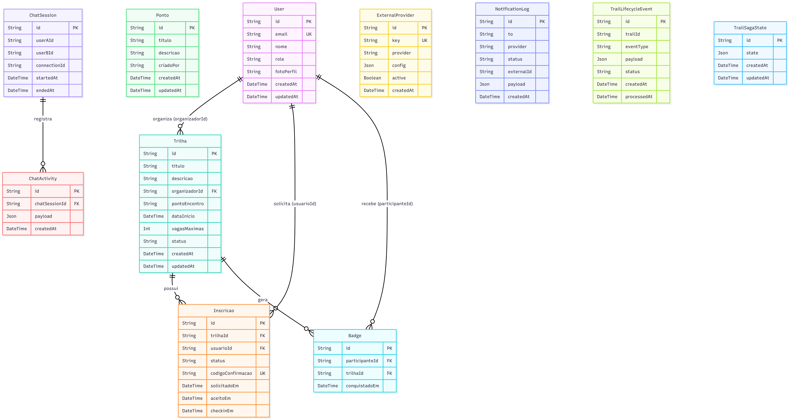

# 4.1.6. Visão de Dados

## Introdução

A Visão de Dados descreve o modelo relacional persistido no PostgreSQL 15, gerenciado pelo Prisma 7. Cobre o esquema atual, os relacionamentos entre entidades, as constraints de integridade e a evolução do esquema via migrations.

> Esta visão não é canônica no modelo 4+1 de Kruchten. Foi adicionada porque o esquema relacional é a fonte de persistência de todas as entidades de domínio e seu entendimento é necessário para compreender as demais visões.

---

## Diagrama Entidade-Relacionamento

---

## Descrição das Tabelas

### `users`

Armazena perfis de usuários. O `id` é o UUID gerado pelo Supabase Auth — não é gerado pelo banco. O campo `role` é uma string (`COMMON_USER`, `ORGANIZER`, `ADMIN`); não há enum no banco (Prisma usa validação na camada de aplicação).

**Constraint de integridade:** `email UNIQUE`.

### `trilhas`

Trilhas ecológicas criadas por organizadores. `organizadorId` é FK para `users.id`. `status` é string (`ATIVA`, `FINALIZADA`) — controlado pela aplicação via `FinalizarTrilhaUseCase`.

### `inscricoes`

Vínculo entre usuário e trilha. `status` percorre: `PENDENTE → ACEITA → PRESENTE` (caminho normal) ou `PENDENTE → REJEITADA`. `codigoConfirmacao` é UNIQUE — gerado pelo `ConfirmationCodeService` no aceite e revogado no check-in. **Constraint composta:** `@@unique([trilhaId, usuarioId])` — um usuário não pode ter mais de uma inscrição por trilha.

### `badges`

Registra conquistas: um badge por usuário por trilha. **Constraint:** `@@unique([participanteId, trilhaId])`.

### `pontos`

Pontos turísticos. `criadoPor` é o `userId` do criador (string, sem FK declarada no schema — ausência intencional para permitir pontos sem usuário cadastrado).

### `chat_sessions`

Sessões de chat entre dois usuários. `connectionId` referencia a conexão no pool em memória do NestJS — não é uma FK real no banco.

### `chat_activity`

Mensagens/eventos de uma sessão de chat. `payload` é JSON para flexibilidade de estrutura.

### `external_providers`

Configuração de provedores externos (Google Maps, Twilio, Google OAuth). `key` é UNIQUE. `config` é JSON com credenciais — armazenar credenciais como JSON no banco é um risco de segurança em produção.

### `notification_logs`

Log de notificações enviadas. Sem FK para `users` — permite registrar notificações para destinatários que podem não existir no banco.

### `trail_lifecycle_events`

Eventos do ciclo de vida de trilhas, gravados pelo `HistoryNotificationHandler` do Mediator. `trailId` não tem FK para `trilhas` (sem constraint no schema), o que permite gravar eventos de trilhas deletadas.

### `trail_saga_states`

Armazena estados intermediários de processos de longa duração. Estrutura livre via JSON. Presente no schema mas com uso limitado no código atual.

---

## Evolução do Esquema (Migrations)

| Migration                               | Data       | Descrição                                                                                                                          |
| --------------------------------------- | ---------- | ---------------------------------------------------------------------------------------------------------------------------------- |
| `20260504122502_add_user_model`         | 04/05/2026 | Criação da tabela `users`                                                                                                          |
| `20260518132820_add_trilhas_inscricoes` | 18/05/2026 | Tabelas `trilhas`, `inscricoes`                                                                                                    |
| `20260518141742_add_badges`             | 18/05/2026 | Tabela `badges`                                                                                                                    |
| `20260519_add_pontos_turisticos`        | 19/05/2026 | Tabela `pontos`                                                                                                                    |
| `20260519_add_chat_adapter_mediator`    | 19/05/2026 | Tabelas `chat_sessions`, `chat_activity`, `external_providers`, `notification_logs`, `trail_lifecycle_events`, `trail_saga_states` |

O arquivo `backend/prisma/migrations/migration_lock.toml` registra o provider (`postgresql`) e impede alteração do banco-alvo sem reset explícito.

---

## Mapeamento Domínio → Banco

| Entidade de Domínio | Tabela PostgreSQL | Mapper                                                 |
| ------------------- | ----------------- | ------------------------------------------------------ |
| `User`              | `users`           | `UserMapper`                                           |
| `Trilha`            | `trilhas`         | `TrilhaMapper`                                         |
| `Inscricao`         | `inscricoes`      | `InscricaoMapper`                                      |
| `Badge`             | `badges`          | `BadgeMapper`                                          |
| `Ponto`             | `pontos`          | (sem mapper — aplicação usa objeto Prisma diretamente) |
| `ChatSession`       | `chat_sessions`   | (sem mapper)                                           |
| `ChatActivity`      | `chat_activity`   | (sem mapper)                                           |

A ausência de mappers para `Ponto`, `ChatSession` e `ChatActivity` significa que o objeto Prisma chega diretamente ao controller nesses módulos — isso viola a regra de isolamento de domínio definida para `trilhas` e `accounts`.

---

## Senso Crítico

**`criadoPor` em `pontos` sem FK:** o campo `criadoPor` armazena o userId do criador como string sem foreign key declarada. Isso permite inserir um ponto sem que o usuário exista em `users`, o que pode gerar inconsistência de dados. A ausência de FK é uma escolha que reduz o acoplamento mas abre espaço para dados órfãos.

**`role` como string (sem enum no banco):** o campo `role` em `users` é `String` no Prisma schema, não um `enum`. O controle de valores válidos fica na aplicação (`role.enum.ts`). Se alguém inserir um valor inválido diretamente no banco, o `JwtAuthGuard`/`RolesGuard` pode se comportar de forma inesperada. Usar um `enum` PostgreSQL teria prevenido isso em nível de banco.

**`config` com credenciais em `external_providers`:** armazenar credenciais de APIs externas como JSON em uma coluna de banco é um risco de segurança — qualquer acesso ao banco expõe as credenciais. Em produção, o padrão é usar um vault (HashiCorp Vault, AWS Secrets Manager) ou variáveis de ambiente, não o banco de dados.

**`trail_saga_states` subutilizado:** a tabela existe no schema e o `TrailSagaStateRepository` está registrado como provider no `trail-lifecycle.module.ts`, mas nenhum handler ou serviço do fluxo atual o invoca — não há saga implementada. É um artefato que antecipa uma necessidade futura mas não está em uso.

---

## Declaração de Uso de IA

Este documento e o diagrama ER foram desenvolvidos com o auxílio de IA para otimizar a estrutura e a apresentação do conteúdo. O diagrama foi gerado a partir do `schema.prisma` real; a análise de constraints, ausências de FK e riscos de segurança foi realizada pela equipe com senso crítico e autoridade própria.

A IA foi utilizada como ferramenta de suporte em duas frentes:

**Documentação:** estruturação da visão de dados, descrição das tabelas e mapeamento domínio/banco.

**Diagramação:** geração do diagrama Mermaid `erDiagram` a partir do `schema.prisma`.

Cada seção foi revisada e ajustada conforme as necessidades do projeto. A equipe mantém total responsabilidade pelas escolhas implementadas.

---

## Referências

> Prisma. **Schema reference**. Disponível em: https://www.prisma.io/docs/reference/api-reference/prisma-schema-reference. Acesso em: jun. 2026.

> PostgreSQL. **Constraints**. Disponível em: https://www.postgresql.org/docs/15/ddl-constraints.html. Acesso em: jun. 2026.

> BASS, L.; CLEMENTS, P.; KAZMAN, R. **Software Architecture in Practice**. 3. ed. Addison-Wesley, 2012.

---

## Revisão Técnica

| Integrante                                            | Revisão                                                                                                                                                                                                                                          |
| :---------------------------------------------------- | :----------------------------------------------------------------------------------------------------------------------------------------------------------------------------------------------------------------------------------------------- |
| [Antonio Carvalho](https://github.com/antonioscarvalho) | Revisão técnica da visão de dados: o DER Mermaid está 100% fiel ao `schema.prisma`. A observação sobre a falta de FK em `criadoPor` nos pontos e a ausência de mappers em alguns módulos foi verificada e está correta conforme a arquitetura. |

---

## Histórico de Versões

| Versão | Data       | Descrição                                                                                                 | Autor                                                  | Revisor | Detalhamento da Revisão |
| :----- | :--------- | :-------------------------------------------------------------------------------------------------------- | :----------------------------------------------------- | :--- | :--- |
| `1.0`  | 11/06/2026 | Criação da visão de dados: DER, descrição de tabelas, migrations, mapeamento domínio/banco, senso crítico | [Vitor Hoffmann](https://github.com/vitor-hoffmann) e [Ana Pfeilsticker](https://github.com/ana-pfeilsticker) | [Antonio Carvalho](https://github.com/antonioscarvalho) | Validação do diagrama ER e da integridade referencial do esquema PostgreSQL. Registro de senso crítico sobre enums. |
| `1.1`  | 13/06/2026 | Atualização técnica dos diagramas (PNG) | [Antonio Carvalho](https://github.com/antonioscarvalho) | — | — |
