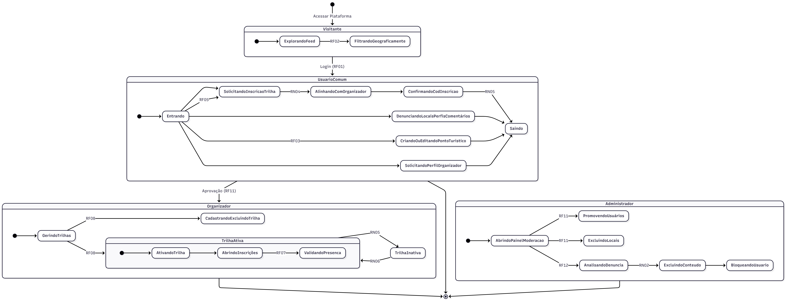
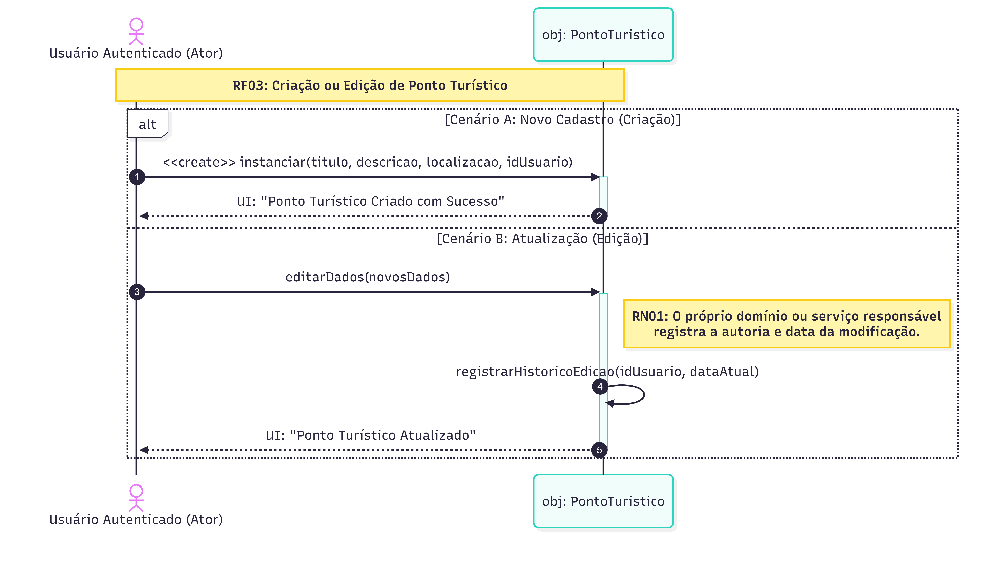
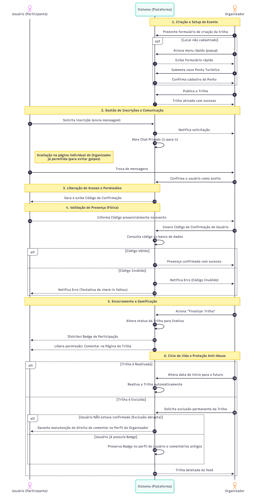
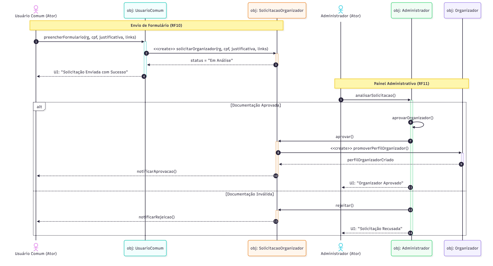
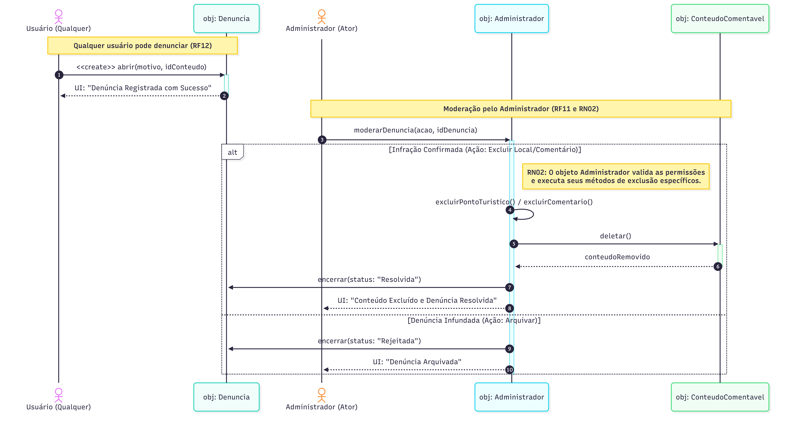

# 2.2. Módulo Notação UML – Modelagem Dinâmica

## Introdução

A **Modelagem Dinâmica na UML (Unified Modeling Language)** descreve o comportamento de um sistema ao longo do tempo, evidenciando como objetos, atores e componentes interagem, mudam de estado e controlam o fluxo de execução.

Seu propósito é representar o que ocorre durante a execução de processos, casos de uso ou operações, permitindo compreender de maneira clara como o sistema responde a estímulos internos e externos. Essa compreensão antecipada é essencial para prever inconsistências, reduzir ambiguidades e evitar possíveis falhas na **Plataforma de Belezas Naturais e Trilhas**.

---

## Metodologia

Embora diversas técnicas de modelagem possam ser aplicadas nessa fase, a escolha pelos **Diagramas de Estados** e de **Sequência** não foi arbitrária; ambos foram selecionados para cobrir lacunas que a modelagem estática (como o Diagrama de Classes) não alcança ([SERRANO, 2026](#referências-bibliográficas))::

* **Diagrama de Estados:** Foi essencial para mapear a complexa hierarquia de permissões da plataforma. Como o sistema possui transições críticas de papéis (ex: de Usuário Comum para Organizador), o diagrama de estados permitiu visualizar as pré-condições e os gatilhos que alteram o comportamento do objeto `Usuario`, garantindo que funcionalidades restritas não sejam acessadas indevidamente.
* **Diagramas de Sequência:** Foram aplicados aos fluxos de maior valor de negócio e risco técnico. Ao detalhar a troca de mensagens entre objetos ao longo do tempo, conseguimos validar a viabilidade de regras complexas, como a **RN05** (entrega de badges apenas após validação física) e a governança de denúncias, assegurando que a lógica de programação suporte as interações descritas nos Casos de Uso.

---

### 2.2.1. Diagrama de Estados

O diagrama de estados modela o ciclo de vida e as transições de permissões do usuário dentro da plataforma **Belezas Naturais Brasileiras**. Ele utiliza **Estados Compostos** para segregar as funcionalidades disponíveis de acordo com o nível de autenticação e o papel (*role*) assumido pelo ator (RF01, RF02, RF04).

A lógica central baseia-se na progressão de privilégios: o fluxo inicia-se no estado **Visitante**, onde as ações são limitadas à visualização. Após a autenticação via `Login (RF02)`, o usuário transita para o estado **Usuário Comum**, que encapsula as interações de consumo e participação. A partir deste, é possível transitar para estados de gestão especializada (**Organizador** ou **Administrador**) conforme o perfil e as permissões validadas pelo sistema.

**Fluxo de Estados:**

1.  **Visitante:** Estado inicial onde o usuário navega pelo feed e visualiza pontos turísticos.
2.  **Usuário Comum:** Acessado via login. Permite gerenciar perfil, interagir com conteúdos (RF05), gerenciar pontos turísticos (RF03) e solicitar perfil de Organizador.
3.  **Organizador:** Estado focado na gestão de trilhas. Inclui sub-estados para cadastro de trilhas (RF06) e o ciclo de vida de uma **Trilha Ativa** (Acessar trilha → Abrir inscrições → Validar presença).
4.  **Administrador:** Estado de governança. Permite o gerenciamento de usuários (RF10), exclusão de contas e moderação de conteúdo (RF12) com bloqueio de usuários.

> **Ferramenta utilizada:** [Mermaid.js](https://mermaid.js.org/) 

### 2.2.2. Diagrama de Sequência — Criação e Edição de Ponto Turístico
 
O diagrama modela o fluxo de **criação e edição de pontos turísticos** (RF03, RN01), cobrindo dois cenários alternativos: o cadastro de um novo ponto e a atualização de um ponto já existente. Em ambos os casos, o ator principal é o **Usuário Autenticado**, que interage diretamente com o objeto `PontoTuristico`.
 
O cenário de edição destaca a aplicação da regra de negócio **RN01**: ao editar um ponto turístico, o próprio domínio registra automaticamente a autoria e a data da modificação por meio do método `registrarHistoricoEdicao`, garantindo rastreabilidade completa das alterações sem depender de chamadas externas.

**Fluxo principal:**
1. UsuárioComum → Sistema: `solicitarParticipação(trilhaId)`
2. Sistema → Organizador: `notificarSolicitação(usuárioId)`
3. Organizador → Sistema: `confirmarParticipante(usuárioId)`
4. Sistema → UsuárioComum: `emitirCódigoPresença(código único)`
5. [No dia do evento] Organizador → Sistema: `validarCódigo(código)`
6. Sistema → ServiçoDeBadge: `distribuirBadge(usuárioId, trilhaId)`
7. Sistema → UsuárioComum: `notificarBadge()`

> **Ferramenta utilizada:** [Mermaid.js](https://mermaid.js.org/) 

---

### 2.2.3. Diagrama de Sequência — Fluxo de Gestão e Inscrição em Trilhas

O diagrama modela o fluxo de **gestão e inscrição em trilhas** (RF05, RF06, RF07, RF09), cobrindo os cenários completos desde a criação do evento até a validação presencial e o seu encerramento. Os atores principais são o **Usuário (Participante)** e o **Organizador**, que interagem diretamente com o **Sistema (Plataforma)**.

O cenário destaca a aplicação de regras de negócio fundamentais para a segurança do ecoturismo: a **RN03** garante que a comunicação ocorra exclusivamente em um chat privado 1-para-1 (bloqueando golpes e cobranças indevidas), e a **RN05** assegura que a distribuição da *badge* de participação ocorra de forma automatizada apenas após o organizador acionar a finalização da trilha com o código validado no *check-in* físico. O modelo também prevê os fluxos alternativos de proteção anti-abuso caso a trilha seja excluída prematuramente.

**Fluxo principal:**
1. Organizador → Sistema: `criarTrilha(dados)` (com opção iterativa de `submeterNovoPontoTuristico()`)
2. Usuário → Sistema: `solicitarInscricao(mensagem)`
3. Sistema → Organizador: `notificarSolicitacao(usuárioId)` e instanciar Chat Privado 1-para-1
4. Organizador → Sistema: `confirmarAceite(usuárioId)`
5. Sistema → Usuário: `emitirCodigoConfirmacao(código único)`
6. [No dia do evento] Organizador → Sistema: `inserirCodigoConfirmacao(código)` fornecido pelo usuário
7. Sistema → Organizador/Usuário: `validarPresenca(código)` (retornando sucesso ou notificando erro em caso de código inválido)
8. Organizador → Sistema: `finalizarTrilha()`
9. Sistema → ServiçoDeGamificacao: `distribuirBadge(usuárioId)` e liberar permissão de comentários na página da trilha

### V2 Considerando o Feedback da Equipe 

### O que mudou?

Depois de analizar o feedback da equipe e conversarmos calmamente na reunião do dia 22/4 passando pelo diagrama com calma, vimos que todos os feedbacks que falavam sobre a sobrecarda de informações não eram tão legitimos assim, ja que o Diagrama Sequencial é muito embasado na interação do usuário com o sistema. No entanto, vimos que a parte de "aciona menu rápido" era realmente desnecessária, porque a resposta do sistema ja está tratando o caso de ele não encontrar o ponto turistico pelo qual a trilha irá passar. 

---

### V1 incial

> **Ferramentas utilizadas:** [Mermaid.js](https://mermaid.js.org/) 
---

### 2.2.4. Diagrama de Sequência — Fluxo de Upgrade de Conta Solicitação de Organizador

O fluxo de upgrade para Organizador no BelezasNaturaisBrasileiras é um processo estruturado em duas etapas principais que garantem segurança e controle rígido de permissões. Inicialmente, o usuário comum submete seus dados (como RG, CPF, justificativa e links) por meio da interface, instruindo o sistema a instanciar um objeto `SolicitacaoOrganizador` que assume o status de "Em Análise". A partir desse momento, a responsabilidade é transferida para o Administrador, que avalia a requisição através de seu painel de controle. O fluxo adota então uma ramificação condicional: se a documentação for validada, a classe `Administrador` orquestra a aprovação, o que dispara imediatamente a criação do novo perfil `Organizador` e notifica o usuário sobre o sucesso da promoção. Por outro lado, caso a documentação não atenda aos critérios, a solicitação é rejeitada pelo administrador e o usuário recebe um aviso informando a recusa, encerrando o ciclo de forma clara e sem alterar os privilégios da conta original.

**Fluxo Principal: Upgrade para Organizador (Aprovação)**

**Fase 1: Envio do Formulário (RF10)**

1. O **Usuário Comum** preenche o formulário na interface fornecendo seus dados (RG, CPF, justificativa e links).
2. O objeto `UsuarioComum` aciona a criação de uma nova `SolicitacaoOrganizador` contendo essas informações.
3. A solicitação é registrada e retorna o status de "Em Análise".
4. A interface exibe a mensagem de confirmação para o usuário: *"Solicitação Enviada com Sucesso"*.

**Fase 2: Painel Administrativo e Aprovação (RF11)**

1. O **Administrador** acessa o painel e aciona a análise da solicitação recebida.
2. Ao constatar que a documentação é válida, o objeto `Administrador` inicia o processo de aprovação (`aprovarOrganizador()`).
3. O objeto `Administrador` altera o status da `SolicitacaoOrganizador` para aprovado.
4. A `SolicitacaoOrganizador` envia o comando para instanciar/promover o perfil para `Organizador`.
5. O objeto `Organizador` é criado com sucesso e confirma a ação.
6. O sistema envia uma notificação de aprovação para o Usuário Comum.
7. A interface do Administrador exibe a mensagem de conclusão: *"Organizador Aprovado"*.

> **Ferramenta utilizada:** [Mermaid.js](https://mermaid.js.org/) 

### 2.2.5. Diagrama de Sequência — Fluxo de Moderação e Governança

O fluxo de Moderação e Governança assegura a integridade da plataforma ao permitir que qualquer usuário abra uma denúncia contra um ponto turístico ou comentário, gerando um registro que fica pendente de análise. A partir desse ponto, o Administrador assume o controle através de seu painel gerencial, avaliando o mérito da solicitação. O fluxo então se divide em dois cenários distintos geridos pelas regras de negócio: se a infração for confirmada, o objeto Administrador valida suas permissões exclusivas para invocar a deleção no conteúdo alvo e encerra a denúncia como resolvida; por outro lado, se a denúncia for considerada infundada, o administrador simplesmente a rejeita e arquiva, garantindo que o conteúdo original permaneça intacto e que todas as ações de moderação fiquem devidamente registradas no sistema.

**Fluxo Principal: Moderação e Governança (Denúncias)**

**Fase 1: Criação da Denúncia (RF12)**

1. Um **Usuário (Qualquer)** interage com a interface e aciona a criação de uma denúncia, fornecendo o motivo e o ID do conteúdo alvo (`idConteudo`).

2. O objeto `Denuncia` é instanciado no sistema, e a interface exibe a mensagem de confirmação para o usuário: "Denúncia Registrada com Sucesso".

**Fase 2: Moderação pelo Administrador (RF11 e RN02)**

3. O **Administrador** acessa o painel gerencial e envia o comando para moderar a denúncia (`moderarDenuncia`), passando a ação desejada e o ID da denúncia. A partir daqui, o sistema avalia qual caminho seguir:

**Caminho A: Infração Confirmada (Ação de Excluir)**

4. O objeto Administrador verifica as permissões de exclusividade (Regra RN02) e chama seu método interno correspondente (`excluirPontoTuristico()` ou `excluirComentario()`).
5. O objeto Administrador envia o comando `deletar()` diretamente para a classe pai `ConteudoComentavel`.
6. A classe `ConteudoComentavel` processa a exclusão no banco de dados e retorna a confirmação de que o conteúdo foi removido.
7. O objeto `Administrador` atualiza o objeto `Denuncia`, encerrando-a com o status de "Resolvida".
8. A interface do painel exibe para o Administrador a mensagem: "Conteúdo Excluído e Denúncia Resolvida".

**Caminho B: Denúncia Infundada (Ação de Arquivar)**

9. O Administrador decide que a denúncia não procede. O objeto `Administrador` então atualiza direto o objeto `Denuncia`, encerrando-a com o status de "Rejeitada".
10. A interface do painel exibe para o Administrador a mensagem: *"Denúncia Arquivada"*, mantendo o conteúdo original intacto na plataforma.

> **Ferramenta utilizada:** [Mermaid.js](https://mermaid.js.org/) 

## Participantes

| Aluno                                               | Participação                                                                             |
| --------------------------------------------------- | ---------------------------------------------------------------------------------------- |
| [Mateus Magno](https://github.com/mtsmgn0) |Participação na revisão de todos os diagramas, contribuíndo com feedback ativo e criticas cosntrutivas. Produção direta do diagrama sequencial do Fluxo de Gestão e Inscrição em Trilhas |
| [Mário Vinícius](https://github.com/MarioViniciusBC) |Responsável por criar os diagramas de sequência dos módulos de Moderação/Governança e Upgrade para Organizador. Colaborou também com a revisão técnica e o refinamento dos diagramas gerados pelos colegas, assegurando a consistência do projeto. |
| [Antonio Carvalho](https://github.com/antonioscarvalho) | Atuou com pontos detalhados de melhoria nos diagramas em geral, fornecendo ideias, ponderamentos e revisão colaborativa. Foi responsável direto pelo auxílio na criação do Diagrama de Estados e do Diagrama de Sequência — Criação e Edição de Ponto Turístico. |

---

## Tabela de Feedbacks

Ao longo do desenvolvimento dos diagramas, para garantir a participação de todos os membros da equipe, fizemos: primeiro de maneira assincrona, mas então em uma reunião juntos com a participação de todos os membros da equipe, a análise dos diagramas e a filtragem desses feedbacks. Para a parte de modelagem dinâmica, cada membro do grupo que não participou da modelagem dos diagramas contribuíu com feedbacks construtivos na parte tanto dos documentos quanto dos artefatos.

### Documentação e Estrutura da Página

| Membro da Equipe           | Artefato Avaliado  | Feedback Exato                                                                                                                                                                                                                                                                                                                                                                                                                                                                                                                                                                                                                                                                                                 | Análise e Ação (Acatado / Não Acatado / Justificativa)                                                                                                                                     |
| :------------------------- | :----------------- | :------------------------------------------------------------------------------------------------------------------------------------------------------------------------------------------------------------------------------------------------------------------------------------------------------------------------------------------------------------------------------------------------------------------------------------------------------------------------------------------------------------------------------------------------------------------------------------------------------------------------------------------------------------------------------------------------------------- | :----------------------------------------------------------------------------------------------------------------------------------------------------------------------------------------- |
| **Ana Luiza Pfeilsticker** | Documentação Geral | "A página está muito organizada, todas as imagens dos diagramas estão nítidas, o detalhamento também está adequado. Gostei bastante dos créditos para a inteligência artificial, acredito que tenha sido usada de forma proveitosa e agregou na entrega. Adicionaria no histórico de revisões o detalhamento dessas revisões: o que foi revisado, quais foram os pontos de melhoria levantados e que nas próximas versões foram aprimorados."                                                                                                                                                                                                                                                                  | **Acatado.** O histórico de versões será padronizado e passará a detalhar exatamente o que foi revisado, quais melhorias foram identificadas e como foram aplicadas nas versões seguintes. |
| **Miguel Arthur**          | Documentação Geral | "A página do Foco 2 é um excelente exemplo de como justificar a Metodologia. A explicação do ‘porquê’ escolhemos o Diagrama de Estados (para gerenciar a transição de papéis) e o de Sequência (para os fluxos críticos) mostra muita maturidade no desenho do software."                                                                                                                                                                                                                                                                                                                                                                                                                                      | **Observação (Feedback Positivo).** Valida as decisões metodológicas adotadas pela equipe.                                                                                                 |
| **Paulo Filho**            | Documentação Geral | "A página está muito bem estruturada e bem organizada, apresenta textos claros de se entender. Gostei bastante das motivações pelo qual escolheu cada tipo de diagrama e como foi representado em todos os diagramas uma conexão com os requisitos do projeto. Única ressalva sobre o histórico de versões que não está padronizado"                                                                                                                                                                                                                                                                                                                                                                           | **Acatado.** O histórico de versões será revisado para seguir um padrão consistente em toda a documentação.                                                                                |
| **Vitor Hoffmann**         | Documentação Geral | "A página está muito bem estruturada e a justificativa para a escolha dos diagramas (Estados e Sequência) demonstra bastante maturidade na nossa arquitetura. As imagens estão nítidas e foi legal incluir os créditos do uso de IA. Como pontos de melhoria, concordo que precisamos padronizar o histórico de versões e detalhar melhor o que exatamente foi alterado e aprimorado entre as revisões."                                                                                                                                                                                                                                                                                                       | **Acatado.** O histórico será padronizado e enriquecido com descrições claras das mudanças entre versões.                                                                                  |
| **Heloisa Silva**          | Documentação Geral | "Gostei bastante da organização da página, pois ela está bem estruturada e facilita a compreensão do conteúdo apresentado. As citações ao longo do texto estão adequadas às normas da ABNT, além de manterem coerência com os elos dos requisitos elicitados na etapa anterior, o que demonstra cuidado na construção do trabalho. Acredito que, para deixá-lo ainda mais completo, seria interessante adicionar uma seção de motivação, explicando de forma mais clara o propósito e a relevância do tema abordado. Isso contribuiria para contextualizar melhor o leitor e fortalecer a introdução do trabalho."                                                                                             | **Não Acatado.** O grupo decidiu que a página já possui motivações suficientes distribuídas ao longo do texto, não sendo necessária uma seção adicional.                                   |
| **Breno Alexandre**        | Documentação Geral | "O documento está bem completo e detalhado, com boa organização entre introdução, metodologia e descrição dos diagramas, além de deixar claro o vínculo com requisitos funcionais e regras de negócio. A explicação dos fluxos é consistente e ajuda bastante na compreensão da lógica do sistema, especialmente nos cenários de trilhas, moderação e upgrade de conta. A presença de versões, histórico e participação dos membros também fortalece a transparência do trabalho. Como ponto de melhoria, em alguns trechos há excesso de detalhamento textual nos fluxos de sequência, o que pode deixar a leitura um pouco longa, mas no geral o documento está bem estruturado e tecnicamente consistente." | **Observação.** Não gera ação direta nesta seção; melhoria considerada nos diagramas de sequência.                                                                                         |

---

### Diagrama de Estados

| Membro da Equipe           | Artefato Avaliado   | Feedback Exato                                                                                                                                                                                                                                                                                                                                                                                                                                                                                                                                                                                                                                             | Análise e Ação                                                                                                                                                                                                                                    |
| :------------------------- | :------------------ | :--------------------------------------------------------------------------------------------------------------------------------------------------------------------------------------------------------------------------------------------------------------------------------------------------------------------------------------------------------------------------------------------------------------------------------------------------------------------------------------------------------------------------------------------------------------------------------------------------------------------------------------------------------- | :------------------------------------------------------------------------------------------------------------------------------------------------------------------------------------------------------------------------------------------------ |
| **Ana Luiza Pfeilsticker** | Diagrama de Estados | "O diagrama está nítido, gostei da forma como ele traz o ator visitante e realmente mostra a progressão de roles. Acredito apenas que, após o login, não necessariamente o visitante é um usuário comum. Após a criação da conta ele se torna um usuário comum. No caso do login, o visitante pode ser apenas um admin que não está logado, e após o login ele passa para seus privilégios de administrador. Acredito que o fluxo apresente mais sentido trocando login por criação de conta."                                                                                                                                                             | **Acatado.** O gatilho será alterado de "Login" para "Criação de Conta".                                                                                                                                                                          |
| **Paulo Filho**            | Diagrama de Estados | "O diagrama apresenta uma ótima hierarquia visual (Visitante, Usuário Comum, Organizador e Administrador) e apresenta um ótimo fluxo dos estados. Gostei bastante do estado Trilha Ativa, tornando bem mais claro o ciclo que apresenta dentro do estado Organizador. As transições de um estado para o outro mostrando os requisitos é uma ótima ideia, mas acredito que ficaria mais intuitivo e fácil de ler o diagrama se também colocasse o nome do evento que causa essa transição e colocar o nome nas transições finais também ajudaria na clareza do diagrama."                                                                                   | **Acatado.** Serão adicionados os nomes dos eventos em todas as transições para melhorar a clareza.                                                                                                                                               |
| **Vitor Hoffmann**         | Diagrama de Estados | "A hierarquia visual entre Visitante, Usuário Comum, Organizador e Administrador ficou excelente. Concordo com a observação da Ana: a transição de Visitante para Usuário Comum faz mais sentido ser engatilhada por "Criação de Conta" em vez de "Login", já que administradores também fazem login. Além disso, adicionar o nome dos eventos que causam as transições deixará o fluxo bem mais intuitivo de ler."                                                                                                                                                                                                                                        | **Acatado.** Consolida as alterações de gatilho e nomeação de eventos.                                                                                                                                                                            |
| **Heloisa Silva**          | Diagrama de Estados | "Na minha avaliação, o diagrama está bem estruturado e demonstra um bom entendimento do sistema como um todo. A separação por papéis (Visitante, Usuário Comum, Organizador e Administrador) facilita a leitura e evidencia claramente as responsabilidades de cada ator. Além disso, a associação com requisitos funcionais (RFs) e regras de negócio (RNs) ao longo das transições é um ponto forte, pois garante rastreabilidade. Por outro lado, o diagrama está visualmente carregado, com muitas transições e cruzamentos, o que pode dificultar a compreensão. Dividir em diagramas menores poderia melhorar a clareza."                            | **Não Acatado.** A divisão foi considerada inviável, para manter a visão integrada do fluxo. Depois de analisarmos a crítica em grupo, o consenso foi de que estava perfeitamente intuitivo e limpo visualmente, de acordo com o modelo proposto. |
| **Breno Alexandre**        | Diagrama de Estados | "O diagrama de estados está bem estruturado e consegue representar de forma clara a progressão de permissões do usuário dentro da plataforma, deixando evidente a transição entre Visitante, Usuário Comum, Organizador e Administrador. A ideia de usar estados compostos ajuda bastante na organização das funcionalidades e na separação de responsabilidades. Também é positivo que o fluxo esteja alinhado com regras de negócio e requisitos funcionais, o que deixa o modelo mais próximo da implementação real. No geral, o diagrama cumpre bem o papel de mostrar o ciclo de vida do usuário e as mudanças de comportamento ao longo do sistema." | **Observação (Feedback Positivo).** Valida a estrutura e a aderência do diagrama aos requisitos do sistema.                                                                                                                                       |

---

### Diagrama de Sequência (Criação e Edição de Ponto Turístico)

| Membro da Equipe           | Artefato Avaliado | Feedback Exato                                                                                                                                                                                                                                                                                                                                                                                                                                                                                                                          | Análise e Ação                                                                                                                                     |
| :------------------------- | :---------------- | :-------------------------------------------------------------------------------------------------------------------------------------------------------------------------------------------------------------------------------------------------------------------------------------------------------------------------------------------------------------------------------------------------------------------------------------------------------------------------------------------------------------------------------------- | :------------------------------------------------------------------------------------------------------------------------------------------------- |
| **Ana Luiza Pfeilsticker** | Sequência (RF03)  | "O diagrama está nítido, e a imagem faz sentido com o título, entretanto, não entendi o “Fluxo principal”, ele parece estar falando sobre inscrição de trilhas invés do fluxo de criação e edição de ponto turístico."                                                                                                                                                                                                                                                                                                                  | **Acatado (Correção Crítica).** O texto do fluxo principal será corrigido.                                                                         |
| **Miguel Arthur**          | Sequência (RF03)  | "Faço coro à observação da Ana sobre o texto do "Fluxo principal" está divergente da imagem, descrevendo uma inscrição em vez da criação do local. Precisamos corrigir esse texto com urgência para não quebrar a rastreabilidade com o nosso RF03. Observando o diagrama em si, a estrutura está boa, mas recomendo garantirmos que a mensagem de "edição" explicite a gravação do log de versionamento no banco de dados, cumprindo estritamente a nossa Regra de Negócio (RN01)."                                                    | **Acatado.** Correção do fluxo + inclusão explícita do log de versionamento (RN01).                                                                |
| **Paulo Filho**            | Sequência (RF03)  | "O diagrama está bem feito e fácil de acompanhar, apresenta muito claramente a ideia geral do RF03. O fluxo principal apresentado na pagina parece estar falando sobre outro tópico que seria o de se inscrever e realizar uma trilha."                                                                                                                                                                                                                                                                                                 | **Acatado.** Reforça a necessidade de correção do fluxo principal para manter consistência com o RF03.                                             |
| **Vitor Hoffmann**         | Sequência (RF03)  | "O diagrama em si está bom, mas temos um problema crítico na documentação: o texto do "Fluxo principal" está descrevendo a inscrição em trilhas, e não a criação/edição do ponto. Precisamos corrigir isso com urgência para manter a rastreabilidade com o RF03. Na parte técnica, é importante explicitarmos a gravação do log de versionamento na mensagem de edição para cumprirmos a regra de negócio (RN01)."                                                                                                                     | **Acatado.** Consolida os ajustes críticos de documentação e regra de negócio.                                                                     |
| **Heloisa Silva**          | Sequência (RF03)  | "A separação em cenários alternativos (criação e edição) utilizando o bloco alt está clara e adequada, facilitando a leitura e o entendimento dos diferentes fluxos possíveis dentro do mesmo requisito. Alguns pontos que podem ser melhorados. Primeiro, o diagrama apresenta apenas o ator e o objeto de domínio (PontoTuristico), mas não explicita uma camada intermediária, como um controlador ou serviço de aplicação."                                                                                                         | **Não Acatado.** A modelagem foi mantida mais abstrata propositalmente, sem detalhar camadas arquiteturais intermediárias neste nível de diagrama. |
| **Breno Alexandre**        | Sequência (RF03)  | "O diagrama apresenta de forma clara o fluxo de criação e edição de pontos turísticos, deixando bem definido o papel do usuário autenticado e a interação com o sistema. A separação entre criação e atualização ajuda a entender os dois cenários possíveis, e a inclusão da regra de negócio de rastreabilidade (registro de histórico de edição) é um ponto positivo, pois reforça a integridade das informações. No geral, o fluxo está coerente e bem estruturado, com boa representação da lógica de interação entre os objetos." | **Observação (Feedback Positivo).** Valida a clareza e a coerência do fluxo modelado.                                                              |

---

### Diagrama de Sequência (Upgrade de Conta)

| Membro da Equipe           | Artefato Avaliado | Feedback Exato                                                                                                                                                                                                                                                                                                                                                                                                                                                                                                                            | Análise e Ação                                               |
| :------------------------- | :---------------- | :---------------------------------------------------------------------------------------------------------------------------------------------------------------------------------------------------------------------------------------------------------------------------------------------------------------------------------------------------------------------------------------------------------------------------------------------------------------------------------------------------------------------------------------- | :----------------------------------------------------------- |
| **Ana Luiza Pfeilsticker** | Sequência Upgrade | "O diagrama está nítido, e a imagem faz sentido com o título. A explicação do fluxo está boa, gostei da construção coerente da ramificação dos dois momentos do fluxo. Ele está enxuto, não vejo pontos de ajuste."                                                                                                                                                                                                                                                                                                                       | **Observação (Feedback Positivo).** Nenhuma ação necessária. |
| **Miguel Arthur**          | Sequência Upgrade | "Estrutura impecável. A ramificação condicional e o tratamento dos fluxos ilustram perfeitamente a barreira de segurança que definimos na arquitetura. Fica muito claro visualmente como o sistema bloqueia o escalonamento de privilégios e só concede os acessos de Organizador (RBAC) após a validação rigorosa dos comprovantes. Sem pontos de ajuste."                                                                                                                                                                               | **Observação (Feedback Positivo).** Nenhuma ação necessária. |
| **Vitor Hoffmann**         | Sequência Upgrade | "Ambos estão impecáveis. O fluxo de upgrade ilustra perfeitamente as barreiras de segurança e a validação do nosso RBAC, enquanto a divisão por fases no diagrama de moderação prova que isolamos as ações do Administrador muito bem. Sem ressalvas nesses dois."                                                                                                                                                                                                                                                                        | **Observação (Feedback Positivo).** Nenhuma ação necessária. |
| **Paulo Filho**            | Sequência Upgrade | "O diagrama apresenta um fluxo claro, bem organizado e fácil de acompanhar. O uso de alt foi adequado para representar os cenários de aprovação e rejeição, e as lifelines ajudam a entender bem a interação entre usuário, administrador e sistema. Além disso, o fluxo está coerente com a regra de negócio de promoção para organizador."                                                                                                                                                                                              | **Observação (Feedback Positivo).** Nenhuma ação necessária. |
| **Breno Alexandre**        | Sequência Upgrade | "O diagrama está bem organizado e representa de forma clara o processo de solicitação e aprovação de upgrade de conta. O fluxo está dividido corretamente entre envio da solicitação pelo usuário e análise do administrador, o que facilita a compreensão do processo. A definição de estados da solicitação (em análise, aprovado ou rejeitado) ajuda a deixar o fluxo mais consistente e rastreável. No geral, é um diagrama bem estruturado, com boa separação de responsabilidades e alinhado ao funcionamento esperado do sistema." | **Observação (Feedback Positivo).** Nenhuma ação necessária. |

### Diagrama de Sequência (Fluxo de Gestão e Inscrição em Trilhas)

| Membro da Equipe           | Artefato Avaliado | Feedback Exato                                                                                                                                                                                                                                                                                                                                                                                                                                                                                                                                           | Análise e Ação                                                                                                              |
| :------------------------- | :---------------- | :------------------------------------------------------------------------------------------------------------------------------------------------------------------------------------------------------------------------------------------------------------------------------------------------------------------------------------------------------------------------------------------------------------------------------------------------------------------------------------------------------------------------------------------------------- | :-------------------------------------------------------------------------------------------------------------------------- |
| **Ana Luiza Pfeilsticker** | Sequência Trilhas | "O diagrama está nítido, e a imagem faz sentido com o título. A explicação geral do fluxo está ótima e o diagrama está com um nível de detalhes muito bom, não vejo muitos ajustes necessários. Acredito apenas que de para deixar um pouco mais direto ao ponto, tirando por exemplo o “aciona menu rápido” e a duplicidade entre “submete novo ponto” e “confirma ponto turístico”, acredito que tudo isso esteja englobado na ação de “submeter novo ponto”."                                                                                         | **Acatado.** No entanto vimos que muito do que foi pedido para ser simplificado na verdade era necessário, sobrando somente um ponto que realmente necessetaria de alteração.                 |
| **Miguel Arthur**          | Sequência Trilhas | "O diagrama está muito rico em regras de negócio e reflete bem o nosso MVP. Concordo com a Ana sobre a oportunidade de simplificação. Em diagramas de sequência, o foco deve ser a troca de mensagens entre as camadas da aplicação (Frontend, API e Banco de Dados). Podemos agrupar etapas que são apenas interações de interface do usuário, como "acionar menu", e focar nas requisições reais que alteram o estado do sistema. Isso deixará o diagrama mais limpo e focado na arquitetura."                                                         | **Acatado** Vimos que na verdade o diagrama ja segue esses modelos como um todo, mas o ponto em si que foi comentado "acionar menu" realmente era desnecessário.  |
| **Paulo Filho**            | Sequência Trilhas | "O fluxo do diagrama está bem detalhado e cobre o processo de ponta a ponta e ainda apresentou uma boa organização fazendo a divisão em etapas numeradas ajudando bastante na leitura."                                                                                                                                                                                                                                                                                                                                                                  | **Observação (Feedback Positivo).** Valida a organização e clareza do fluxo apresentado.                                    |
| **Vitor Hoffmann**         | Sequência Trilhas | "O fluxo está super detalhado e mapeia muito bem o processo de ponta a ponta. Para deixar o diagrama mais limpo e focado na arquitetura, concordo com a ideia de simplificarmos as etapas que são apenas interações de interface (como "acionar menu rápido") e focar nas trocas de mensagens reais entre o Frontend, a API e o Banco."                                                                                                                                                                                                                  | **Não Acatado.** O exemplo especifico que foi dado será acatado, mas a ideia geral não procede. O diagrama sequencial precisa, de fato, mostrar a interação do usuário com o sistema.                                               |
| **Breno Alexandre**        | Sequência Trilhas | "O diagrama está bem completo e representa de forma consistente o ciclo de vida da trilha, desde a criação até a validação e finalização. O fluxo de inscrição e confirmação de participantes está claro, assim como a interação entre usuário, organizador e sistema. A presença de regras de negócio como comunicação via chat privado e distribuição automática de badges fortalece o modelo. No geral, é um diagrama bem detalhado e alinhado com os requisitos do sistema, mostrando boa evolução do estado da trilha e das interações envolvidas." | **Observação (Feedback Positivo).** Valida a completude e aderência do diagrama aos requisitos do sistema.                  |

---

### Diagrama de Sequência (Fluxo de Moderação e Governança)

| Membro da Equipe           | Artefato Avaliado   | Feedback Exato                                                                                                                                                                                                                                                                                                                                                                                                                                                                                                                                                                 | Análise e Ação                                                                                              |
| :------------------------- | :------------------ | :----------------------------------------------------------------------------------------------------------------------------------------------------------------------------------------------------------------------------------------------------------------------------------------------------------------------------------------------------------------------------------------------------------------------------------------------------------------------------------------------------------------------------------------------------------------------------- | :---------------------------------------------------------------------------------------------------------- |
| **Ana Luiza Pfeilsticker** | Sequência Moderação | "O diagrama está nítido, e a imagem faz sentido com o título. A explicação do fluxo está boa, também gostei da divisão por fases."                                                                                                                                                                                                                                                                                                                                                                                                                                             | **Observação (Feedback Positivo).** Valida a clareza e organização do fluxo.                                |
| **Miguel Arthur**          | Sequência Moderação | "A divisão por fases facilitou imensamente a leitura técnica. Esse fluxo é o núcleo da nossa segurança operacional. Mostrar de forma gráfica o isolamento das ações restritas do Administrador prova que a nossa lógica de autorização está blindada e alinhada com o que projetamos nos Casos de Uso. Excelente trabalho arquitetural."                                                                                                                                                                                                                                       | **Observação (Feedback Positivo).** Reforça a qualidade arquitetural e a aderência às regras de segurança.  |
| **Vitor Hoffmann**         | Sequência Moderação | "Ambos estão impecáveis. O fluxo de upgrade ilustra perfeitamente as barreiras de segurança e a validação do nosso RBAC, enquanto a divisão por fases no diagrama de moderação prova que isolamos as ações do Administrador muito bem. Sem ressalvas nesses dois."                                                                                                                                                                                                                                                                                                             | **Observação (Feedback Positivo).** Confirma a consistência da modelagem com o RBAC e segurança do sistema. |
| **Paulo Filho**            | Sequência Moderação | "O diagrama está bem estruturado e representa com clareza os dois caminhos principais da moderação. O uso de alt foi uma escolha acertada, pois facilita a visualização dos cenários de denúncia procedente e infundada. Também se destaca a boa evidência da regra RN02 e a organização das interações entre denúncia, administrador e conteúdo moderado."                                                                                                                                                                                                                    | **Observação (Feedback Positivo).** Valida o uso adequado de alt e a clareza dos fluxos de decisão.         |
| **Breno Alexandre**        | Sequência Moderação | "O diagrama está bem construído e representa de forma clara o processo de denúncia e moderação de conteúdo na plataforma. O fluxo está bem dividido entre criação da denúncia pelo usuário e análise do administrador, deixando evidente as possíveis decisões (remoção do conteúdo ou arquivamento da denúncia). A separação dos cenários ajuda na compreensão das regras de negócio envolvidas e reforça a consistência do sistema em termos de governança e controle de conteúdo. No geral, é um fluxo bem definido e coerente com os objetivos da moderação na aplicação." | **Observação (Feedback Positivo).** Valida a coerência e robustez do fluxo de moderação.                    |

---

## Apoio Tecnológico e Agradecimentos

Este documento contou com o suporte da inteligência artificial **Gemini (Google)** como ferramenta auxiliar no processo de documentação e refinamento técnico, edição e produção de alguns dos textos e formatação. A colaboração deu-se especificamente nos seguintes pontos:

* **Síntese de Ideias:** Auxílio na estruturação textual dos fluxos dinâmicos, garantindo que a descrição dos diagramas estivesse alinhada às Regras de Negócio (RN) e Requisitos Funcionais (RF) estabelecidos.
* **Edição e Padronização:** Suporte na revisão gramatical e na formatação Markdown para o *GitHub Pages*, assegurando a coesão visual e técnica entre as seções produzidas pelos diferentes integrantes do grupo.
* **Refinamento de Modelagem:** Apoio na análise crítica das transições de estados e interações de sequência, contribuindo para uma documentação mais clara e objetiva para desenvolvedores e revisores.
* **Auxilio de Formatação:** Ajuda para a conversão dos textos no formato markdown agradável de ler e profissional. 

O uso da ferramenta serviu para potencializar a produtividade dos integrantes, mantendo a responsabilidade técnica e a tomada de decisão final sob total controle dos membros do **Grupo 05**.

---

### 2.4. Conclusão

A elaboração da **Modelagem Dinâmica** para a Entrega 02 permitiu ao **Grupo 05** antecipar desafios de implementação que seriam invisíveis em uma análise puramente estática. Através da representação temporal das interações e da gestão de estados, foi possível refinar a arquitetura da plataforma **Belezas Naturais Brasileiras**, tornando-a mais robusta e segura.

A integração entre os diagramas de sequência e o de estados demonstra que o sistema possui um fluxo lógico consistente, onde a segurança e a rastreabilidade (especialmente na edição de pontos turísticos e moderação de conteúdo) são nativas ao design da solução. Esta etapa consolida a base necessária para o desenvolvimento das próximas fases, garantindo que a equipe possua um "mapa de execução" claro para a construção do código-fonte.

---

## Referências Bibliográficas

> SERRANO, Milene. **Material do Aprender - Módulo Notação UML - Modelagem Dinâmica**. [S.l.]: Milene Serrano, 2026.

> FOWLER, Martin. **UML Distilled: A Brief Guide to the Standard Object Modeling Language**. 3. ed. Boston: Addison-Wesley, 2003.

---

## Planilha de Versionamento

| Versão | Data | Descrição | Autor(es) | Revisor(es) | Detalhamento da Revisão |
|--------|------|-----------|-----------|-------------|--------------------------|
| `1.0` | 21/04/2026 | Criação do documento de Modelagem Dinâmica. | [Antonio Carvalho](https://github.com/antonioscarvalho) | [Mateus Magno](https://github.com/mtsmgn0) | **Revisão aprovada:** Estrutura inicial validada com introdução da modelagem dinâmica, definição dos objetivos dos diagramas e organização base do documento. |
| `2.0` | 21/04/2026 | Inserção do diagrama de sequência do fluxo de vida da trilha. | [Mateus Magno](https://github.com/mtsmgn0) | [Mário Vinícius](https://github.com/MarioViniciusBC) | **Revisão aprovada:** Fluxo validado cobrindo o ciclo completo da trilha (criação, inscrição, execução e finalização), com boa organização e alinhamento com requisitos funcionais. |
| `3.0` | 21/04/2026 | Inserção do diagrama de Upgrade de Conta (Solicitação de Organizador). | [Mário Vinícius](https://github.com/MarioViniciusBC) | [Mateus Magno](https://github.com/mtsmgn0) | **Revisão aprovada:** Diagrama validado quanto à representação do fluxo de solicitação e análise de upgrade, garantindo aderência à regra de negócio de controle de privilégios (RBAC). |
| `3.1` | 21/04/2026 | Ilustração do caminho feliz com relação ao fluxo de Upgrade de Conta (Solicitação de Organizador). | [Mário Vinícius](https://github.com/MarioViniciusBC) | [Antonio Carvalho](https://github.com/antonioscarvalho) | **Revisão aprovada:** Caminho feliz validado, destacando claramente o fluxo de aprovação da solicitação e a transição de permissões do usuário. |
| `3.2` | 21/04/2026 | Inserção do diagrama de Moderação e Governança. | [Mário Vinícius](https://github.com/MarioViniciusBC) | [Antonio Carvalho](https://github.com/antonioscarvalho) | **Revisão aprovada:** Fluxo de moderação validado, com correta separação entre denúncia, análise e decisão administrativa, garantindo aderência às regras de governança (RN02). |
| `4.0` | 23/04/2026 | Inserção da tabela de feedbacks para cada um dos diagramas | [Mateus Magno](https://github.com/mtsmgn0) | PREENCHER | **Revisão Solicitada:** Preencher  |
| `4.1` | 23/04/2026 | Atualização do histórico de versões com detalhamento das revisões e padronização conforme feedback da equipe. | [Mateus Magno](https://github.com/mtsmgn0) | PREENCHER | **Revisão solicitada:** Preencher |
