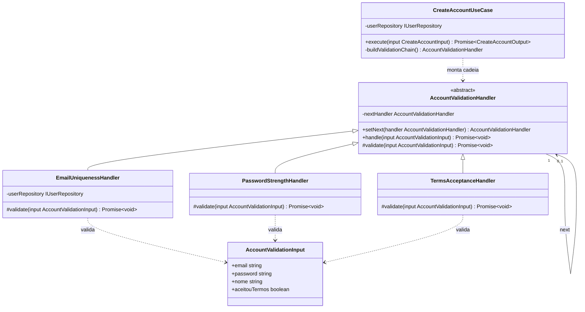

# 3.3.1 Chain of Responsibility

## Participantes

| Matrícula | Nome                                                 | Commits                                                                                                                                                                                                                                                                      |
| :-------- | :--------------------------------------------------- | :--------------------------------------------------------------------------------------------------------------------------------------------------------------------------------------------------------------------------------------------------------------------------- |
| 222015060 | [Ana Luiza](https://github.com/ana-pfeilsticker)     | [a0f336e](https://github.com/UnBArqDsw2026-1-Turma01/2026.1-T01-_G5_BelezasNaturaisBrasileiras_Entrega_01/commit/a0f336e), [271d181](https://github.com/UnBArqDsw2026-1-Turma01/2026.1-T01-_G5_BelezasNaturaisBrasileiras_Entrega_01/commit/271d181) |

## Introdução

O **Chain of Responsibility** é um padrão comportamental que passa um pedido ao longo de uma cadeia de handlers, onde cada um decide se processa o pedido ou o passa adiante. É útil quando você deseja emitir um pedido sem saber qual objeto o processará.

Este padrão permite desacoplar o remetente do receptor, criando uma cadeia de objetos que podem processar o pedido. Cada handler na cadeia possui uma referência ao próximo handler; se não consegue ou não deve tratar a requisição, a encaminha — caso contrário, a trata e pode optar por continuar (ou interromper) a cadeia.

## Quando Aplicar?

- Quando mais de um objeto pode processar um pedido
- Quando você deseja emitir um pedido sem especificar o receptor explicitamente
- Quando o conjunto de objetos que pode processar um pedido deve ser especificado dinamicamente
- Quando um pedido pode precisar de processamento em cascata
- Quando é importante processar pedidos em ordem específica

## Metodologia

O padrão Chain of Responsibility foi aplicado à **validação de criação de conta**. Antes de criar um usuário no Supabase Auth, o `CreateAccountUseCase` precisa garantir que o e-mail seja único, que a senha seja forte o suficiente e que os termos de uso foram aceitos. Sem o padrão, todas essas validações estariam acumuladas no próprio use case, tornando-o difícil de estender e testar.

Com o Chain of Responsibility, cada regra de negócio é encapsulada em um handler independente. O use case monta a cadeia `EmailUniquenessHandler → PasswordStrengthHandler → TermsAcceptanceHandler` via `buildValidationChain()` e simplesmente chama `chain.handle(input)`. Se qualquer handler falhar, uma exceção HTTP adequada é lançada imediatamente e a cadeia é interrompida — o Supabase só é chamado se todas as validações passarem.

A classe abstrata `AccountValidationHandler` implementa o comportamento de encadeamento: `setNext` registra o próximo handler e `handle` chama o método abstrato `validate` antes de delegar ao próximo nó. Isso significa que handlers novos (ex.: verificação de domínio de e-mail bloqueado) podem ser adicionados à cadeia sem modificar nenhuma classe existente.

## Estrutura e Participantes

| Classe                       | Papel no Padrão         | Responsabilidade                                                                                        |
| :--------------------------- | :---------------------- | :------------------------------------------------------------------------------------------------------ |
| `AccountValidationInput`     | Request                 | Objeto de entrada compartilhado por todos os handlers (email, password, nome, aceitouTermos)            |
| `AccountValidationHandler`   | Handler (abstrato)      | Define a interface de encadeamento (`setNext`, `handle`) e delega a validação concreta ao método `validate` |
| `EmailUniquenessHandler`     | Concrete Handler        | Lança `ConflictException` se já existe um usuário com o mesmo e-mail                                   |
| `PasswordStrengthHandler`    | Concrete Handler        | Lança `BadRequestException` se a senha tem menos de 8 caracteres ou não contém dígito                  |
| `TermsAcceptanceHandler`     | Concrete Handler        | Lança `UnprocessableEntityException` se `aceitouTermos !== true`                                        |
| `CreateAccountUseCase`       | Client                  | Monta e executa a cadeia de validação antes de chamar o Supabase Auth                                   |

## Diagrama de Classes



## Descrição das Classes

**`AccountValidationInput`** (`domain/validation/AccountValidationInput.ts`)

Interface TypeScript que tipifica o objeto de entrada percorrido por toda a cadeia. Contém os campos `email`, `password`, `nome` e `aceitouTermos`. Não carrega lógica — é apenas o envelope de dados que cada handler inspeciona.

**`AccountValidationHandler`** (`domain/validation/AccountValidationHandler.ts`)

Classe abstrata que implementa o mecanismo de encadeamento. O método `setNext` registra o próximo handler e o retorna (permitindo encadeamento fluente). O método `handle` chama o método abstrato protegido `validate` — onde cada handler concreto implementa sua regra — e, se não houver exceção, delega ao próximo nó da cadeia.

**`EmailUniquenessHandler`** (`domain/validation/EmailUniquenessHandler.ts`)

Handler concreto que injeta `IUserRepository` e verifica se o e-mail já está cadastrado. Em caso positivo, lança `ConflictException('E-mail já cadastrado')`, interrompendo a cadeia antes que qualquer outra validação ou criação de conta ocorra.

**`PasswordStrengthHandler`** (`domain/validation/PasswordStrengthHandler.ts`)

Handler concreto que aplica as regras de força de senha: mínimo de 8 caracteres e presença de pelo menos um dígito. Lança `BadRequestException` com mensagem descritiva em caso de violação. Não depende de repositório — é validação puramente sincro local.

**`TermsAcceptanceHandler`** (`domain/validation/TermsAcceptanceHandler.ts`)

Handler concreto que rejeita criações de conta quando `aceitouTermos !== true`. Lança `UnprocessableEntityException`, sinalizando que a requisição é sintaticamente válida mas semanticamente incompleta.

**`CreateAccountUseCase`** (`application/use-cases/CreateAccountUseCase.ts`)

Client do padrão. O método privado `buildValidationChain()` instancia os três handlers e os encadeia. A chamada `await this.buildValidationChain().handle(input)` é feita no início de `execute()`, antes de qualquer interação com Supabase — garantindo que o banco externo só seja tocado com dados válidos.

## Trechos de Código

### `AccountValidationHandler` — handler abstrato com encadeamento
> [`backend/src/modules/accounts/domain/validation/AccountValidationHandler.ts`](https://github.com/UnBArqDsw2026-1-Turma01/2026.1-T01-_G5_BelezasNaturaisBrasileiras_Entrega_01/blob/main/backend/src/modules/accounts/domain/validation/AccountValidationHandler.ts)

```typescript
export abstract class AccountValidationHandler {
  private nextHandler: AccountValidationHandler | null = null;

  setNext(handler: AccountValidationHandler): AccountValidationHandler {
    this.nextHandler = handler;
    return handler; // retorna o próximo para encadeamento fluente
  }

  async handle(input: AccountValidationInput): Promise<void> {
    await this.validate(input);
    if (this.nextHandler) await this.nextHandler.handle(input);
  }

  protected abstract validate(input: AccountValidationInput): Promise<void>;
}
```

### `EmailUniquenessHandler` — handler concreto
> [`backend/src/modules/accounts/domain/validation/EmailUniquenessHandler.ts`](https://github.com/UnBArqDsw2026-1-Turma01/2026.1-T01-_G5_BelezasNaturaisBrasileiras_Entrega_01/blob/main/backend/src/modules/accounts/domain/validation/EmailUniquenessHandler.ts)

```typescript
export class EmailUniquenessHandler extends AccountValidationHandler {
  constructor(private readonly userRepository: IUserRepository) { super(); }

  protected async validate(input: AccountValidationInput): Promise<void> {
    const existing = await this.userRepository.findByEmail(input.email);
    if (existing) throw new ConflictException('E-mail já cadastrado');
  }
}
// Cadeia montada no use case:
// email.setNext(password).setNext(terms);
// await email.handle(input);
```

## Vídeo de Demonstração

[Adicionar link para o vídeo de demonstração do padrão em funcionamento]

## Rotas Relacionadas

| Rota             | Método | Descrição                                                                         | Como Testar                                                                                              |
| :--------------- | :----- | :-------------------------------------------------------------------------------- | :------------------------------------------------------------------------------------------------------- |
| `POST /accounts` | POST   | Cria uma conta; a cadeia de validação executa antes do Supabase ser invocado      | Enviar e-mail duplicado → `409 Conflict`; senha fraca → `400 Bad Request`; sem termos → `422 Unprocessable` |

## Declaração de Uso de IA

Este documento e a implementação foram desenvolvidos com o auxílio do Claude para otimizar a estrutura, apresentação do conteúdo e codificação. Todas as decisões de implementação, modelagem de classes e escolhas arquiteturais foram realizadas pela equipe com senso crítico e autoridade própria.

O Claude foi utilizado como ferramenta de suporte em duas frentes:

**Documentação:**

- Otimização da estrutura e apresentação do padrão
- Refinamento da apresentação técnica
- Geração de exemplos e descrições

**Codificação:**

- Auxílio na criação da estrutura base do código
- A equipe utilizou de arquivos de especificação (specs) bem definidos para garantir que o Claude seguisse fielmente o planejamento
- As escolhas arquiteturais foram realizadas EXCLUSIVAMENTE pela equipe
- O Claude auxiliou na implementação mantendo todos os parâmetros e restrições estabelecidas pelo grupo

Cada implementação, diagrama e decisão foi revisado e alterado conforme as necessidades do projeto. A equipe mantém total responsabilidade pelas escolhas implementadas.

## Referências Bibliográficas

> Gamma, E., Helm, R., Johnson, R., & Vlissides, J. (1994). Design Patterns: Elements of Reusable Object-Oriented Software. Addison-Wesley.

> Refactoring Guru. Chain of Responsibility. Disponível em: https://refactoring.guru/design-patterns/chain-of-responsibility. Acesso em: 19 mai. 2026.

> Freeman, E., Freeman, E., Kathy, S., & Bates, B. (2004). Head First Design Patterns. O'Reilly Media.

## Histórico de versões

| Versão | Data       | Descrição                                                                                                                       | Autor                                            | Revisor | Detalhamento da Revisão |
| :----- | :--------- | :------------------------------------------------------------------------------------------------------------------------------ | :----------------------------------------------- | :------ | :---------------------- |
| `1.0`  | 18/05/2026 | Criação da estrutura do documento com seções de participantes, introdução, metodologia, estrutura de classes, diagrama e rotas. | [Ana Luiza](https://github.com/ana-pfeilsticker) |         |                         |
| `1.1`  | 19/05/2026 | Preenchimento da metodologia, diagrama Mermaid, estrutura e participantes, descrição das classes e rotas relacionadas.          | [Ana Luiza](https://github.com/ana-pfeilsticker) |         |                         |
