# 3.3.2 Iterator

## Participantes

| Matrícula | Nome                                             | Commits                                                                                                                   |
| :-------- | :----------------------------------------------- | :------------------------------------------------------------------------------------------------------------------------ |
| 222015060 | [Ana Luiza](https://github.com/ana-pfeilsticker) | [b443998](https://github.com/UnBArqDsw2026-1-Turma01/2026.1-T01-_G5_BelezasNaturaisBrasileiras_Entrega_01/commit/b443998) |

## Introdução

O **Iterator** é um padrão de projeto comportamental que permite percorrer elementos de uma coleção sem expor sua representação subjacente (seja ela uma lista, pilha, árvore, etc.).

A ideia principal é extrair o comportamento de travessia de uma coleção para um objeto separado chamado _iterador_. Isso permite que você acesse sequencialmente os elementos de diferentes estruturas de dados por meio de uma interface comum, promovendo o encapsulamento e o Princípio da Responsabilidade Única ao separar a lógica de armazenamento da lógica de iteração.

## Quando Aplicar?

- Quando sua coleção possui uma estrutura de dados complexa internamente, mas você deseja ocultar essa complexidade dos clientes por razões de conveniência ou segurança.
- Para reduzir a duplicação de código de travessia em toda a sua aplicação.
- Quando você deseja que seu código seja capaz de percorrer diferentes estruturas de dados, ou mesmo estruturas desconhecidas, usando a mesma interface.
- Quando você precisa de múltiplas formas de percorrer a mesma coleção (ex: ordenado, filtrado, paginado).

## Metodologia

O padrão Iterator foi aplicado à **listagem de trilhas** para gerenciar filtros por status e paginação de forma desacoplada. Antes da implementação, o `ListarTrilhasUseCase` concentrava toda a lógica de manipulação de arrays, o que dificultava a manutenção e a reutilização de algoritmos de filtragem.

Com a adoção do padrão, criamos iteradores especializados que encapsulam estratégias de percurso:

- **`TrilhaFilteredIterator`**: Responsável por filtrar a coleção original com base em critérios de status, entregando apenas os itens relevantes para o próximo passo.
- **`TrilhaPaginatedIterator`**: Foca exclusivamente em extrair uma "janela" específica de dados (página), abstraindo os cálculos matemáticos de índices para o cliente.

O use case atua como orquestrador, encadeando esses iteradores. Primeiro, o filtro é aplicado; em seguida, o iterador de paginação percorre o resultado filtrado. Essa composição permite que novas regras de exibição (como ordenação por data) sejam adicionadas como novos iteradores sem modificar a lógica central do use case.

## Estrutura e Participantes

| Classe                    | Papel no Padrão      | Responsabilidade                                                                |
| :------------------------ | :------------------- | :------------------------------------------------------------------------------ |
| `ITrilhaIterator`         | Iterator (Interface) | Define as operações fundamentais para percorrer a coleção (`hasNext`, `next`).  |
| `TrilhaFilteredIterator`  | Concrete Iterator    | Implementa a lógica de percurso filtrado sobre o array de trilhas.              |
| `TrilhaPaginatedIterator` | Concrete Iterator    | Implementa a lógica de percurso paginado, gerenciando o deslocamento (offset).  |
| `ListarTrilhasUseCase`    | Client               | Consome os iteradores para processar a lista de trilhas conforme os parâmetros. |
| `ListarTrilhasInput`      | DTO / Solicitação    | Transporta os critérios de filtragem e paginação vindos da interface.           |

## Diagrama de Classes



## Descrição das Classes

**`ITrilhaIterator`** (`domain/iterators/ITrilhaIterator.ts`)

Interface que define o contrato de todos os iteradores de trilha. Os métodos `hasNext()` e `next()` são o mínimo necessário para traversal; `current()` permite inspecionar o elemento atual sem avançar o ponteiro; `reset()` reinicia a iteração do início.

**`TrilhaFilteredIterator`** (`domain/iterators/TrilhaFilteredIterator.ts`)

Iterador concreto que filtra a coleção no momento da construção: recebe o array completo de trilhas e um `TrilhaStatus` opcional. Quando o filtro é informado, aplica `Array.filter` internamente antes de armazenar o subconjunto. A iteração em si é linear sobre esse subconjunto, mantendo um `index` interno.

**`TrilhaPaginatedIterator`** (`domain/iterators/TrilhaPaginatedIterator.ts`)

Iterador concreto que aplica paginação: recebe a lista (já filtrada pelo iterador anterior) e calcula o `slice` correspondente à `page` solicitada usando `(page - 1) * pageSize`. Itera sequencialmente sobre a janela resultante.

**`ListarTrilhasUseCase`** (`application/use-cases/ListarTrilhasUseCase.ts`)

Client e orquestrador. O método `execute(input)` busca todas as trilhas no repositório, cria um `TrilhaFilteredIterator` e coleta os elementos via loop `while (filtered.hasNext())`. Se `page` e `pageSize` foram fornecidos no input, repete o processo com `TrilhaPaginatedIterator` sobre o resultado filtrado.

**`ListarTrilhasInput`** (`application/dtos/ListarTrilhasInput.ts`)

DTO de entrada com três campos opcionais validados via `class-validator`: `status` (enum `TrilhaStatus`), `page` (inteiro ≥ 1) e `pageSize` (inteiro ≥ 1). O decorator `@Type(() => Number)` do `class-transformer` converte query params string em número automaticamente.

## Trechos de Código

### `TrilhaFilteredIterator` — iterador com filtro por status

> [`backend/src/modules/trilhas/domain/iterators/TrilhaFilteredIterator.ts`](https://github.com/UnBArqDsw2026-1-Turma01/2026.1-T01-_G5_BelezasNaturaisBrasileiras_Entrega_01/blob/main/backend/src/modules/trilhas/domain/iterators/TrilhaFilteredIterator.ts)

```typescript
export class TrilhaFilteredIterator implements ITrilhaIterator {
  private index = 0;
  private readonly items: Trilha[];

  constructor(trilhas: Trilha[], filter?: TrilhaStatus) {
    this.items = filter
      ? trilhas.filter((t) => t.status === filter)
      : [...trilhas];
  }

  hasNext(): boolean {
    return this.index < this.items.length;
  }
  next(): Trilha {
    return this.items[this.index++];
  }
  reset(): void {
    this.index = 0;
  }
}
```

### `TrilhaPaginatedIterator` — iterador com paginação

> [`backend/src/modules/trilhas/domain/iterators/TrilhaPaginatedIterator.ts`](https://github.com/UnBArqDsw2026-1-Turma01/2026.1-T01-_G5_BelezasNaturaisBrasileiras_Entrega_01/blob/main/backend/src/modules/trilhas/domain/iterators/TrilhaPaginatedIterator.ts)

```typescript
export class TrilhaPaginatedIterator implements ITrilhaIterator {
  private localIndex = 0;
  private readonly pageItems: Trilha[];

  constructor(trilhas: Trilha[], page: number, pageSize: number) {
    const start = (page - 1) * pageSize;
    this.pageItems = trilhas.slice(start, start + pageSize);
  }

  hasNext(): boolean {
    return this.localIndex < this.pageItems.length;
  }
  next(): Trilha {
    return this.items[this.localIndex++];
  }
  reset(): void {
    this.localIndex = 0;
  }
}
```

## Vídeo de Demonstração

[Adicionar link para o vídeo de demonstração do padrão em funcionamento]

## Rotas Relacionadas

| Rota           | Método | Descrição                                                                | Como Testar                                   |
| :------------- | :----- | :----------------------------------------------------------------------- | :-------------------------------------------- |
| `GET /trilhas` | GET    | Lista todas as trilhas com suporte a filtro e paginação via query params | `GET /trilhas?status=ATIVA&page=1&pageSize=5` |
| `GET /trilhas` | GET    | Sem parâmetros retorna todas as trilhas ativas                           | `GET /trilhas`                                |
| `GET /trilhas` | GET    | Com `status=FINALIZADA` retorna apenas trilhas finalizadas               | `GET /trilhas?status=INATIVA`                 |

## Declaração de Uso de IA

Este documento e a implementação foram desenvolvidos com o auxílio da IA para otimizar a estrutura, apresentação do conteúdo e codificação. Todas as decisões de implementação, modelagem de classes e escolhas arquiteturais foram realizadas pela equipe com senso crítico e autoridade própria.

A IA foi utilizada como ferramenta de suporte em duas frentes:

**Documentação:**

- Otimização da estrutura e apresentação do padrão baseada no Refactoring Guru.
- Refinamento da apresentação técnica e diagramação Mermaid.
- Geração de descrições baseadas no código implementado.

**Codificação:**

- Auxílio na criação da estrutura base do código seguindo o padrão NestJS.
- As escolhas arquiteturais foram realizadas pela equipe.

Cada implementação, diagrama e decisão foi revisado e alterado conforme as necessidades do projeto. A equipe mantém total responsabilidade pelas escolhas implementadas.

## Referências Bibliográficas

> Gamma, E., Helm, R., Johnson, R., & Vlissides, J. (1994). Design Patterns: Elements of Reusable Object-Oriented Software. Addison-Wesley.

> Refactoring Guru. Iterator. Disponível em: https://refactoring.guru/design-patterns/iterator. Acesso em: 19 mai. 2026.

> Freeman, E., Freeman, E., Kathy, S., & Bates, B. (2004). Head First Design Patterns. O'Reilly Media.

## Histórico de versões

| Versão | Data       | Descrição                                                                                                                       | Autor                                            | Revisor                                   | Detalhamento da Revisão                                                                                                                                                                        |
| :----- | :--------- | :------------------------------------------------------------------------------------------------------------------------------ | :----------------------------------------------- | :---------------------------------------- | :--------------------------------------------------------------------------------------------------------------------------------------------------------------------------------------------- |
| `1.0`  | 18/05/2026 | Criação da estrutura do documento com seções de participantes, introdução, metodologia, estrutura de classes, diagrama e rotas. | [Ana Luiza](https://github.com/ana-pfeilsticker) |                                           |                                                                                                                                                                                                |
| `1.1`  | 19/05/2026 | Preenchimento da metodologia, diagrama Mermaid, estrutura e participantes, descrição das classes e rotas relacionadas.          | [Ana Luiza](https://github.com/ana-pfeilsticker) | [Mateus Magno](http://github.com/mtsmgn0) | Melhoria na descrição do padrão e alinhamento terminológico. A linguagem foi revisada para refletir melhor a metodologia, e foi acrescentado o asset do diagrama construído para esta entrega. |
