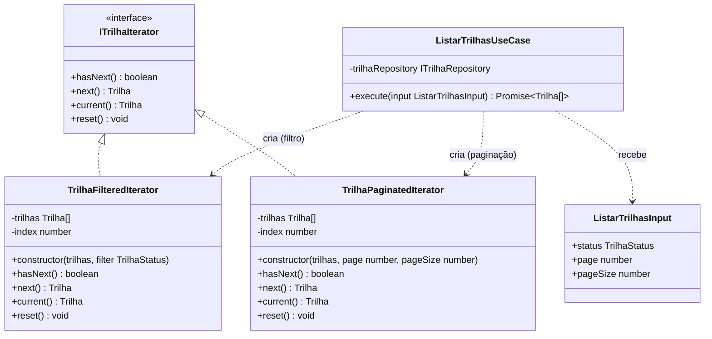

# 3.3.2 Iterator

## Participantes

| Matrícula | Nome                                                 | Commits                                                                                                                                                                                                                                                                      |
| :-------- | :--------------------------------------------------- | :--------------------------------------------------------------------------------------------------------------------------------------------------------------------------------------------------------------------------------------------------------------------------- |
| 222015060 | [Ana Luiza](https://github.com/ana-pfeilsticker)     | [209083b](https://github.com/UnBArqDsw2026-1-Turma01/2026.1-T01-_G5_BelezasNaturaisBrasileiras_Entrega_01/commit/209083b), [9fadc2d](https://github.com/UnBArqDsw2026-1-Turma01/2026.1-T01-_G5_BelezasNaturaisBrasileiras_Entrega_01/commit/9fadc2d) |

## Introdução

O **Iterator** é um padrão comportamental que fornece uma forma de acessar sequencialmente os elementos de uma coleção sem expor sua representação subjacente. É útil quando você deseja acessar elementos de uma coleção de diferentes formas.

Este padrão permite desacoplar os algoritmos de iteração da estrutura de dados, facilitando a adição de novas formas de iteração sem modificar a coleção. O Iterator padroniza o acesso por meio de uma interface uniforme (`hasNext`, `next`, `current`, `reset`), tornando os algoritmos de traversal intercambiáveis.

## Quando Aplicar?

- Quando você deseja acessar conteúdo de um objeto sem expor sua representação
- Quando você tem múltiplas maneiras de percorrer uma estrutura
- Quando você deseja fornecer uma interface padrão para percorrer coleções diferentes
- Quando você quer encapsular a complexidade de iterar sobre estruturas complexas
- Quando novos tipos de iteradores devem ser adicionados frequentemente

## Metodologia

O padrão Iterator foi aplicado à **listagem de trilhas** com suporte a filtro por status e paginação. Antes da implementação, o `ListarTrilhasUseCase` simplesmente retornava `this.trilhaRepository.findAll()` sem nenhuma capacidade de filtragem ou divisão em páginas — todo o processamento era responsabilidade dos clientes.

Com o Iterator, dois iteradores especializados foram criados, cada um encapsulando uma estratégia diferente de traversal:

- **`TrilhaFilteredIterator`**: ao ser instanciado, filtra a lista completa pelo `TrilhaStatus` informado (ou devolve todos se nenhum filtro for passado) e itera sobre o subconjunto resultante.
- **`TrilhaPaginatedIterator`**: recebe a lista já filtrada e um par `(page, pageSize)`, fatia internamente o array e itera apenas sobre os elementos da página solicitada.

O use case encadeia os dois: primeiro aplica o filtro via `TrilhaFilteredIterator`, coleta os resultados, depois — se `page` e `pageSize` foram fornecidos — aplica a paginação via `TrilhaPaginatedIterator`. Essa composição garante que filtro e paginação sejam independentes e testáveis isoladamente.

A interface `ITrilhaIterator` define o contrato comum. Novos iteradores (ex.: por ordenação, por proximidade geográfica) podem ser adicionados implementando essa interface sem tocar no use case.

## Estrutura e Participantes

| Classe                    | Papel no Padrão     | Responsabilidade                                                                     |
| :------------------------ | :------------------ | :----------------------------------------------------------------------------------- |
| `ITrilhaIterator`         | Iterator (interface) | Define o contrato de traversal: `hasNext`, `next`, `current`, `reset`               |
| `TrilhaFilteredIterator`  | Concrete Iterator   | Itera sobre trilhas filtradas por `TrilhaStatus`; aceita `undefined` para retornar todas |
| `TrilhaPaginatedIterator` | Concrete Iterator   | Itera sobre uma "janela" de resultados definida por `page` e `pageSize`              |
| `ListarTrilhasUseCase`    | Client / Aggregate  | Encadeia os dois iteradores e devolve o array resultante                             |
| `ListarTrilhasInput`      | DTO                 | Carrega os parâmetros opcionais `status`, `page` e `pageSize`                        |

## Diagrama de Classes



## Descrição das Classes

**`ITrilhaIterator`** (`domain/iterators/ITrilhaIterator.ts`)

Interface que define o contrato de todos os iteradores de trilha. Os métodos `hasNext()` e `next()` são o mínimo necessário para traversal; `current()` permite inspecionar o elemento atual sem avançar o ponteiro; `reset()` reinicia a iteração do início.

**`TrilhaFilteredIterator`** (`domain/iterators/TrilhaFilteredIterator.ts`)

Iterador concreto que filtra a coleção no momento da construção: recebe o array completo de trilhas e um `TrilhaStatus` opcional. Quando o filtro é informado, aplica `Array.filter` internamente antes de armazenar o subconjunto. A iteração em si é linear sobre esse subconjunto, mantendo um `index` interno.

**`TrilhaPaginatedIterator`** (`domain/iterators/TrilhaPaginatedIterator.ts`)

Iterador concreto que aplica paginação: recebe a lista (já filtrada pelo iterador anterior) e calcula o `slice` correspondente à `page` solicitada usando `(page - 1) * pageSize`. Itera sequencialmente sobre a janela resultante.

**`ListarTrilhasUseCase`** (`application/use-cases/ListarTrilhasUseCase.ts`)

Client e orquestrador. O método `execute(input)` busca todas as trilhas no repositório, cria um `TrilhaFilteredIterator` e coleta os elementos via loop `while (filtered.hasNext())`. Se `page` e `pageSize` foram fornecidos no input, repete o processo com `TrilhaPaginatedIterator` sobre o resultado filtrado.

**`ListarTrilhasInput`** (`application/dtos/ListarTrilhasInput.ts`)

DTO de entrada com três campos opcionais validados via `class-validator`: `status` (enum `TrilhaStatus`), `page` (inteiro ≥ 1) e `pageSize` (inteiro ≥ 1). O decorator `@Type(() => Number)` do `class-transformer` converte query params string em número automaticamente.

## Trechos de Código

### `TrilhaFilteredIterator` — iterador com filtro por status
> [`backend/src/modules/trilhas/domain/iterators/TrilhaFilteredIterator.ts`](https://github.com/UnBArqDsw2026-1-Turma01/2026.1-T01-_G5_BelezasNaturaisBrasileiras_Entrega_01/blob/main/backend/src/modules/trilhas/domain/iterators/TrilhaFilteredIterator.ts)

```typescript
export class TrilhaFilteredIterator implements ITrilhaIterator {
  private index = 0;
  private readonly items: Trilha[];

  constructor(trilhas: Trilha[], filter?: TrilhaStatus) {
    this.items = filter ? trilhas.filter((t) => t.status === filter) : [...trilhas];
  }

  hasNext(): boolean { return this.index < this.items.length; }
  next(): Trilha     { return this.items[this.index++]; }
  reset(): void      { this.index = 0; }
}
```

### `TrilhaPaginatedIterator` — iterador com paginação
> [`backend/src/modules/trilhas/domain/iterators/TrilhaPaginatedIterator.ts`](https://github.com/UnBArqDsw2026-1-Turma01/2026.1-T01-_G5_BelezasNaturaisBrasileiras_Entrega_01/blob/main/backend/src/modules/trilhas/domain/iterators/TrilhaPaginatedIterator.ts)

```typescript
export class TrilhaPaginatedIterator implements ITrilhaIterator {
  private localIndex = 0;
  private readonly pageItems: Trilha[];

  constructor(trilhas: Trilha[], page: number, pageSize: number) {
    const start = (page - 1) * pageSize;
    this.pageItems = trilhas.slice(start, start + pageSize);
  }

  hasNext(): boolean { return this.localIndex < this.pageItems.length; }
  next(): Trilha     { return this.pageItems[this.localIndex++]; }
  reset(): void      { this.localIndex = 0; }
}
```

## Vídeo de Demonstração

[Adicionar link para o vídeo de demonstração do padrão em funcionamento]

## Rotas Relacionadas

| Rota        | Método | Descrição                                                                          | Como Testar                                                                              |
| :---------- | :----- | :--------------------------------------------------------------------------------- | :--------------------------------------------------------------------------------------- |
| `GET /trilhas` | GET | Lista todas as trilhas com suporte a filtro e paginação via query params           | `GET /trilhas?status=ATIVA&page=1&pageSize=5`                                            |
| `GET /trilhas` | GET | Sem parâmetros retorna todas as trilhas ativas                                     | `GET /trilhas`                                                                           |
| `GET /trilhas` | GET | Com `status=FINALIZADA` retorna apenas trilhas finalizadas                         | `GET /trilhas?status=INATIVA`                                                            |

## Declaração de Uso de IA

Este documento e a implementação foram desenvolvidos com o auxílio do Claude para otimizar a estrutura, apresentação do conteúdo e codificação. Todas as decisões de implementação, modelagem de classes e escolhas arquiteturais foram realizadas pela equipe com senso crítico e autoridade própria.

O Claude foi utilizado como ferramenta de suporte em duas frentes:

**Documentação:**

- Otimização da estrutura e apresentação do padrão
- Refinamento da apresentação técnica
- Geração de exemplos e descrições

**Codificação:**

- Auxílio na criação da estrutura base do código
- A equipe utilizou de arquivos de especificação (specs) bem definidos para garantir que o Claude seguisse fielmente o planejamento
- As escolhas arquiteturais foram realizadas EXCLUSIVAMENTE pela equipe
- O Claude auxiliou na implementação mantendo todos os parâmetros e restrições estabelecidas pelo grupo

Cada implementação, diagrama e decisão foi revisado e alterado conforme as necessidades do projeto. A equipe mantém total responsabilidade pelas escolhas implementadas.

## Referências Bibliográficas

> Gamma, E., Helm, R., Johnson, R., & Vlissides, J. (1994). Design Patterns: Elements of Reusable Object-Oriented Software. Addison-Wesley.

> Refactoring Guru. Iterator. Disponível em: https://refactoring.guru/design-patterns/iterator. Acesso em: 19 mai. 2026.

> Freeman, E., Freeman, E., Kathy, S., & Bates, B. (2004). Head First Design Patterns. O'Reilly Media.

## Histórico de versões

| Versão | Data       | Descrição                                                                                                                       | Autor                                            | Revisor | Detalhamento da Revisão |
| :----- | :--------- | :------------------------------------------------------------------------------------------------------------------------------ | :----------------------------------------------- | :------ | :---------------------- |
| `1.0`  | 18/05/2026 | Criação da estrutura do documento com seções de participantes, introdução, metodologia, estrutura de classes, diagrama e rotas. | [Ana Luiza](https://github.com/ana-pfeilsticker) |         |                         |
| `1.1`  | 19/05/2026 | Preenchimento da metodologia, diagrama Mermaid, estrutura e participantes, descrição das classes e rotas relacionadas.          | [Ana Luiza](https://github.com/ana-pfeilsticker) |         |                         |
