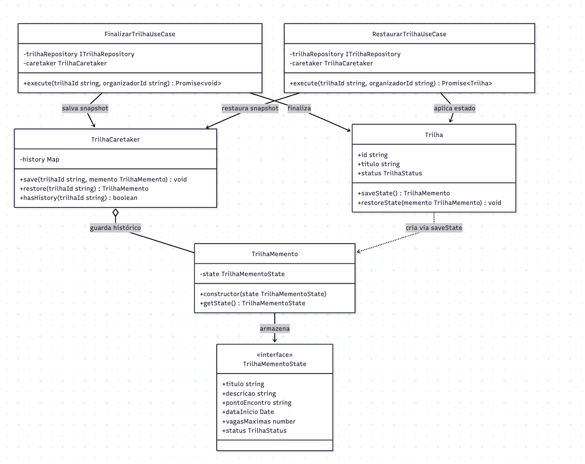

# 3.3.3 Memento

## Participantes

| Matrícula | Nome                                             | Commits                                                                                                                                                                                                                                              |
| :-------- | :----------------------------------------------- | :--------------------------------------------------------------------------------------------------------------------------------------------------------------------------------------------------------------------------------------------------- |
| 222015060 | [Ana Luiza](https://github.com/ana-pfeilsticker) | [aebc567](https://github.com/UnBArqDsw2026-1-Turma01/2026.1-T01-_G5_BelezasNaturaisBrasileiras_Entrega_01/commit/aebc567), [a1451c7](https://github.com/UnBArqDsw2026-1-Turma01/2026.1-T01-_G5_BelezasNaturaisBrasileiras_Entrega_01/commit/a1451c7) |

## Introdução

O **Memento** é um padrão comportamental que captura e externaliza um estado interno de um objeto sem violar o encapsulamento, permitindo que o objeto seja restaurado para esse estado mais tarde. É útil quando você deseja implementar funcionalidades como undo/redo ou checkpoints de processo.

Este padrão armazena snapshots do estado de um objeto em objetos separados (mementos) cujo conteúdo é opaco para quem os guarda (caretaker), preservando o encapsulamento do objeto originador.

## Quando Aplicar?

- Quando você deseja salvar e restaurar o estado anterior de um objeto
- Quando undo/redo é necessário
- Quando você deseja implementar checkpoints em um processo
- Quando você precisa preservar encapsulamento sem violar privacidade
- Quando múltiplos estados de um objeto devem ser armazenados

## Metodologia

O padrão Memento foi aplicado ao **ciclo de finalização de trilha** para habilitar a restauração do estado anterior caso necessário. Antes de uma trilha ser finalizada (`ATIVA` → `INATIVA`), toda sua informação é salva em um `TrilhaMemento`. Se o organizador precisar reverter a finalização, o `RestaurarTrilhaUseCase` resgata o último snapshot e repõe o estado na entidade.

A implementação respeita estritamente os papéis canônicos do padrão GoF:

- **Originator (`Trilha`)**: a entidade de domínio expõe `saveState()` — que cria e retorna um memento com cópia dos campos atuais — e `restoreState(memento)` — que aplica o estado do memento de volta à entidade.
- **Memento (`TrilhaMemento`)**: objeto imutável que guarda uma cópia profunda de `TrilhaMementoState`. O método `getState()` também retorna uma cópia para evitar mutação acidental do snapshot.
- **Caretaker (`TrilhaCaretaker`)**: serviço NestJS injetável que mantém um `Map<trilhaId, TrilhaMemento[]>` (pilha LIFO por trilha). Não conhece a estrutura interna do memento — apenas o armazena e o devolve.

O `FinalizarTrilhaUseCase` chama `caretaker.save(trilhaId, trilha.saveState())` **antes** de alterar o estado da trilha. O `RestaurarTrilhaUseCase` chama `caretaker.restore(trilhaId)` para recuperar o último snapshot e `trilha.restoreState(memento)` para aplicá-lo, persistindo a trilha atualizada em seguida.

## Estrutura e Participantes

| Classe                   | Papel no Padrão   | Responsabilidade                                                                                     |
| :----------------------- | :---------------- | :--------------------------------------------------------------------------------------------------- |
| `Trilha`                 | Originator        | Cria snapshots com `saveState()` e restaura estado com `restoreState(memento)`                       |
| `TrilhaMemento`          | Memento           | Armazena cópia imutável de `TrilhaMementoState`; `getState()` retorna nova cópia para evitar mutação |
| `TrilhaMementoState`     | State (interface) | Tipagem dos campos capturados: titulo, descricao, pontoEncontro, dataInicio, vagasMaximas, status    |
| `TrilhaCaretaker`        | Caretaker         | Mantém pilha LIFO de mementos por `trilhaId`; expõe `save`, `restore` e `hasHistory`                 |
| `FinalizarTrilhaUseCase` | Client (salva)    | Salva snapshot antes de finalizar a trilha                                                           |
| `RestaurarTrilhaUseCase` | Client (restaura) | Recupera o último snapshot e restaura o estado anterior da trilha                                    |

## Diagrama de Classes

## Descrição das Classes

**`TrilhaMementoState`** (`domain/memento/TrilhaMemento.ts`)

Interface TypeScript que define os campos capturados no snapshot: `titulo`, `descricao`, `pontoEncontro`, `dataInicio`, `vagasMaximas` e `status`. Todos os campos são requeridos, garantindo que o snapshot seja sempre completo.

**`TrilhaMemento`** (`domain/memento/TrilhaMemento.ts`)

Origina de `TrilhaMementoState`. O construtor cria uma cópia rasa do objeto de entrada (spread), prevenindo que mutações externas afetem o snapshot. O método `getState()` também retorna uma cópia, garantindo imutabilidade completa.

**`TrilhaCaretaker`** (`domain/memento/TrilhaCaretaker.ts`)

Serviço NestJS (`@Injectable`) que gerencia o histórico de mementos por trilha usando um `Map<string, TrilhaMemento[]>`. O método `save` empilha um novo memento; `restore` desempilha o último (LIFO); `hasHistory` verifica se há snapshots disponíveis. O Caretaker não interpreta o conteúdo dos mementos — apenas os armazena e devolve.

**`Trilha`** (`domain/entities/Trilha.ts`)

Originator do padrão. O método `saveState()` instancia um `TrilhaMemento` com os valores atuais dos campos da entidade. O método `restoreState(memento)` desestrutura o state do memento e reatribui cada campo — restaurando completamente o estado sem expor atributos privados ao caretaker.

**`FinalizarTrilhaUseCase`** (`application/use-cases/FinalizarTrilhaUseCase.ts`)

Client que persiste o snapshot. Injeta `TrilhaCaretaker` e, **antes** de chamar `trilha.finalizar()`, chama `this.caretaker.save(trilhaId, trilha.saveState())`. Isso garante que o estado `ATIVA` seja preservado antes da transição irreversível para `INATIVA`.

**`RestaurarTrilhaUseCase`** (`application/use-cases/RestaurarTrilhaUseCase.ts`)

Client que consome o snapshot. Verifica se o solicitante é o organizador e se há histórico disponível (lançando `BadRequestException` caso contrário), recupera o último memento via `caretaker.restore`, aplica `trilha.restoreState(memento)` e persiste a trilha atualizada.

## Vídeo de Demonstração

[Adicionar link para o vídeo de demonstração do padrão em funcionamento]

## Rotas Relacionadas

| Rota                          | Método | Descrição                                                         | Como Testar                                                                                     |
| :---------------------------- | :----- | :---------------------------------------------------------------- | :---------------------------------------------------------------------------------------------- |
| `POST /trilhas/:id/finalizar` | POST   | Finaliza a trilha e salva snapshot do estado anterior via Memento | Requer JWT do organizador; snapshot é salvo automaticamente no caretaker em memória             |
| `POST /trilhas/:id/restaurar` | POST   | Restaura o último estado salvo da trilha (desfaz a finalização)   | Chamar após `/finalizar`; requer JWT do organizador; trilha volta ao status e campos anteriores |

## Declaração de Uso de IA

Este documento e a implementação foram desenvolvidos com o auxílio do Claude para otimizar a estrutura, apresentação do conteúdo e codificação. Todas as decisões de implementação, modelagem de classes e escolhas arquiteturais foram realizadas pela equipe com senso crítico e autoridade própria.

O Claude foi utilizado como ferramenta de suporte em duas frentes:

**Documentação:**

- Otimização da estrutura e apresentação do padrão
- Refinamento da apresentação técnica
- Geração de exemplos e descrições

**Codificação:**

- Auxílio na criação da estrutura base do código
- A equipe utilizou de arquivos de especificação (specs) bem definidos para garantir que o Claude seguisse fielmente o planejamento
- As escolhas arquiteturais foram realizadas EXCLUSIVAMENTE pela equipe
- O Claude auxiliou na implementação mantendo todos os parâmetros e restrições estabelecidas pelo grupo

Cada implementação, diagrama e decisão foi revisado e alterado conforme as necessidades do projeto. A equipe mantém total responsabilidade pelas escolhas implementadas.

## Referências Bibliográficas

> Gamma, E., Helm, R., Johnson, R., & Vlissides, J. (1994). Design Patterns: Elements of Reusable Object-Oriented Software. Addison-Wesley.

> Refactoring Guru. Memento. Disponível em: https://refactoring.guru/design-patterns/memento. Acesso em: 19 mai. 2026.

> Freeman, E., Freeman, E., Kathy, S., & Bates, B. (2004). Head First Design Patterns. O'Reilly Media.

## Histórico de versões

| Versão | Data       | Descrição                                                                                                                       | Autor                                            | Revisor | Detalhamento da Revisão |
| :----- | :--------- | :------------------------------------------------------------------------------------------------------------------------------ | :----------------------------------------------- | :------ | :---------------------- |
| `1.0`  | 18/05/2026 | Criação da estrutura do documento com seções de participantes, introdução, metodologia, estrutura de classes, diagrama e rotas. | [Ana Luiza](https://github.com/ana-pfeilsticker) |         |                         |
| `1.1`  | 19/05/2026 | Preenchimento da metodologia, diagrama Mermaid, estrutura e participantes, descrição das classes e rotas relacionadas.          | [Ana Luiza](https://github.com/ana-pfeilsticker) |         |                         |
