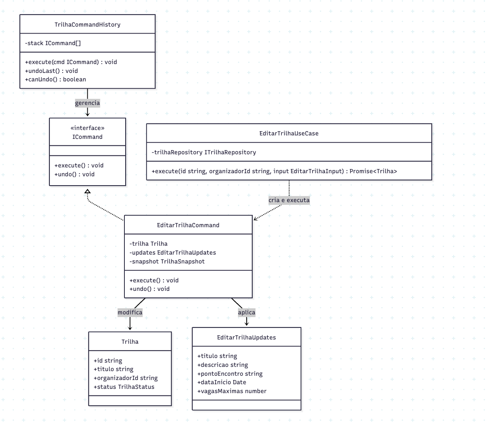

# 3.3.6 Command

## Participantes

| Matrícula | Nome                                             | Commits |
| :-------- | :----------------------------------------------- | :------ |
| 222015060 | [Ana Luiza](https://github.com/ana-pfeilsticker) |         |

## Introdução

O **Command** é um padrão comportamental que encapsula um pedido como um objeto, permitindo parametrizar clientes com diferentes pedidos, enfileirar, registrar e executar operações. É útil quando você deseja desacoplar o objeto que invoca uma operação do objeto que a realiza.

Este padrão transforma um pedido em um objeto independente que pode ser passado, armazenado, desfeito (undo) e refeito (redo). O objeto de comando conhece o receptor, os parâmetros da ação e como revertê-la — tornando o histórico de operações uma estrutura de dados de primeira classe.

## Quando Aplicar?

- Quando você deseja parametrizar objetos com operações
- Quando você deseja enfileirar operações, agendar sua execução ou executá-las remotamente
- Quando você deseja suportar undo/redo
- Quando você deseja estruturar um sistema em torno de objetos de alto nível que executam ações
- Quando múltiplos comandos podem ser agrupados e executados juntos

## Metodologia

O padrão Command foi aplicado à **edição de trilha** para suportar rastreabilidade e reversão de edições. Antes da implementação, editar uma trilha era uma operação direta sem histórico: qualquer modificação era imediatamente persistida sem possibilidade de desfazer.

Com o Command, a operação de edição é encapsulada em `EditarTrilhaCommand`, que antes de aplicar as alterações tira um snapshot (`TrilhaSnapshot`) dos campos originais. O método `execute()` aplica as mudanças diretamente na entidade `Trilha`; o método `undo()` restaura o snapshot capturado.

O `TrilhaCommandHistory` atua como invoker e gerenciador de histórico: mantém uma pilha LIFO de comandos executados. Chamar `execute(cmd)` executa o comando e o empilha; `undoLast()` desempilha e desfaz o último comando. Isso permite sequências de edições reversíveis sem que o use case precise conhecer o mecanismo de undo.

O `EditarTrilhaUseCase` é o client do padrão: recupera a trilha do repositório, verifica autorização, cria um `EditarTrilhaCommand` com os dados de atualização e o executa. A separação entre criação do comando e execução garante que o histórico possa ser inspecionado, serializado ou transmitido de forma independente.

## Estrutura e Participantes

| Classe                 | Papel no Padrão     | Responsabilidade                                                                                             |
| :--------------------- | :------------------ | :----------------------------------------------------------------------------------------------------------- |
| `ICommand`             | Command (interface) | Define o contrato mínimo: `execute()` e `undo()`                                                             |
| `EditarTrilhaCommand`  | Concrete Command    | Encapsula a edição de uma trilha; captura snapshot antes de aplicar mudanças; suporta `undo()`               |
| `TrilhaCommandHistory` | Invoker / History   | Mantém pilha LIFO de comandos; expõe `execute`, `undoLast` e `canUndo`                                       |
| `EditarTrilhaUseCase`  | Client              | Cria o `EditarTrilhaCommand` com a trilha e as atualizações; chama `cmd.execute()` e persiste                |
| `EditarTrilhaInput`    | DTO                 | Carrega os campos opcionais a serem atualizados (titulo, descricao, pontoEncontro, dataInicio, vagasMaximas) |

## Diagrama de Classes

## Descrição das Classes

**`ICommand`** (`domain/commands/ICommand.ts`)

Interface TypeScript que define o contrato de todos os comandos do domínio: `execute(): void` e `undo(): void`. Ambos são síncronos — as operações na entidade são em memória; a persistência é responsabilidade do use case após o `execute`.

**`EditarTrilhaCommand`** (`domain/commands/EditarTrilhaCommand.ts`)

Comando concreto que encapsula a edição de uma `Trilha`. O construtor recebe a entidade e um objeto `EditarTrilhaUpdates` (todos os campos opcionais: `titulo`, `descricao`, `pontoEncontro`, `dataInicio`, `vagasMaximas`). O método `execute()` copia os valores atuais da trilha para um `TrilhaSnapshot` interno e aplica as atualizações. O método `undo()` restaura os valores do snapshot; lança `Error('Nenhuma edição para desfazer')` se chamado antes de `execute`.

**`TrilhaCommandHistory`** (`domain/commands/TrilhaCommandHistory.ts`)

Invoker do padrão. Mantém uma pilha (`ICommand[]`) de comandos executados. O método `execute(cmd)` chama `cmd.execute()` e empilha o comando. `undoLast()` desempilha o topo e chama `cmd.undo()`; lança `Error('Histórico de comandos vazio')` se a pilha estiver vazia. `canUndo()` retorna `boolean` indicando se há comandos a desfazer.

**`EditarTrilhaUseCase`** (`application/use-cases/EditarTrilhaUseCase.ts`)

Client do padrão. Recupera a trilha via `ITrilhaRepository.findById`, verifica se `organizadorId` corresponde ao criador da trilha, cria um `EditarTrilhaCommand` com a entidade e as atualizações do DTO, chama `cmd.execute()` e persiste a trilha atualizada com `trilhaRepository.save(trilha)`.

**`EditarTrilhaInput`** (`application/dtos/EditarTrilhaInput.ts`)

DTO com todos os campos opcionais validados via `class-validator`: `titulo` e `descricao` (`@IsString @IsOptional`), `pontoEncontro` (`@IsString @IsOptional`), `dataInicio` (`@IsDateString @IsOptional`) e `vagasMaximas` (`@IsInt @Min(1) @IsOptional`).

## Vídeo de Demonstração

[Adicionar link para o vídeo de demonstração do padrão em funcionamento]

## Rotas Relacionadas

| Rota                 | Método | Descrição                                                                 | Como Testar                                                                   |
| :------------------- | :----- | :------------------------------------------------------------------------ | :---------------------------------------------------------------------------- |
| `PATCH /trilhas/:id` | PATCH  | Edita campos de uma trilha; operação encapsulada em `EditarTrilhaCommand` | Requer JWT do organizador; enviar body com campos a alterar (todos opcionais) |

## Declaração de Uso de IA

Este documento e a implementação foram desenvolvidos com o auxílio do Claude para otimizar a estrutura, apresentação do conteúdo e codificação. Todas as decisões de implementação, modelagem de classes e escolhas arquiteturais foram realizadas pela equipe com senso crítico e autoridade própria.

O Claude foi utilizado como ferramenta de suporte em duas frentes:

**Documentação:**

- Otimização da estrutura e apresentação do padrão
- Refinamento da apresentação técnica
- Geração de exemplos e descrições

**Codificação:**

- Auxílio na criação da estrutura base do código
- A equipe utilizou de arquivos de especificação (specs) bem definidos para garantir que o Claude seguisse fielmente o planejamento
- As escolhas arquiteturais foram realizadas EXCLUSIVAMENTE pela equipe
- O Claude auxiliou na implementação mantendo todos os parâmetros e restrições estabelecidas pelo grupo

Cada implementação, diagrama e decisão foi revisado e alterado conforme as necessidades do projeto. A equipe mantém total responsabilidade pelas escolhas implementadas.

## Referências Bibliográficas

> Gamma, E., Helm, R., Johnson, R., & Vlissides, J. (1994). Design Patterns: Elements of Reusable Object-Oriented Software. Addison-Wesley.

> Refactoring Guru. Command. Disponível em: https://refactoring.guru/design-patterns/command. Acesso em: 19 mai. 2026.

> Freeman, E., Freeman, E., Kathy, S., & Bates, B. (2004). Head First Design Patterns. O'Reilly Media.

## Histórico de versões

| Versão | Data       | Descrição                                                                                                                       | Autor                                            | Revisor | Detalhamento da Revisão |
| :----- | :--------- | :------------------------------------------------------------------------------------------------------------------------------ | :----------------------------------------------- | :------ | :---------------------- |
| `1.0`  | 18/05/2026 | Criação da estrutura do documento com seções de participantes, introdução, metodologia, estrutura de classes, diagrama e rotas. | [Ana Luiza](https://github.com/ana-pfeilsticker) |         |                         |
| `1.1`  | 19/05/2026 | Preenchimento da metodologia, diagrama Mermaid, estrutura e participantes, descrição das classes e rotas relacionadas.          | [Ana Luiza](https://github.com/ana-pfeilsticker) |         |                         |
