# 3.3.6 Mediator

## Participantes

| Matrícula  | Nome                                                    | Commits                                                                                                                                                    |
| :--------- | :------------------------------------------------------ | :--------------------------------------------------------------------------------------------------------------------------------------------------------- |
| 22/2006552 | [Antonio Carvalho](https://github.com/antonioscarvalho) | [9eaacb1](https://github.com/UnBArqDsw2026-1-Turma01/2026.1-T01-_G5_BelezasNaturaisBrasileiras_Entrega_01/commit/9eaacb12b38b2d4012498f978b3b76332070d57a) |
| 20/2046265 | [Mário Vinícius](https://github.com/MarioViniciusBC)    | [d16d7fe](https://github.com/UnBArqDsw2026-1-Turma01/2026.1-T01-_G5_BelezasNaturaisBrasileiras_Entrega_01/commit/d16d7fe445c1eb6e72989875ca9e20bc3d2fd573) |
| 22/2021998 | [Mateus Magno](https://github.com/mtsmgn0)              | [4dff353](https://github.com/UnBArqDsw2026-1-Turma01/2026.1-T01-_G5_BelezasNaturaisBrasileiras_Entrega_01/commit/4dff3536c7b619e54054dfafaa8211cfa1b86d88) |

## Introdução

O **Mediator** é um padrão de projeto comportamental que reduz o acoplamento caótico entre objetos. O padrão restringe comunicações diretas entre os objetos e os obriga a colaborar apenas por meio de um objeto mediador.

Em sistemas complexos, é comum que muitos objetos dependam uns dos outros para realizar uma tarefa, criando uma teia de dependências difícil de manter. O Mediator resolve isso centralizando essas interações. Em vez de um objeto falar com outros dez, ele fala apenas com o Mediador, que sabe como orquestrar a interação entre todos os participantes. Isso promove o princípio da responsabilidade única e facilita a reutilização de componentes individuais.

## Quando Aplicar?

- Quando é difícil mudar algumas classes porque elas estão densamente acopladas a várias outras classes.
- Quando você não pode reutilizar um componente em um programa diferente porque ele é muito dependente de outros componentes.
- Quando você se encontra criando várias subclasses de componentes apenas para reutilizar algum comportamento básico em contextos diferentes.
- Para centralizar regras de orquestração de fluxo de trabalho que envolvem múltiplos serviços ou entidades.

## Metodologia

No sistema Belezas Naturais Brasileiras, o padrão Mediator foi implementado para gerenciar o **Ciclo de Vida de Finalização de Trilhas**. Quando uma trilha é finalizada, várias ações independentes precisam ocorrer: atualização do status da trilha, registro de presença dos participantes, concessão de badges e envio de notificações de histórico.

Utilizamos o `TrailLifecycleMediatorService` como o mediador central. Ele orquestra diversos _handlers_ especializados. Cada handler (como o `BadgeHandler`) foca apenas em sua responsabilidade e não conhece a existência dos outros. O mediador é responsável por registrar esses handlers e executá-los na ordem correta quando o evento de finalização ocorre. Se um handler falhar, o mediador decide se interrompe o processo ou se continua para os demais, isolando as falhas e garantindo a robustez do sistema.

## Estrutura e Participantes

| Classe                                    | Papel no Padrão       | Responsabilidade                                                              |
| :---------------------------------------- | :-------------------- | :---------------------------------------------------------------------------- |
| `ITrailLifecycleMediator`                 | Mediator (Interface)  | Define a interface de comunicação para o evento de finalização de trilha.     |
| `TrailLifecycleMediatorService`           | Concrete Mediator     | Orquestra a execução de múltiplos handlers de ciclo de vida.                  |
| `ILifecycleHandler`                       | Colleague (Interface) | Interface comum para todos os componentes que reagem à finalização da trilha. |
| `BadgeHandler`, `AttendanceHandler`, etc. | Concrete Colleagues   | Executam ações específicas (ex: dar badges) sem conhecer outros handlers.     |
| `FinalizarTrilhaUseCase`                  | Client                | Dispara o processo através do mediador.                                       |

## Diagrama de Classes



## Descrição das Classes

**`ITrailLifecycleMediator`** (`backend/src/modules/pontos-turisticos/mediator/interfaces/trail-lifecycle-mediator.interface.ts`)

Interface do Mediator. Define o contrato para a comunicação dos eventos de finalização de trilha e o registro dinâmico de novos handlers. Ela desacopla o disparador do evento da lógica de orquestração.

**`TrailLifecycleMediatorService`** (`backend/src/modules/pontos-turisticos/mediator/trail-lifecycle-mediator.service.ts`)

Concrete Mediator que atua como o centro nervoso da operação. Ele mantém uma lista de handlers registrados e os executa sequencialmente durante o ciclo de finalização. Isso centraliza a lógica de fluxo, evitando que o `UseCase` ou a entidade `Trilha` fiquem sobrecarregados com responsabilidades de integração.

**`ILifecycleHandler`** (`backend/src/modules/pontos-turisticos/mediator/interfaces/lifecycle-handler.interface.ts`)

Interface do Colleague. Define o método `handle(event)` que todos os componentes reativos à trilha devem implementar. Permite que o mediador trate todos os handlers de forma genérica (Polimorfismo).

**`Handlers` (Badge, Attendance, History, TrailState)** (`backend/src/modules/pontos-turisticos/mediator/handlers/*`)

Concrete Colleagues que implementam ações específicas. O `BadgeHandler` concede conquistas, o `AttendanceHandler` registra presença, o `HistoryNotificationHandler` gera logs e o `TrailStateHandler` atualiza o status. Eles não se conhecem, comunicando-se apenas com o mediador.

**`FinalizarTrilhaUseCase`** (`backend/src/modules/trilhas/application/use-cases/FinalizarTrilhaUseCase.ts`)

Client do padrão. É responsável por disparar o processo através do mediador. Ao chamar `mediator.finishTrail()`, ele inicia toda a cadeia de eventos secundários sem precisar conhecer quais ou quantos handlers estão envolvidos.

## Trechos de Código

### `TrailLifecycleMediatorService` — mediador que orquestra os handlers

> [`backend/src/modules/pontos-turisticos/mediator/trail-lifecycle-mediator.service.ts`](https://github.com/UnBArqDsw2026-1-Turma01/2026.1-T01-_G5_BelezasNaturaisBrasileiras_Entrega_01/blob/branch-adapter-object_pool-mediator/backend/src/modules/pontos-turisticos/mediator/trail-lifecycle-mediator.service.ts)

```typescript
@Injectable()
export class TrailLifecycleMediatorService
  implements ITrailLifecycleMediator, OnModuleInit
{
  private handlers: { name: string; handler: ILifecycleHandler }[] = [];

  constructor(
    private readonly lifecycleRepo: TrailLifecycleRepository,
    private readonly attendanceHandler: AttendanceHandler,
    private readonly badgeHandler: BadgeHandler,
    private readonly historyHandler: HistoryNotificationHandler,
    private readonly trailStateHandler: TrailStateHandler,
  ) {}

  onModuleInit() {
    // Registra handlers na ordem de execução — handlers não se conhecem entre si
    this.registerHandler("trailState", this.trailStateHandler);
    this.registerHandler("attendance", this.attendanceHandler);
    this.registerHandler("badge", this.badgeHandler);
    this.registerHandler("historyNotification", this.historyHandler);
  }

  async finishTrail(trailId: string, actorId: string): Promise<MediatorResult> {
    const event = { trailId, actorId, timestamp: new Date().toISOString() };
    const errors: any[] = [];
    for (const h of this.handlers) {
      try {
        await h.handler.handle(event);
      } catch (e) {
        errors.push({ handler: h.name, error: e?.message });
        // continua mesmo em falha parcial
      }
    }
    return { success: errors.length === 0, errors };
  }
}
```

## Vídeo de Demonstração

[Adicionar link para o vídeo de demonstração do padrão em funcionamento]

## Rotas Relacionadas

| Rota                     | Método | Descrição                                 | Como Testar                                                                      |
| :----------------------- | :----- | :---------------------------------------- | :------------------------------------------------------------------------------- |
| `/trilhas/:id/finalizar` | `POST` | Inicia o processo de finalização mediado. | Chamar a rota de finalização e verificar se badges e notificações foram gerados. |

## Declaração de Uso de IA

Este documento e a implementação foram desenvolvidos com o auxílio da IA para otimizar a estrutura, apresentação do conteúdo e codificação. Todas as decisões de implementação, modelagem de classes e escolhas arquiteturais foram realizadas pela equipe com senso crítico e autoridade própria.

A IA foi utilizada como ferramenta de suporte em duas frentes:

**Documentação:**

- Otimização da estrutura e apresentação do padrão baseada no Refactoring Guru.
- Refinamento da apresentação técnica e diagramação Mermaid.
- Geração de descrições baseadas no código implementado.

**Codificação:**

- Auxílio na criação da estrutura base do código
- A equipe utilizou de arquivos de especificação (specs) bem definidos para garantir que o Claude seguisse fielmente o planejamento
- As escolhas arquiteturais foram realizadas EXCLUSIVAMENTE pela equipe
- O Claude auxiliou na implementação mantendo todos os parâmetros e restrições estabelecidas pelo grupo

Cada implementação, diagrama e decisão foi revisado e alterado conforme as necessidades do projeto. A equipe mantém total responsabilidade pelas escolhas implementadas.

## Referências Bibliográficas

> Gamma, E., Helm, R., Johnson, R., & Vlissides, J. (1994). Design Patterns: Elements of Reusable Object-Oriented Software. Addison-Wesley.

> Refactoring Guru. Mediator. Disponível em: https://refactoring.guru/design-patterns/mediator. Acesso em: 18 mai. 2026.

> Freeman, E., Freeman, E., Kathy, S., & Bates, B. (2004). Head First Design Patterns. O'Reilly Media.

## Histórico de versões

| Versão | Data       | Descrição                                                                                                                       | Autor                                            | Revisor                                   | Detalhamento da Revisão              |
| :----- | :--------- | :------------------------------------------------------------------------------------------------------------------------------ | :----------------------------------------------- | :---------------------------------------- | :----------------------------------- |
| `1.0`  | 18/05/2026 | Criação da estrutura do documento com seções de participantes, introdução, metodologia, estrutura de classes, diagrama e rotas. | [Ana Luiza](https://github.com/ana-pfeilsticker) | [Mateus Magno](http://github.com/mtsmgn0) | Revisão de ortografia e terminologia |
| `1.1`  | 21/05/2026 | Adição do diagrama de modelagem juntamente com a documentação geral.                                                            | [Mateus Magno](http://github.com/mtsmgn0)       |                                           |                                      |
| `1.2`  | 21/05/2026 | Refinamento da descrição das classes seguindo o padrão dos demais patterns.                                                     | [Antônio Carvalho](https://github.com/antonioscarvalho) |                                           |                                      |
