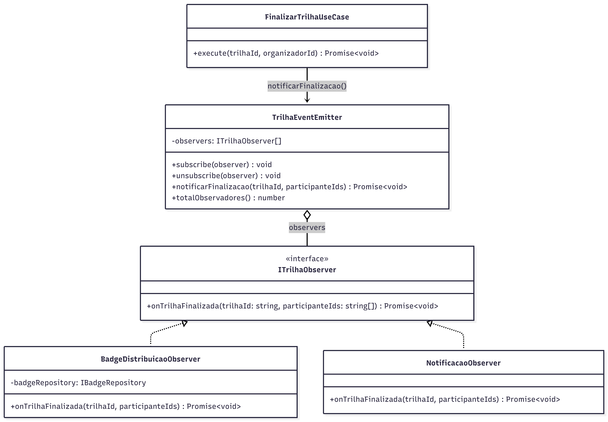

# 3.3.7 Observer

## Participantes

| Matrícula  | Nome                                                    | Commits                                                                                                                   |
| :--------- | :------------------------------------------------------ | :------------------------------------------------------------------------------------------------------------------------ |
| 222006211  | [Vitor Hoffmann](https://github.com/vitor-hoffmann)     | [4b6942c](https://github.com/UnBArqDsw2026-1-Turma01/2026.1-T01-_G5_BelezasNaturaisBrasileiras_Entrega_01/commit/4b6942c) |
| 222015060  | [Ana Luiza](https://github.com/ana-pfeilsticker)        | [4b6942c](https://github.com/UnBArqDsw2026-1-Turma01/2026.1-T01-_G5_BelezasNaturaisBrasileiras_Entrega_01/commit/4b6942c) |
| 222021998  | [Mateus Magno](https://github.com/mtsmgn0)              | [4b6942c](https://github.com/UnBArqDsw2026-1-Turma01/2026.1-T01-_G5_BelezasNaturaisBrasileiras_Entrega_01/commit/4b6942c) |
| 20/2046265 | [Mário Vinícius](https://github.com/MarioViniciusBC)    | [4b6942c](https://github.com/UnBArqDsw2026-1-Turma01/2026.1-T01-_G5_BelezasNaturaisBrasileiras_Entrega_01/commit/4b6942c) |
| 222006552  | [Antônio Carvalho](https://github.com/antonioscarvalho) | [4b6942c](https://github.com/UnBArqDsw2026-1-Turma01/2026.1-T01-_G5_BelezasNaturaisBrasileiras_Entrega_01/commit/4b6942c) |

## Introdução

O **Observer** é um padrão de projeto comportamental que permite definir um mecanismo de assinatura para notificar múltiplos objetos sobre quaisquer eventos que aconteçam com o objeto que eles estão observando.

O padrão sugere que o objeto que tem um estado interessante (frequentemente chamado de _Subject_ ou _Publisher_) seja responsável por notificar outros objetos (_Observers_ ou _Subscribers_) quando esse estado mudar. Isso permite uma dependência de um-para-muitos que é dinâmica e desacoplada, já que o publicador não precisa saber as classes concretas de seus assinantes, apenas que eles implementam uma interface específica de notificação.

## Quando Aplicar?

- Quando uma mudança no estado de um objeto requer a mudança de outros objetos, e o conjunto real de objetos é desconhecido de antemão ou muda dinamicamente.
- Quando alguns objetos em sua aplicação devem observar outros, mas apenas por um tempo limitado ou em casos específicos.
- Para implementar sistemas de tratamento de eventos ou comunicação entre diferentes módulos sem criar acoplamento forte entre eles.

## Metodologia

O padrão Observer foi aplicado ao **processo de finalização de trilhas** no sistema BNB. Quando o organizador encerra uma atividade, o sistema precisa disparar uma série de ações secundárias que não pertencem ao núcleo da gestão de trilhas, como a distribuição de conquistas (badges) e o registro de notificações para os usuários.

Implementamos um `TrilhaEventEmitter` que atua como o Subject. Ele mantém uma lista de observadores que implementam a interface `ITrilhaObserver`. Ao finalizar uma trilha, o `FinalizarTrilhaUseCase` apenas informa ao emitter que o evento ocorreu. O emitter, por sua vez, percorre todos os assinantes registrados (como o `BadgeDistribuicaoObserver`) e os notifica.

Esta abordagem permite que adicionemos novas funcionalidades pós-finalização (ex: enviar e-mails de agradecimento ou atualizar rankings) apenas criando um novo observer e registrando-o no emitter, respeitando o Princípio Aberto/Fechado.

## Estrutura e Participantes

| Classe                      | Papel no Padrão      | Responsabilidade                                                              |
| :-------------------------- | :------------------- | :---------------------------------------------------------------------------- |
| `ITrilhaObserver`           | Observer (Interface) | Define a interface de atualização para objetos que devem ser notificados.     |
| `TrilhaEventEmitter`        | Subject (Publisher)  | Gerencia a lista de observadores e envia as notificações de eventos.          |
| `BadgeDistribuicaoObserver` | Concrete Observer    | Reage à finalização da trilha gerando badges para os participantes presentes. |
| `NotificacaoObserver`       | Concrete Observer    | Reage ao evento criando registros de notificação no sistema.                  |
| `FinalizarTrilhaUseCase`    | Client               | Disparador do evento inicial no Subject.                                      |

## Diagrama de Classes



## Descrição das Classes

**`ITrilhaObserver`** (`domain/interfaces/ITrilhaObserver.ts`)

Interface do observer. Define o método `onTrilhaFinalizada(trilhaId, participanteIds)` retornando `Promise<void>`. O retorno assíncrono é necessário para que o subject possa aguardar a conclusão de todas as ações (ex.: escrita no banco) antes de continuar.

**`TrilhaEventEmitter`** (`domain/observers/TrilhaEventEmitter.ts`)

Subject do padrão. Mantém uma lista de `ITrilhaObserver[]` e expõe `subscribe`/`unsubscribe`. O método `notificarFinalizacao` usa `Promise.all` para disparar todos os observadores em paralelo. Os observadores são registrados no `TrilhasModule.onModuleInit()`, separando a configuração da lógica.

**`BadgeDistribuicaoObserver`** (`domain/observers/BadgeDistribuicaoObserver.ts`)

Observer concreto. Ao ser notificado, chama `IBadgeRepository.create()` para cada `participanteId`, persistindo o badge no banco. Usa `upsert` internamente para evitar duplicatas caso a trilha seja finalizada mais de uma vez.

**`NotificacaoObserver`** (`domain/observers/NotificacaoObserver.ts`)

Observer concreto. Registra em log uma mensagem informando cada participante que seu badge está disponível. Implementação atual usa `Logger` do NestJS; pode ser substituída por push notifications ou e-mail sem impacto nos demais participantes.

## Trechos de Código

### `TrilhaEventEmitter` — subject que notifica os observers registrados

> [`backend/src/modules/trilhas/domain/observers/TrilhaEventEmitter.ts`](https://github.com/UnBArqDsw2026-1-Turma01/2026.1-T01-_G5_BelezasNaturaisBrasileiras_Entrega_01/blob/main/backend/src/modules/trilhas/domain/observers/TrilhaEventEmitter.ts)

```typescript
@Injectable()
export class TrilhaEventEmitter {
  private readonly observers: ITrilhaObserver[] = [];

  subscribe(observer: ITrilhaObserver): void {
    if (!this.observers.includes(observer)) this.observers.push(observer);
  }

  async notificarFinalizacao(
    trilhaId: string,
    participanteIds: string[],
  ): Promise<void> {
    await Promise.all(
      this.observers.map((o) =>
        o.onTrilhaFinalizada(trilhaId, participanteIds),
      ),
    );
  }
}
```

### `BadgeDistribuicaoObserver` — observer concreto que distribui badges

> [`backend/src/modules/trilhas/domain/observers/BadgeDistribuicaoObserver.ts`](https://github.com/UnBArqDsw2026-1-Turma01/2026.1-T01-_G5_BelezasNaturaisBrasileiras_Entrega_01/blob/main/backend/src/modules/trilhas/domain/observers/BadgeDistribuicaoObserver.ts)

```typescript
@Injectable()
export class BadgeDistribuicaoObserver implements ITrilhaObserver {
  constructor(
    @Inject("IBadgeRepository")
    private readonly badgeRepository: IBadgeRepository,
  ) {}

  async onTrilhaFinalizada(
    trilhaId: string,
    participanteIds: string[],
  ): Promise<void> {
    await Promise.all(
      participanteIds.map((id) => this.badgeRepository.create(id, trilhaId)),
    );
  }
}
```

## Vídeo de Demonstração

[Adicionar link para o vídeo de demonstração do padrão em funcionamento]

## Rotas Relacionadas

| Rota                     | Método | Descrição                                                                    | Como Testar                      |
| :----------------------- | :----- | :--------------------------------------------------------------------------- | :------------------------------- |
| `/trilhas/:id/finalizar` | `POST` | Finaliza a trilha e dispara os observers (badges + notificações) em paralelo | Requer token JWT do organizador  |
| `/trilhas/badges/minhas` | `GET`  | Lista os badges conquistados pelo usuário autenticado                        | Requer token JWT do participante |

## Declaração de Uso de IA

Este documento e a implementação foram desenvolvidos com o auxílio da IA para otimizar a estrutura, apresentação do conteúdo e codificação. Todas as decisões de implementação, modelagem de classes e escolhas arquiteturais foram realizadas pela equipe com senso crítico e autoridade própria.

A IA foi utilizada como ferramenta de suporte em duas frentes:

**Documentação:**

- Otimização da estrutura e apresentação do padrão baseada no Refactoring Guru.
- Refinamento da apresentação técnica e diagramação.
- Geração de descrições técnicas precisas.

**Codificação:**

- Auxílio na criação da estrutura base do código seguindo o padrão Pub/Sub.
- As escolhas arquiteturais foram realizadas EXCLUSIVAMENTE pela equipe.

Cada implementação, diagrama e decisão foi revisado e alterado conforme as necessidades do projeto. A equipe mantém total responsabilidade pelas escolhas implementadas.

## Referências Bibliográficas

> Gamma, E., Helm, R., Johnson, R., & Vlissides, J. (1994). Design Patterns: Elements of Reusable Object-Oriented Software. Addison-Wesley.

> Refactoring Guru. Observer. Disponível em: https://refactoring.guru/design-patterns/observer. Acesso em: 18 mai. 2026.

> Freeman, E., Freeman, E., Kathy, S., & Bates, B. (2004). Head First Design Patterns. O'Reilly Media.

## Histórico de versões

| Versão | Data       | Descrição                                                                                                                       | Autor                                               | Revisor | Detalhamento da Revisão |
| :----- | :--------- | :------------------------------------------------------------------------------------------------------------------------------ | :-------------------------------------------------- | :------ | :---------------------- |
| `1.0`  | 18/05/2026 | Criação da estrutura do documento com seções de participantes, introdução, metodologia, estrutura de classes, diagrama e rotas. | [Ana Luiza](https://github.com/ana-pfeilsticker)    |         |                         |
| `1.1`  | 19/05/2026 | Preenchimento da metodologia, diagrama de classes, descrição das classes e rotas relacionadas.                                  | [Vitor Hoffmann](https://github.com/vitor-hoffmann) |         |                         |
| `1.2`  | 21/05/2026 | Revisão e refinamento do texto técnico com base nos padrões do Refactoring Guru.                                                | [Mateus Magno](http://github.com/mtsmgn0)           |         |                         |
