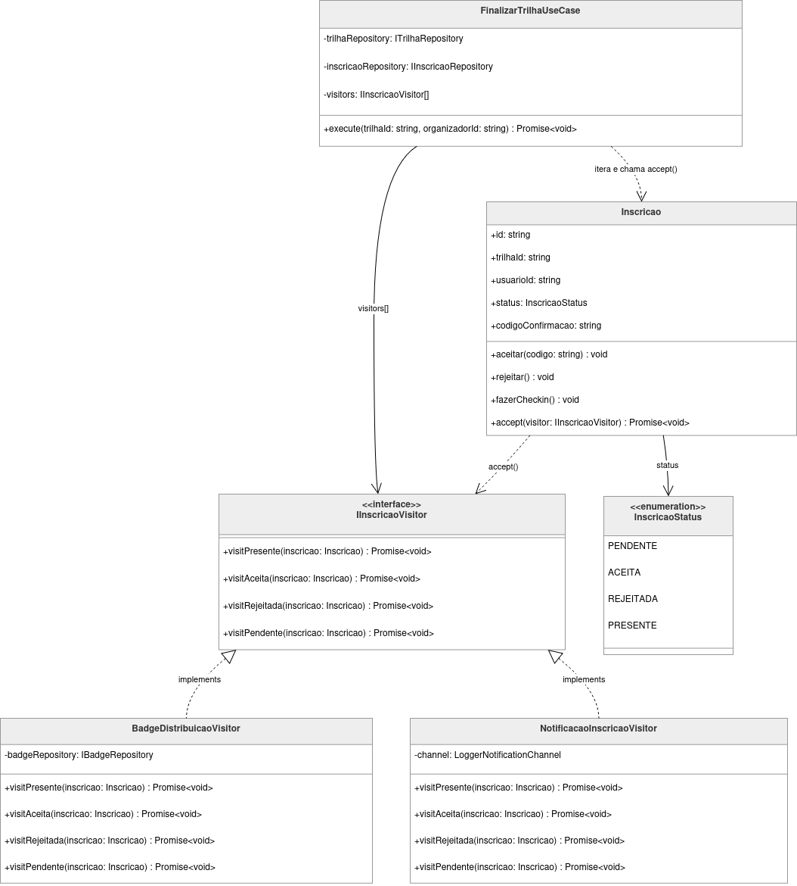

# 3.3.9 Visitor

## Participantes

| Matrícula | Nome                                             | Commits                                                                                                                                                    |
| :-------- | :----------------------------------------------- | :--------------------------------------------------------------------------------------------------------------------------------------------------------- |
| 222015060 | [Ana Luiza](https://github.com/ana-pfeilsticker) | [bfefa72](https://github.com/UnBArqDsw2026-1-Turma01/2026.1-T01-_G5_BelezasNaturaisBrasileiras_Entrega_03/commit/d19271087f34af222d45b3a45ff65d69cbfefa72) |
| 211062320 | [Miguel Arthur](https://github.com/zlimaz) | [bfefa72](https://github.com/UnBArqDsw2026-1-Turma01/2026.1-T01-_G5_BelezasNaturaisBrasileiras_Entrega_03/commit/d19271087f34af222d45b3a45ff65d69cbfefa72) |


## Introdução

O **Visitor** é um padrão comportamental que permite separar algoritmos dos objetos sobre os quais operam. Em vez de adicionar novos métodos às classes de domínio para cada nova operação, você cria um objeto _visitante_ externo que implementa cada operação, e a classe de domínio apenas delega a chamada ao visitante por meio de um método `accept()`.

O padrão resolve o problema de "operações heterogêneas em uma estrutura de objetos": quando uma coleção contém objetos com tipos ou estados diferentes e cada tipo exige comportamento específico, o Visitor evita longas cadeias de `if/instanceof` no código cliente, centralizando a lógica de despacho na própria entidade.

## Quando Aplicar?

- Quando você precisa executar operações distintas sobre os elementos de uma estrutura de objetos e não quer poluir suas classes com métodos não relacionados ao domínio
- Quando a estrutura de objetos raramente muda, mas novas operações são adicionadas frequentemente
- Quando operações precisam de acesso ao estado interno de múltiplos tipos de objeto
- Quando o comportamento deve variar de acordo com o estado ou tipo concreto do elemento visitado
- Quando você deseja adicionar funcionalidades a hierarquias de classes sem modificá-las

## Metodologia

O padrão Visitor foi aplicado ao **ciclo de finalização de trilha** — o fluxo mais crítico do sistema BNB. Quando uma trilha é encerrada, múltiplas operações precisam ser executadas sobre cada inscrição, e o comportamento correto depende do estado (`PENDENTE`, `ACEITA`, `REJEITADA`, `PRESENTE`) de cada uma.

**Problema resolvido:** O `FinalizarTrilhaUseCase` originalmente filtrava apenas inscrições `PRESENTE` para extrair IDs e repassá-los ao `TrilhaEventEmitter`. Esse design tinha três limitações:

1. A informação de estado era descartada cedo demais — os observers recebiam apenas IDs, sem o objeto `Inscricao`.
2. Adicionar novos comportamentos (ex.: notificar participantes rejeitados com uma mensagem diferente) exigia alterar o observer existente ou criar um novo com filtros duplicados.
3. O use case acumulava responsabilidade de triagem que pertence ao domínio.

**Solução com Visitor:** A entidade `Inscricao` recebeu o método `accept(visitor)`, que despacha a chamada correta com base no `status` atual. O use case agora busca **todas** as inscrições da trilha e aplica cada visitor sobre elas — cada visitor decide o que fazer em cada estado. Isso abre espaço para adicionar, por exemplo, um `RelatorioPresencaVisitor` ou um `NotificacaoRejeicaoVisitor` sem tocar em nenhuma classe existente.

## Estrutura e Participantes

| Classe                        | Papel no Padrão          | Responsabilidade                                                                                       |
| :---------------------------- | :----------------------- | :----------------------------------------------------------------------------------------------------- |
| `IInscricaoVisitor`           | Visitor (interface)      | Contrato com um método por estado: `visitPresente`, `visitAceita`, `visitRejeitada`, `visitPendente`   |
| `Inscricao`                   | Element                  | Entidade de domínio; método `accept(visitor)` despacha para o método correto baseado no `status` atual |
| `BadgeDistribuicaoVisitor`    | ConcreteVisitor          | Distribui badge ao banco via `IBadgeRepository` apenas em `visitPresente`; no-op nos demais estados    |
| `NotificacaoInscricaoVisitor` | ConcreteVisitor          | Envia notificação via `LoggerNotificationChannel` apenas em `visitPresente`; no-op nos demais estados  |
| `FinalizarTrilhaUseCase`      | Client / ObjectStructure | Itera sobre todas as inscrições e aplica cada visitor; não precisa saber o que cada visitor faz        |

## Diagrama de Classes



## Descrição das Classes

**`IInscricaoVisitor`** (`inscricoes/domain/interfaces/IInscricaoVisitor.ts`)

Interface do visitante. Define quatro métodos, um para cada valor possível do enum `InscricaoStatus`. Todos retornam `Promise<void>`, pois os visitors concretos realizam operações assíncronas (escrita no banco, envio de notificações). Novas operações sobre inscrições são adicionadas criando novas implementações desta interface, sem alterar as classes existentes.

**`Inscricao`** (`inscricoes/domain/entities/Inscricao.ts`)

Entidade de domínio e _elemento_ do padrão. O método `accept(visitor: IInscricaoVisitor)` usa um `switch` sobre `this.status` para delegar ao método correto do visitor (`visitPresente`, `visitAceita`, etc.). A entidade não sabe o que o visitor fará — apenas disponibiliza o ponto de entrada correto.

**`BadgeDistribuicaoVisitor`** (`trilhas/domain/visitors/BadgeDistribuicaoVisitor.ts`)

Visitante concreto responsável pela distribuição de badges. `visitPresente()` persiste um badge no banco via `IBadgeRepository.create()` e registra em log. Os três demais métodos são no-ops intencionais: participantes que não completaram o check-in não recebem badge.

**`NotificacaoInscricaoVisitor`** (`trilhas/domain/visitors/NotificacaoInscricaoVisitor.ts`)

Visitante concreto responsável pelas notificações. `visitPresente()` envia uma mensagem de conclusão via `LoggerNotificationChannel`. Os demais métodos são no-ops — ponto de extensão natural para futuras mensagens personalizadas por estado (ex.: "sua inscrição foi rejeitada").

**`FinalizarTrilhaUseCase`** (`trilhas/application/use-cases/FinalizarTrilhaUseCase.ts`)

Cliente e estrutura de objetos do padrão. Recebe a lista `IInscricaoVisitor[]` por injeção de dependência (token `IInscricaoVisitors`). Após finalizar a trilha, busca **todas** as inscrições com `findByTrilhaId` e percorre o produto cartesiano `visitors × inscricoes`, chamando `inscricao.accept(visitor)` para cada par. O use case não contém nenhuma lógica de negócio específica a badges ou notificações.

## Trechos de Código

### `IInscricaoVisitor` — interface do visitante

> [`backend/src/modules/inscricoes/domain/interfaces/IInscricaoVisitor.ts`](https://github.com/UnBArqDsw2026-1-Turma01/2026.1-T01-_G5_BelezasNaturaisBrasileiras_Entrega_01/blob/main/backend/src/modules/inscricoes/domain/interfaces/IInscricaoVisitor.ts)

```typescript
export interface IInscricaoVisitor {
  visitPresente(inscricao: Inscricao): Promise<void>;
  visitAceita(inscricao: Inscricao): Promise<void>;
  visitRejeitada(inscricao: Inscricao): Promise<void>;
  visitPendente(inscricao: Inscricao): Promise<void>;
}
```

### `Inscricao.accept()` — método do elemento

> [`backend/src/modules/inscricoes/domain/entities/Inscricao.ts`](https://github.com/UnBArqDsw2026-1-Turma01/2026.1-T01-_G5_BelezasNaturaisBrasileiras_Entrega_01/blob/main/backend/src/modules/inscricoes/domain/entities/Inscricao.ts)

```typescript
async accept(visitor: IInscricaoVisitor): Promise<void> {
  switch (this.status) {
    case InscricaoStatus.PRESENTE:
      return visitor.visitPresente(this);
    case InscricaoStatus.ACEITA:
      return visitor.visitAceita(this);
    case InscricaoStatus.REJEITADA:
      return visitor.visitRejeitada(this);
    case InscricaoStatus.PENDENTE:
      return visitor.visitPendente(this);
  }
}
```

### `BadgeDistribuicaoVisitor` — visitante concreto de badges

> [`backend/src/modules/trilhas/domain/visitors/BadgeDistribuicaoVisitor.ts`](https://github.com/UnBArqDsw2026-1-Turma01/2026.1-T01-_G5_BelezasNaturaisBrasileiras_Entrega_01/blob/main/backend/src/modules/trilhas/domain/visitors/BadgeDistribuicaoVisitor.ts)

```typescript
@Injectable()
export class BadgeDistribuicaoVisitor implements IInscricaoVisitor {
  constructor(
    @Inject("IBadgeRepository")
    private readonly badgeRepository: IBadgeRepository,
  ) {}

  async visitPresente(inscricao: Inscricao): Promise<void> {
    const badge = await this.badgeRepository.create(
      inscricao.usuarioId,
      inscricao.trilhaId,
    );
    this.logger.log(
      `Badge distribuído: participante=${inscricao.usuarioId} trilha=${inscricao.trilhaId}`,
    );
  }

  async visitAceita(_inscricao: Inscricao): Promise<void> {}
  async visitRejeitada(_inscricao: Inscricao): Promise<void> {}
  async visitPendente(_inscricao: Inscricao): Promise<void> {}
}
```

### `FinalizarTrilhaUseCase` — cliente que aplica os visitors

> [`backend/src/modules/trilhas/application/use-cases/FinalizarTrilhaUseCase.ts`](https://github.com/UnBArqDsw2026-1-Turma01/2026.1-T01-_G5_BelezasNaturaisBrasileiras_Entrega_01/blob/main/backend/src/modules/trilhas/application/use-cases/FinalizarTrilhaUseCase.ts)

```typescript
// Visitor Pattern — aplica cada visitor sobre todas as inscrições da trilha.
// Cada visitor decide o que fazer com base no status de cada Inscricao.
const inscricoes = await this.inscricaoRepository.findByTrilhaId(trilhaId);
for (const visitor of this.visitors) {
  for (const inscricao of inscricoes) {
    await inscricao.accept(visitor);
  }
}
```

## Vídeo de Demonstração

[Adicionar link para o vídeo de demonstração do padrão em funcionamento]

## Rotas Relacionadas

| Rota                          | Método | Descrição                                                                                                                          | Como Testar                                                                                                                    |
| :---------------------------- | :----- | :--------------------------------------------------------------------------------------------------------------------------------- | :----------------------------------------------------------------------------------------------------------------------------- |
| `POST /trilhas/:id/finalizar` | `POST` | Finaliza a trilha; aciona os visitors sobre todas as inscrições — `BadgeDistribuicaoVisitor` e `NotificacaoInscricaoVisitor`       | Criar trilha, inscrever usuários, fazer check-in em pelo menos um; finalizar e verificar badge em `GET /trilhas/badges/minhas` |
| `GET /trilhas/badges/minhas`  | `GET`  | Lista os badges do usuário autenticado — evidência de que o `BadgeDistribuicaoVisitor` processou corretamente a inscrição PRESENTE | Autenticar com um usuário que fez check-in numa trilha recém-finalizada; o badge deve aparecer na resposta                     |

## Declaração de Uso de IA

Este documento e a implementação foram desenvolvidos com o auxílio do Claude para otimizar a estrutura, apresentação do conteúdo e codificação. Todas as decisões de implementação, modelagem de classes e escolhas arquiteturais foram realizadas pela equipe com senso crítico e autoridade própria.

O Claude foi utilizado como ferramenta de suporte em duas frentes:

**Documentação:**

- Otimização da estrutura e apresentação do padrão
- Refinamento da apresentação técnica
- Geração de exemplos e descrições

**Codificação:**

- Auxílio na criação da estrutura base do código
- A equipe utilizou de arquivos de especificação (specs) bem definidos para garantir que o Claude seguisse fielmente o planejamento
- As escolhas arquiteturais foram realizadas EXCLUSIVAMENTE pela equipe
- O Claude auxiliou na implementação mantendo todos os parâmetros e restrições estabelecidas pelo grupo

Cada implementação, diagrama e decisão foi revisado e alterado conforme as necessidades do projeto. A equipe mantém total responsabilidade pelas escolhas implementadas.

## Referências Bibliográficas

> Gamma, E., Helm, R., Johnson, R., & Vlissides, J. (1994). Design Patterns: Elements of Reusable Object-Oriented Software. Addison-Wesley.

> Refactoring Guru. Visitor. Disponível em: https://refactoring.guru/design-patterns/visitor. Acesso em: 21 mai. 2026.

> Freeman, E., Freeman, E., Kathy, S., & Bates, B. (2004). Head First Design Patterns. O'Reilly Media.

## Histórico de versões

| Versão | Data       | Descrição                                                                     | Autor                                            | Revisor | Detalhamento da Revisão |
| :----- | :--------- | :---------------------------------------------------------------------------- | :----------------------------------------------- | :------ | :---------------------- |
| `1.0`  | 21/05/2026 | Criação do documento com implementação completa do padrão Visitor no projeto. | [Ana Luiza](https://github.com/ana-pfeilsticker) |         |                         |
| `1.1`  | 22/05/2026 | Revisão do padrão Visitor | [Miguel Arthur](https://github.com/zlimaz) |         | Documento analisado. A estrutura do Visitor e o método accept() na entidade Inscricao foram implementados corretamente, resolvendo a segregação de responsabilidades no UseCase. |
