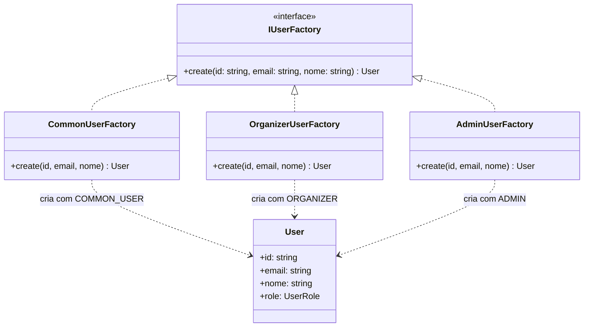

# 3.1.1 Factory Method

## Participantes

| Matrícula | Nome                                                  | Commits                                                                                                                   |
| :-------- | :---------------------------------------------------- | :------------------------------------------------------------------------------------------------------------------------ |
|           | [Miguel Arthur](https://github.com/MiguelAugusto1040) | [dd90dd9](https://github.com/UnBArqDsw2026-1-Turma01/2026.1-T01-_G5_BelezasNaturaisBrasileiras_Entrega_01/commit/dd90dd9) |
| 222015060 | [Ana Luiza](https://github.com/ana-pfeilsticker)      | [9dc1acc](https://github.com/UnBArqDsw2026-1-Turma01/2026.1-T01-_G5_BelezasNaturaisBrasileiras_Entrega_01/commit/9dc1acc) |

## Introdução

O **Factory Method** é um padrão criacional que define uma interface para criar um objeto, mas deixa que as subclasses decidam qual classe instanciar. É particularmente útil quando uma classe não pode antecipar o tipo de objetos que ela deve criar, ou quando deseja delegar a responsabilidade de criação para suas subclasses.

Este padrão promove o desacoplamento entre o código cliente e as classes concretas, permitindo que novas subclasses sejam adicionadas sem modificar o código existente.

## Quando Aplicar?

- Quando o processo de criação de um objeto envolve muitas etapas ou parâmetros opcionais
- Quando o mesmo algoritmo de construção deve produzir tipos diferentes do mesmo produto
- Quando se deseja isolar o código de construção do código de representação, reduzindo acoplamento
- Quando uma classe não consegue antecipar antecipadamente o tipo de objetos que ela precisa criar
- Quando novas subclasses de criação precisam ser adicionadas frequentemente

## Metodologia

O padrão Factory Method foi aplicado para **criação de usuários por role**. O sistema possui três tipos de usuário (`COMMON_USER`, `ORGANIZER`, `ADMIN`), cada um com configurações diferentes. Em vez de usar condicionais `if/switch` no código cliente para decidir como criar cada tipo, cada role tem sua própria factory concreta que encapsula a criação.

A interface `IUserFactory` define o método `create(id, email, nome): User` — o "factory method". Cada implementação (`CommonUserFactory`, `OrganizerUserFactory`, `AdminUserFactory`) sobrescreve esse método para construir um `User` com a role correta via `UserBuilder`. O código cliente (use cases) depende apenas da interface `IUserFactory`, nunca das factories concretas.

## Estrutura e Participantes

| Classe                 | Papel no Padrão     | Responsabilidade                                  |
| :--------------------- | :------------------ | :------------------------------------------------ |
| `IUserFactory`         | Creator (interface) | Define o contrato `create(id, email, nome): User` |
| `CommonUserFactory`    | Concrete Creator    | Cria `User` com role `COMMON_USER`                |
| `OrganizerUserFactory` | Concrete Creator    | Cria `User` com role `ORGANIZER`                  |
| `AdminUserFactory`     | Concrete Creator    | Cria `User` com role `ADMIN`                      |
| `User`                 | Product             | Objeto resultante de qualquer factory             |

## Diagrama de Classes

## Descrição das Classes

**`IUserFactory`** (`domain/interfaces/IUserFactory.ts`)

Interface do creator. Define o método `create(id, email, nome): User` que todas as factories devem implementar. Desacopla o código cliente das implementações concretas.

**`CommonUserFactory`** (`infrastructure/factories/CommonUserFactory.ts`)

Factory para usuários comuns. Usa `UserBuilder` configurando `role = UserRole.COMMON_USER`. É a factory padrão usada no fluxo de cadastro (`CreateAccountUseCase`).

**`OrganizerUserFactory`** (`infrastructure/factories/OrganizerUserFactory.ts`)

Factory para organizadores. Usa `UserBuilder` configurando `role = UserRole.ORGANIZER`. Usada quando um usuário é promovido para poder criar trilhas.

**`AdminUserFactory`** (`infrastructure/factories/AdminUserFactory.ts`)

Factory para administradores. Usa `UserBuilder` configurando `role = UserRole.ADMIN`. Usada em promoções administrativas.

## Vídeo de Demonstração

[Adicionar link para o vídeo de demonstração do padrão em funcionamento]

## Rotas Relacionadas

| Rota                | Método | Descrição                                                                   | Como Testar                                                                                                      |
| :------------------ | :----- | :-------------------------------------------------------------------------- | :--------------------------------------------------------------------------------------------------------------- |
| `/accounts/signup`  | `POST` | Cadastro de novo usuário; usa `CommonUserFactory` via `UserFactoryRegistry` | `curl -X POST http://localhost:3000/accounts/signup -d '{"email":"x@x.com","password":"123456","nome":"Teste"}'` |
| `/accounts/promote` | `POST` | Promoção de role; a factory da nova role é selecionada pelo Registry        | Requer token JWT de ADMIN                                                                                        |

## Declaração de Uso de IA

Este documento e a implementação foram desenvolvidos com o auxílio do Claude para otimizar a estrutura, apresentação do conteúdo e codificação. Todas as decisões de implementação, modelagem de classes e escolhas arquiteturais foram realizadas pela equipe com senso crítico e autoridade própria.

O Claude foi utilizado como ferramenta de suporte em duas frentes:

**Documentação:**

- Otimização da estrutura e apresentação do padrão
- Refinamento da apresentação técnica
- Geração de exemplos e descrições

**Codificação:**

- Auxílio na criação da estrutura base do código
- A equipe utilizou de arquivos de especificação (specs) bem definidos para garantir que o Claude seguisse fielmente o planejamento
- As escolhas arquiteturais foram realizadas EXCLUSIVAMENTE pela equipe
- O Claude auxiliou na implementação mantendo todos os parâmetros e restrições estabelecidas pelo grupo

Cada implementação, diagrama e decisão foi revisado e alterado conforme as necessidades do projeto. A equipe mantém total responsabilidade pelas escolhas implementadas.

## Referências Bibliográficas

> Gamma, E., Helm, R., Johnson, R., & Vlissides, J. (1994). Design Patterns: Elements of Reusable Object-Oriented Software. Addison-Wesley.

> Refactoring Guru. Factory Method. Disponível em: https://refactoring.guru/design-patterns/factory-method. Acesso em: 18 mai. 2026.

> Freeman, E., Freeman, E., Kathy, S., & Bates, B. (2004). Head First Design Patterns. O'Reilly Media.

## Histórico de versões

| Versão | Data       | Descrição                                                                                                                       | Autor                                               | Revisor | Detalhamento da Revisão |
| :----- | :--------- | :------------------------------------------------------------------------------------------------------------------------------ | :-------------------------------------------------- | :------ | :---------------------- |
| `1.0`  | 18/05/2026 | Criação da estrutura do documento com seções de participantes, introdução, metodologia, estrutura de classes, diagrama e rotas. | [Ana Luiza](https://github.com/ana-pfeilsticker)    |         |                         |
| `1.1`  | 19/05/2026 | Preenchimento da metodologia, diagrama de classes, descrição das classes e rotas relacionadas.                                  | [Vitor Hoffmann](https://github.com/vitor-hoffmann) |         |                         |
