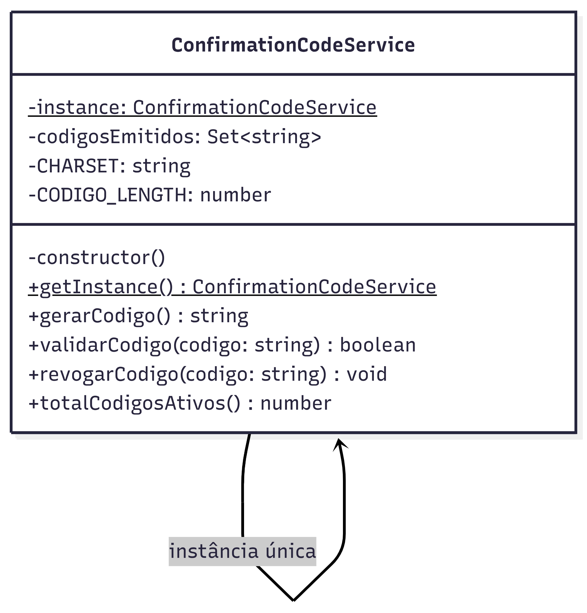

# 3.1.2 Singleton

## Participantes

| Matrícula | Nome | Commits |
| :--- | :--- | :--- |
| 211043683 | [Vitor Hoffmann](https://github.com/vitor-hoffmann) | [4b6942c](https://github.com/UnBArqDsw2026-1-Turma01/2026.1-T01-_G5_BelezasNaturaisBrasileiras_Entrega_01/commit/4b6942c) |
| | [Ana Luiza](https://github.com/ana-pfeilsticker) | [4b6942c](https://github.com/UnBArqDsw2026-1-Turma01/2026.1-T01-_G5_BelezasNaturaisBrasileiras_Entrega_01/commit/4b6942c) |
| | [Mateus Mognon](https://github.com/mtsmgn0) | [4b6942c](https://github.com/UnBArqDsw2026-1-Turma01/2026.1-T01-_G5_BelezasNaturaisBrasileiras_Entrega_01/commit/4b6942c) |
| | [Mário Vinícius](https://github.com/MarioViniciusBC) | [4b6942c](https://github.com/UnBArqDsw2026-1-Turma01/2026.1-T01-_G5_BelezasNaturaisBrasileiras_Entrega_01/commit/4b6942c) |
| | [Antônio Carvalho](https://github.com/antonioscarvalho) | [4b6942c](https://github.com/UnBArqDsw2026-1-Turma01/2026.1-T01-_G5_BelezasNaturaisBrasileiras_Entrega_01/commit/4b6942c) |

## Introdução

O **Singleton** é um padrão criacional que restringe a instanciação de uma classe a um único objeto e fornece um ponto de acesso global a essa instância. É útil quando exatamente uma instância de uma classe é necessária para coordenar ações em todo o sistema.

Este padrão garante que uma classe tenha apenas uma instância e fornece um mecanismo para acessá-la globalmente, sendo especialmente valioso para recursos compartilhados como configurações, loggers, pools de conexão com banco de dados ou gerenciadores de sessão.

## Quando Aplicar?

- Quando exatamente uma instância de uma classe deve existir, e ela deve ser acessível a todos os clientes
- Quando o controle centralizado de um recurso único é necessário
- Quando a instanciação é cara e deve ser minimizada
- Quando um ponto de acesso global é aceitável e desejável
- Para gerenciar recursos compartilhados como conexões de banco de dados, loggers ou configurações globais

## Metodologia

O padrão Singleton foi aplicado ao `ConfirmationCodeService`, serviço responsável por gerar e validar os códigos de confirmação usados no check-in de trilhas.

O problema que motivou o uso do Singleton foi a necessidade de manter um **estado global consistente de códigos ativos**: ao emitir um código para uma inscrição, esse código precisa ser único em toda a aplicação e acessível para validação por qualquer requisição posterior. Se cada instância do serviço mantivesse sua própria memória, o código gerado em uma requisição não poderia ser validado em outra.

A implementação usa o padrão clássico com construtor privado e método `getInstance()`. No contexto do NestJS (que já é um contêiner de DI com escopo singleton por padrão), a instância é registrada com `useValue: ConfirmationCodeService.getInstance()` para garantir que a instância única controlada pela própria classe seja reutilizada — e não uma nova criada pelo framework.

## Estrutura e Participantes

| Classe | Papel no Padrão | Responsabilidade |
| :--- | :--- | :--- |
| `ConfirmationCodeService` | Singleton | Mantém a instância única e gerencia o conjunto de códigos ativos em memória |

## Diagrama de Classes

## Descrição das Classes

**`ConfirmationCodeService`**

Único participante do padrão. Controla toda a lógica de geração e validação de códigos de check-in:

- `getInstance()` — retorna a instância única, criando-a na primeira chamada (lazy initialization).
- `gerarCodigo()` — gera um código aleatório de 8 caracteres alfanuméricos (maiúsculos), garantindo unicidade dentro do `Set` de códigos ativos.
- `validarCodigo(codigo)` — verifica se o código existe no `Set`, ou seja, se foi emitido e ainda não foi revogado.
- `revogarCodigo(codigo)` — remove o código do `Set` após o check-in ser concluído.
- `totalCodigosAtivos` — getter que retorna o tamanho do `Set`, exposto pelo endpoint de status.

## Vídeo de Demonstração

[Adicionar link para o vídeo de demonstração do padrão em funcionamento]

## Rotas Relacionadas

| Rota | Método | Descrição | Como Testar |
| :--- | :--- | :--- | :--- |
| `/trilhas/codigos/gerar` | `POST` | Gera um código único via Singleton e o registra em memória | `curl -X POST http://localhost:3000/trilhas/codigos/gerar` |
| `/trilhas/codigos/validar` | `POST` | Verifica se o código existe no estado interno do Singleton | `curl -X POST http://localhost:3000/trilhas/codigos/validar -d '{"codigo":"XXXXXXXX"}'` |
| `/trilhas/status` | `GET` | Retorna `codigosAtivos` (tamanho do Set) e `observadoresAtivos` | `curl http://localhost:3000/trilhas/status` |
| `/inscricoes/:id/aceitar` | `POST` | Ao aceitar uma inscrição, o Singleton gera o código e o persiste na inscrição | Requer token JWT do organizador |

## Declaração de Uso de IA

Este documento e a implementação foram desenvolvidos com o auxílio do Claude para otimizar a estrutura, apresentação do conteúdo e codificação. Todas as decisões de implementação, modelagem de classes e escolhas arquiteturais foram realizadas pela equipe com senso crítico e autoridade própria.

O Claude foi utilizado como ferramenta de suporte em duas frentes:

**Documentação:**
- Otimização da estrutura e apresentação do padrão
- Refinamento da apresentação técnica
- Geração de exemplos e descrições

**Codificação:**
- Auxílio na criação da estrutura base do código
- A equipe utilizou de arquivos de especificação (specs) bem definidos para garantir que o Claude seguisse fielmente o planejamento
- As escolhas arquiteturais foram realizadas EXCLUSIVAMENTE pela equipe
- O Claude auxiliou na implementação mantendo todos os parâmetros e restrições estabelecidas pelo grupo

Cada implementação, diagrama e decisão foi revisado e alterado conforme as necessidades do projeto. A equipe mantém total responsabilidade pelas escolhas implementadas.

## Referências Bibliográficas

> Gamma, E., Helm, R., Johnson, R., & Vlissides, J. (1994). Design Patterns: Elements of Reusable Object-Oriented Software. Addison-Wesley.

> Refactoring Guru. Singleton. Disponível em: https://refactoring.guru/design-patterns/singleton. Acesso em: 18 mai. 2026.

> Freeman, E., Freeman, E., Kathy, S., & Bates, B. (2004). Head First Design Patterns. O'Reilly Media.

## Histórico de versões

| Versão | Data | Descrição | Autor | Revisor | Detalhamento da Revisão |
| :----- | :--- | :--- | :--- | :--- | :--- |
| `1.0` | 18/05/2026 | Criação da estrutura do documento com seções de participantes, introdução, metodologia, estrutura de classes, diagrama e rotas. | [Ana Luiza](https://github.com/ana-pfeilsticker) | | |
| `1.1` | 19/05/2026 | Preenchimento da metodologia, diagrama de classes, descrição das classes e rotas relacionadas. | [Vitor Hoffmann](https://github.com/vitor-hoffmann) | | |
