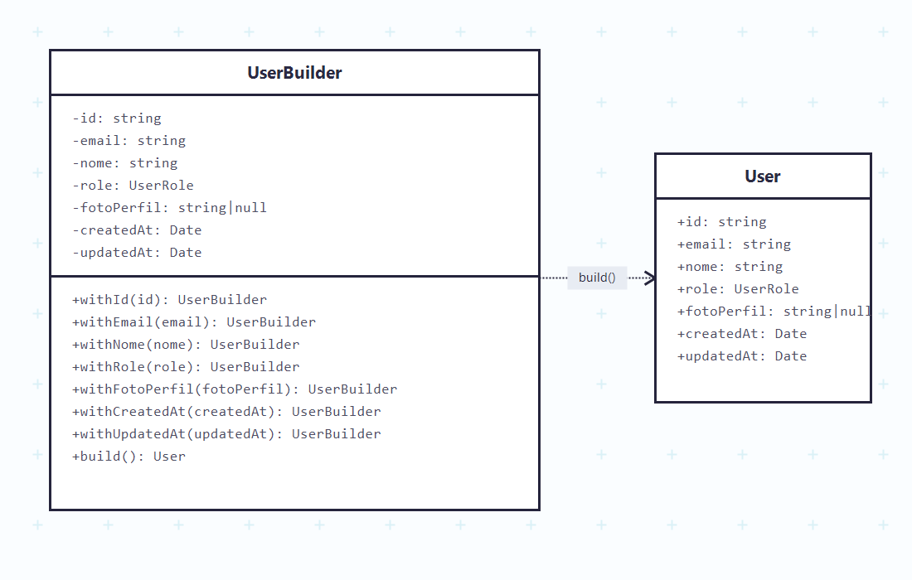

# 3.1.5 Builder

## Participantes

| Matrícula | Nome                                                  | Commits                                                                                                                                                    |
| :-------- | :---------------------------------------------------- | :--------------------------------------------------------------------------------------------------------------------------------------------------------- |
|           | [Miguel Arthur](https://github.com/MiguelAugusto1040) | [dd90dd9](https://github.com/UnBArqDsw2026-1-Turma01/2026.1-T01-_G5_BelezasNaturaisBrasileiras_Entrega_01/commit/dd90dd9)                                  |
| 221031229 | [Paulo Filho](https://github.com/PauloFilho2)         | [ba65a7d](https://github.com/UnBArqDsw2026-1-Turma01/2026.1-T01-_G5_BelezasNaturaisBrasileiras_Entrega_03/commit/ba65a7d54f3ec41b0ebe56021e6f945c17d3534a) |
|           | [Heloisa Santos](https://github.com/Heloisa-Santos)   | [ba65a7d](https://github.com/UnBArqDsw2026-1-Turma01/2026.1-T01-_G5_BelezasNaturaisBrasileiras_Entrega_03/commit/ba65a7d54f3ec41b0ebe56021e6f945c17d3534a) |

## Introdução

O **Builder** é um padrão criacional que constrói um objeto complexo passo a passo, separando a construção de sua representação. Permite que o mesmo processo de construção produza diferentes representações do objeto.

Este padrão é especialmente útil quando um objeto tem muitos atributos opcionais ou quando sua construção envolve múltiplas etapas e decisões.

## Quando Aplicar?

- Quando um objeto possui muitos atributos, alguns deles opcionais
- Quando a construção de um objeto é complexa e envolve múltiplas etapas
- Quando você deseja criar diferentes representações de um objeto
- Quando deseja isolar a lógica de construção do código cliente
- Quando quer tornar o código mais legível ao criar objetos com muitos parâmetros

## Metodologia

O padrão Builder já havia sido aplicado na criação da entidade `User`. O objeto `User` possui 7 campos, alguns obrigatórios (`id`, `email`, `nome`) e outros com valores padrão (`role`, `fotoPerfil`, `createdAt`, `updatedAt`). Usar um construtor convencional com todos esses parâmetros tornaria o código cliente difícil de ler e propenso a erros de ordem de argumentos.

O `UserBuilder` resolve isso com uma API fluente: cada método `withXxx()` configura um campo e retorna a própria instância do builder, permitindo encadeamento. O método `build()` valida os campos obrigatórios e só então instancia o `User`, garantindo que objetos inválidos nunca sejam criados.

Na prática, o Builder de usuários é consumido pelas factories de usuário (`CommonUserFactory`, `OrganizerUserFactory`, `AdminUserFactory`), que o utilizam para criar instâncias de `User` já com a role correta configurada.

Além da implementação já existente em `User`, o padrão Builder foi estendido para a criação da entidade `Trilha`. Antes da alteração, o `CriarTrilhaUseCase` instanciava uma trilha diretamente com `new Trilha(...)`, passando vários argumentos posicionais em sequência. Isso funcionava, mas deixava a criação mais sensível a erros, porque trocar a ordem de `titulo`, `descricao`, `organizadorId`, `pontoEncontro`, `dataInicio` ou `vagasMaximas` poderia gerar um objeto inconsistente sem que o código ficasse imediatamente claro.

Para resolver isso, foi criado o `TrilhaBuilder`. Ele segue a mesma ideia do `UserBuilder`: cada campo é configurado por um método nomeado, e a entidade final só é criada ao chamar `build()`. Dessa forma, o caso de uso fica mais legível e a regra de construção da entidade fica concentrada em uma classe própria.

## Estrutura e Participantes

| Classe                 | Papel no Padrão  | Responsabilidade                                                              |
| :--------------------- | :--------------- | :---------------------------------------------------------------------------- |
| `UserBuilder`          | Builder Concreto | Acumula os campos do usuário passo a passo e valida obrigatórios no `build()` |
| `User`                 | Produto          | Objeto final de usuário construído pelas factories                            |
| `TrilhaBuilder`        | Builder Concreto | Acumula os campos da trilha passo a passo e instancia a entidade `Trilha`     |
| `Trilha`               | Produto          | Objeto final de trilha criado no fluxo de cadastro de trilhas                 |
| `CriarTrilhaUseCase`   | Cliente          | Usa `TrilhaBuilder` para montar a trilha antes de salvá-la no repositório     |
| `CommonUserFactory`    | Cliente          | Usa `UserBuilder` para criar usuários comuns                                  |
| `OrganizerUserFactory` | Cliente          | Usa `UserBuilder` para criar organizadores                                    |
| `AdminUserFactory`     | Cliente          | Usa `UserBuilder` para criar administradores                                  |

## Diagrama de Classes



## Descrição das Classes

**`UserBuilder`** (`domain/builders/UserBuilder.ts`)

Builder concreto para a entidade `User`. Cada método `withXxx()` define um campo e retorna `this`, possibilitando chamadas encadeadas. O método `build()` lança uma exceção se `id`, `email` ou `nome` não foram configurados, garantindo integridade antes da criação do objeto.

**`User`** (`domain/entities/User.ts`)

Produto final do padrão na área de contas. Classe de domínio pura, sem dependências externas. É construída via `UserBuilder` nas factories, garantindo consistência dos dados em toda a aplicação.

**`TrilhaBuilder`** (`domain/builders/TrilhaBuilder.ts`)

Builder concreto adicionado para a entidade `Trilha`. Ele permite montar uma trilha com chamadas nomeadas, como `withTitulo()`, `withDescricao()`, `withDataInicio()` e `withVagasMaximas()`. O objetivo é evitar construtores extensos no código cliente e tornar explícito qual valor está sendo atribuído a cada campo.

**`Trilha`** (`domain/entities/Trilha.ts`)

Produto final do padrão na área de trilhas. A entidade continua concentrando o estado e os comportamentos de domínio da trilha; o Builder apenas organiza o processo de criação.

**`CriarTrilhaUseCase`** (`application/use-cases/CriarTrilhaUseCase.ts`)

Cliente da nova implementação do Builder. Em vez de chamar diretamente `new Trilha(...)`, o caso de uso cria a entidade com `TrilhaBuilder`, deixando a criação mais expressiva antes de persistir a trilha no repositório.

## Trechos de Código

### `UserBuilder` — construção fluente de usuários

> [`backend/src/modules/accounts/domain/builders/UserBuilder.ts`](https://github.com/UnBArqDsw2026-1-Turma01/2026.1-T01-_G5_BelezasNaturaisBrasileiras_Entrega_01/blob/main/backend/src/modules/accounts/domain/builders/UserBuilder.ts)

```typescript
export class UserBuilder {
  private id!: string;
  private email!: string;
  private nome!: string;
  private role: UserRole = UserRole.COMMON_USER;
  private fotoPerfil: string | null = null;

  withId(id: string): UserBuilder {
    this.id = id;
    return this;
  }
  withEmail(email: string): UserBuilder {
    this.email = email;
    return this;
  }
  withNome(nome: string): UserBuilder {
    this.nome = nome;
    return this;
  }
  withRole(role: UserRole): UserBuilder {
    this.role = role;
    return this;
  }

  build(): User {
    if (!this.id || !this.email || !this.nome)
      throw new Error("Campos obrigatórios ausentes no UserBuilder");
    return new User(this.id, this.email, this.nome, this.role, this.fotoPerfil);
  }
}
```

### `TrilhaBuilder` — construção de trilhas com atributos opcionais

> [`backend/src/modules/trilhas/domain/builders/TrilhaBuilder.ts`](https://github.com/UnBArqDsw2026-1-Turma01/2026.1-T01-_G5_BelezasNaturaisBrasileiras_Entrega_01/blob/main/backend/src/modules/trilhas/domain/builders/TrilhaBuilder.ts)

```typescript
export class TrilhaBuilder {
  withTitulo(titulo: string): TrilhaBuilder {
    this.titulo = titulo;
    return this;
  }
  withDataInicio(data: Date): TrilhaBuilder {
    this.dataInicio = data;
    return this;
  }
  withVagasMaximas(n: number): TrilhaBuilder {
    this.vagasMaximas = n;
    return this;
  }
  // ...
  build(): Trilha {
    /* valida e instancia */
  }
}
```

## Vídeo de Demonstração

[Adicionar link para o vídeo de demonstração do padrão em funcionamento]

## Rotas Relacionadas

| Rota                | Método | Descrição                                                                      | Como Testar                                                                                                      |
| :------------------ | :----- | :----------------------------------------------------------------------------- | :--------------------------------------------------------------------------------------------------------------- |
| `/accounts/signup`  | `POST` | Cria um novo usuário; internamente usa `UserBuilder` via `CommonUserFactory`   | `curl -X POST http://localhost:3000/accounts/signup -d '{"email":"x@x.com","password":"123456","nome":"Teste"}'` |
| `/accounts/promote` | `POST` | Promove a role de um usuário; a factory da nova role usa `UserBuilder`         | Requer token JWT de ADMIN                                                                                        |
| `/trilhas`          | `POST` | Cria uma nova trilha; internamente usa `TrilhaBuilder` no `CriarTrilhaUseCase` | Requer token JWT do organizador                                                                                  |

## Declaração de Uso de IA

Este documento e a implementação foram desenvolvidos com o auxílio do Claude para otimizar a estrutura, apresentação do conteúdo e codificação. Todas as decisões de implementação, modelagem de classes e escolhas arquiteturais foram realizadas pela equipe com senso crítico e autoridade própria.

O Claude foi utilizado como ferramenta de suporte em duas frentes:

**Documentação:**

- Otimização da estrutura e apresentação do padrão
- Refinamento da apresentação técnica
- Geração de exemplos e descrições

**Codificação:**

- Auxílio na criação da estrutura base do código
- A equipe utilizou de arquivos de especificação (specs) bem definidos para garantir que o Claude seguisse fielmente o planejamento
- As escolhas arquiteturais foram realizadas EXCLUSIVAMENTE pela equipe
- O Claude auxiliou na implementação mantendo todos os parâmetros e restrições estabelecidas pelo grupo

Cada implementação, diagrama e decisão foi revisado e alterado conforme as necessidades do projeto. A equipe mantém total responsabilidade pelas escolhas implementadas.

## Referências Bibliográficas

> Gamma, E., Helm, R., Johnson, R., & Vlissides, J. (1994). Design Patterns: Elements of Reusable Object-Oriented Software. Addison-Wesley.

> Refactoring Guru. Builder. Disponível em: https://refactoring.guru/design-patterns/builder. Acesso em: 18 mai. 2026.

> Freeman, E., Freeman, E., Kathy, S., & Bates, B. (2004). Head First Design Patterns. O'Reilly Media.

## Histórico de versões

| Versão | Data       | Descrição                                                                                                                       | Autor                                               | Revisor                                             | Detalhamento da Revisão |
| :----- | :--------- | :------------------------------------------------------------------------------------------------------------------------------ | :-------------------------------------------------- | :-------------------------------------------------- | :---------------------- |
| `1.0`  | 18/05/2026 | Criação da estrutura do documento com seções de participantes, introdução, metodologia, estrutura de classes, diagrama e rotas. | [Ana Luiza](https://github.com/ana-pfeilsticker)    |                                                     |                         |
| `1.1`  | 19/05/2026 | Preenchimento da metodologia, diagrama de classes, descrição das classes e rotas relacionadas.                                  | [Vitor Hoffmann](https://github.com/vitor-hoffmann) |                                                     |                         |
| `1.2`  | 21/05/2026 | Inclusão da aplicação adicional do Builder na criação de trilhas com `TrilhaBuilder`.                                           | [Paulo Filho](https://github.com/PauloFilho2)       | [Heloisa Santos](https://github.com/Heloisa-Santos) |                         |
