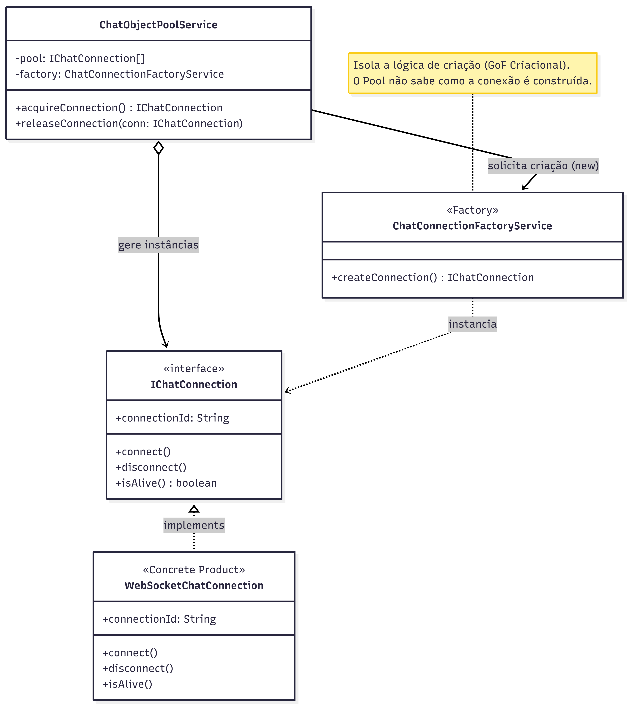

# 3.1.6 Object Pool

## Participantes

| Matrícula  | Nome                                                    | Commits                                                                                                                                                    |
| :--------- | :------------------------------------------------------ | :--------------------------------------------------------------------------------------------------------------------------------------------------------- |
| 22/2006552 | [Antonio Carvalho](https://github.com/antonioscarvalho) | [9eaacb1](https://github.com/UnBArqDsw2026-1-Turma01/2026.1-T01-_G5_BelezasNaturaisBrasileiras_Entrega_01/commit/9eaacb12b38b2d4012498f978b3b76332070d57a) |
| 20/2046265 | [Mário Vinícius](https://github.com/MarioViniciusBC)    | [d16d7fe](https://github.com/UnBArqDsw2026-1-Turma01/2026.1-T01-_G5_BelezasNaturaisBrasileiras_Entrega_01/commit/d16d7fe445c1eb6e72989875ca9e20bc3d2fd573) |
| 22/2021998 | [Mateus Magno](https://github.com/mtsmgn0)              | [4dff353](https://github.com/UnBArqDsw2026-1-Turma01/2026.1-T01-_G5_BelezasNaturaisBrasileiras_Entrega_01/commit/4dff3536c7b619e54054dfafaa8211cfa1b86d88) |

## Introdução

O **Object Pool** é um padrão criacional que mantém um conjunto de objetos inicializados prontos para uso, em vez de criar e destruir objetos sob demanda. Quando um cliente precisa de um objeto, ele o obtém do pool; ao terminar, o devolve ao pool para reutilização por outra requisição.

Embora não faça parte dos 23 padrões originais do GoF, o Object Pool é amplamente reconhecido como um padrão criacional complementar, especialmente relevante em sistemas que lidam com objetos cuja criação é custosa — como conexões de banco de dados, conexões de rede, threads ou, como no BNB, conexões de chat.

## Quando Aplicar?

- Quando a criação de objetos é cara (tempo de CPU, memória, I/O de rede)
- Quando objetos são usados por períodos curtos e frequentes
- Quando um limite máximo de instâncias simultâneas deve ser respeitado
- Quando a reutilização de objetos melhora significativamente o throughput do sistema
- Para gerenciar conexões de rede, threads, drivers de banco de dados ou sessões WebSocket

## Metodologia

O padrão foi aplicado ao módulo de **chat** para gerenciar conexões de comunicação (`IChatConnection`) entre participantes. O problema central era o alto custo de criação e destruição de conexões de chat a cada mensagem enviada: em um sistema com muitos usuários ativos, instanciar e fechar conexões individualmente por requisição desperdicia recursos e aumenta latência.

A solução foi o `ChatObjectPoolService`, que mantém um array interno de conexões ociosas (máximo de 50). Quando `ChatSessionManagerService` precisa transmitir uma mensagem, chama `withConnection(callback)`, que:

1. Chama `pool.acquire()` — retorna uma conexão ociosa do array, ou cria uma nova via `ChatConnectionFactoryService` se o pool estiver vazio;
2. Executa o `callback` com a conexão adquirida;
3. Chama `pool.release(conn)` no bloco `finally` — devolve a conexão ao pool se ela ainda estiver viva e o pool não estiver cheio; caso contrário, fecha a conexão.

Essa abordagem desacopla o consumidor (`ChatSessionManagerService`) do gerenciamento do ciclo de vida das conexões, e impõe um limite explícito de 50 conexões simultâneas no pool.

## Estrutura e Participantes

| Classe                         | Papel no Padrão              | Responsabilidade                                                             |
| :----------------------------- | :--------------------------- | :--------------------------------------------------------------------------- |
| `IObjectPool<T>`               | Pool (interface)             | Contrato genérico com `acquire()`, `release()`, `size()` e `cleanIdle()`     |
| `IChatConnection`              | Produto Poolável (interface) | Abstrai a conexão de chat com `open()`, `close()`, `send()`, `isAlive()`     |
| `ChatObjectPoolService`        | Pool Concreto                | Mantém array de até 50 conexões ociosas; implementa `acquire/release`        |
| `ChatConnectionFactoryService` | Fábrica                      | Cria novas instâncias de `IChatConnection` quando o pool está vazio          |
| `ChatSessionManagerService`    | Cliente do Pool              | Expõe `withConnection(callback)` com acquire/release automático no `finally` |

## Diagrama de Classes

## Descrição das Classes

**`IObjectPool<T>`** — Interface genérica do pool, localizada em `pool/interfaces/chat-pool.interface.ts`. Define o contrato independente do tipo de objeto gerenciado.

**`IChatConnection`** — Interface da conexão de chat, em `pool/interfaces/chat-connection.interface.ts`. Abstrai qualquer implementação concreta (WebSocket, HTTP long-polling, mock), garantindo que o pool seja agnóstico à tecnologia de transporte.

**`ChatObjectPoolService`** — Implementação principal, em `pool/chat-object-pool.service.ts`:

- `acquire()` — faz `pop()` do array; se a conexão estiver morta (`!isAlive()`), descarta e cria uma nova via factory.
- `release(conn)` — faz `push()` de volta ao array se `isAlive()` e `pool.length < max`; caso contrário, chama `close()` na conexão.
- `size()` — retorna o número de conexões ociosas disponíveis no momento.
- `cleanIdle()` — drena e fecha todas as conexões do pool (usado em shutdown).

**`ChatConnectionFactoryService`** — Fábrica de conexões, em `chat-connection.factory.service.ts`. Atualmente retorna um objeto mock com `isAlive: () => true`; em produção, substituível por wrappers de WebSocket reais sem alterar o pool.

**`ChatSessionManagerService`** — Consumidor do pool, em `chat-session.manager.service.ts`. O método `withConnection(callback)` garante que toda conexão adquirida seja devolvida ao pool, mesmo em caso de erro no callback (padrão try/finally).

## Vídeo de Demonstração

[Adicionar link para o vídeo de demonstração do padrão em funcionamento]

## Rotas Relacionadas

| Rota                          | Método | Descrição                                                                    | Como Testar                                                                                                    |
| :---------------------------- | :----- | :--------------------------------------------------------------------------- | :------------------------------------------------------------------------------------------------------------- |
| `/chat/pool/status`           | `GET`  | Retorna `poolSize` (conexões ociosas) e confirma o padrão                    | `curl http://localhost:3000/chat/pool/status`                                                                  |
| `/chat/sessions/:id/messages` | `POST` | Envia mensagem usando uma conexão adquirida do pool; devolve `poolSizeAfter` | `curl -X POST http://localhost:3000/chat/sessions/:id/messages -d '{"message":"Olá","from":"user@email.com"}'` |

## Declaração de Uso de IA

Este documento e a implementação foram desenvolvidos com o auxílio do Claude para otimizar a estrutura, apresentação do conteúdo e codificação. Todas as decisões de implementação, modelagem de classes e escolhas arquiteturais foram realizadas pela equipe com senso crítico e autoridade própria.

O Claude foi utilizado como ferramenta de suporte em duas frentes:

**Documentação:**

- Otimização da estrutura e apresentação do padrão
- Refinamento da apresentação técnica
- Geração de exemplos e descrições

**Codificação:**

- Auxílio na criação da estrutura base do código
- A equipe utilizou de arquivos de especificação (specs) bem definidos para garantir que o Claude seguisse fielmente o planejamento
- As escolhas arquiteturais foram realizadas EXCLUSIVAMENTE pela equipe
- O Claude auxiliou na implementação mantendo todos os parâmetros e restrições estabelecidas pelo grupo

Cada implementação, diagrama e decisão foi revisado e alterado conforme as necessidades do projeto. A equipe mantém total responsabilidade pelas escolhas implementadas.

## Referências Bibliográficas

> Gamma, E., Helm, R., Johnson, R., & Vlissides, J. (1994). Design Patterns: Elements of Reusable Object-Oriented Software. Addison-Wesley.

> Refactoring Guru. Object Pool. Disponível em: https://refactoring.guru/design-patterns/object-pool. Acesso em: 21 mai. 2026.

> Microsoft. Object Pool Pattern. Disponível em: https://learn.microsoft.com/en-us/dotnet/architecture/. Acesso em: 21 mai. 2026.

## Histórico de versões

| Versão | Data       | Descrição                                                                                                    | Autor                                            | Revisor | Detalhamento da Revisão |
| :----- | :--------- | :----------------------------------------------------------------------------------------------------------- | :----------------------------------------------- | :------ | :---------------------- |
| `1.0`  | 21/05/2026 | Criação do documento com estrutura base, introdução, metodologia, estrutura de classes e rotas relacionadas. | [Ana Luiza](https://github.com/ana-pfeilsticker) |         |                         |
