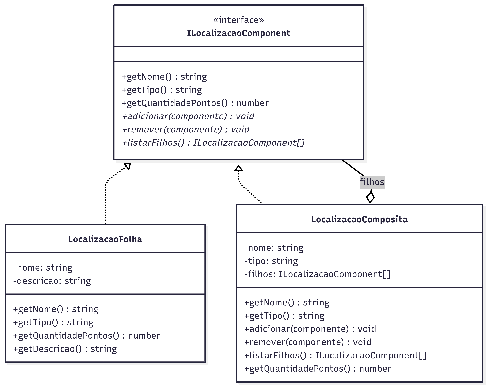

# 3.2.3 Composite

## Participantes

| Matrícula  | Nome                                                    | Commits                                                                                                                   |
| :--------- | :------------------------------------------------------ | :------------------------------------------------------------------------------------------------------------------------ |
| 222006211  | [Vitor Hoffmann](https://github.com/vitor-hoffmann)     | [4b6942c](https://github.com/UnBArqDsw2026-1-Turma01/2026.1-T01-_G5_BelezasNaturaisBrasileiras_Entrega_01/commit/4b6942c) |
| 222015060  | [Ana Luiza](https://github.com/ana-pfeilsticker)        | [4b6942c](https://github.com/UnBArqDsw2026-1-Turma01/2026.1-T01-_G5_BelezasNaturaisBrasileiras_Entrega_01/commit/4b6942c) |
| 222021998  | [Mateus Magno](https://github.com/mtsmgn0)              | [4b6942c](https://github.com/UnBArqDsw2026-1-Turma01/2026.1-T01-_G5_BelezasNaturaisBrasileiras_Entrega_01/commit/4b6942c) |
| 20/2046265 | [Mário Vinícius](https://github.com/MarioViniciusBC)    | [4b6942c](https://github.com/UnBArqDsw2026-1-Turma01/2026.1-T01-_G5_BelezasNaturaisBrasileiras_Entrega_01/commit/4b6942c) |
| 222006552  | [Antonio Carvalho](https://github.com/antonioscarvalho) | [4b6942c](https://github.com/UnBArqDsw2026-1-Turma01/2026.1-T01-_G5_BelezasNaturaisBrasileiras_Entrega_01/commit/4b6942c) |

## Introdução

O **Composite** é um padrão estrutural que compõe objetos em estruturas em árvore para representar hierarquias parte-todo, deixando os clientes tratarem objetos individuais e composições de forma uniforme. É particularmente útil para representar hierarquias que contêm tanto elementos primitivos quanto elementos compostos.

Este padrão permite criar estruturas recursivas onde cada componente pode conter outros componentes, simplificando o código cliente que não precisa distinguir entre folhas e nós.

## Quando Aplicar?

- Quando você precisa representar hierarquias parte-todo de objetos
- Quando os clientes devem ignorar diferenças entre composições de objetos e objetos individuais
- Quando uma estrutura em árvore é necessária
- Quando novos componentes folha devem ser adicionados frequentemente
- Quando você deseja simplificar o código cliente através de polimorfismo

## Metodologia

O padrão Composite foi aplicado para modelar **hierarquias geográficas de pontos turísticos** — a principal entidade do domínio do projeto. O Brasil possui uma estrutura naturalmente hierárquica: estados contêm cidades, que contêm pontos turísticos. O Composite permite navegar e agregar dados nessa árvore sem que o código cliente precise distinguir entre nós intermediários (estados, cidades) e folhas (pontos individuais).

O problema concreto resolvido foi a **contagem recursiva de pontos turísticos**: dado um estado, quantos pontos ele possui no total? Com o Composite, a lógica fica em `getQuantidadePontos()`, que cada nó resolve por si mesmo — folhas retornam 1, compostos somam os filhos recursivamente.

A interface `ILocalizacaoComponent` define o contrato comum. `LocalizacaoFolha` representa um ponto turístico individual e não expõe métodos de composição (`adicionar`, `remover`, `listarFilhos`). `LocalizacaoComposita` representa agrupadores (estado, cidade, região) e gerencia a lista de filhos.

## Estrutura e Participantes

| Classe                  | Papel no Padrão | Responsabilidade                                                                      |
| :---------------------- | :-------------- | :------------------------------------------------------------------------------------ |
| `ILocalizacaoComponent` | Component       | Interface comum que define `getNome()`, `getTipo()` e `getQuantidadePontos()`         |
| `LocalizacaoFolha`      | Leaf            | Representa um ponto turístico individual; sempre retorna 1 em `getQuantidadePontos()` |
| `LocalizacaoComposita`  | Composite       | Agrupador (estado, cidade, região); gerencia filhos e agrega pontos recursivamente    |

## Diagrama de Classes



## Descrição das Classes

**`ILocalizacaoComponent`** (`domain/interfaces/ILocalizacaoComponent.ts`)

Interface do componente base. Define o contrato que tanto folhas quanto compostos devem seguir. Os métodos de composição (`adicionar`, `remover`, `listarFilhos`) são opcionais (`?`) para que `LocalizacaoFolha` não precise implementá-los.

**`LocalizacaoFolha`** (`domain/localizacao/LocalizacaoFolha.ts`)

Representa um ponto turístico individual (ex.: "Chapada dos Veadeiros", "Serra da Canastra"). Implementa `getQuantidadePontos()` retornando sempre `1`. Não expõe métodos de composição — é o elemento terminal da árvore.

**`LocalizacaoComposita`** (`domain/localizacao/LocalizacaoComposita.ts`)

Representa agrupadores geográficos: estado, cidade ou região. Mantém uma lista interna de filhos (`ILocalizacaoComponent[]`). Em `getQuantidadePontos()`, itera sobre os filhos com `reduce`, acumulando recursivamente os pontos de toda a subárvore.

## Trechos de Código

### `LocalizacaoComposita` — nó composto (estado, cidade)

> [`backend/src/modules/trilhas/domain/localizacao/LocalizacaoComposita.ts`](https://github.com/UnBArqDsw2026-1-Turma01/2026.1-T01-_G5_BelezasNaturaisBrasileiras_Entrega_01/blob/main/backend/src/modules/trilhas/domain/localizacao/LocalizacaoComposita.ts)

```typescript
export class LocalizacaoComposita implements ILocalizacaoComponent {
  private filhos: ILocalizacaoComponent[] = [];

  constructor(
    private readonly nome: string,
    private readonly tipo: "estado" | "cidade" | "regiao",
  ) {}

  adicionar(componente: ILocalizacaoComponent): void {
    this.filhos.push(componente);
  }
  remover(componente: ILocalizacaoComponent): void {
    this.filhos = this.filhos.filter((f) => f !== componente);
  }
  getQuantidadePontos(): number {
    return this.filhos.reduce(
      (total, filho) => total + filho.getQuantidadePontos(),
      0,
    );
  }
}
```

### `LocalizacaoFolha` — folha (ponto turístico concreto)

> [`backend/src/modules/trilhas/domain/localizacao/LocalizacaoFolha.ts`](https://github.com/UnBArqDsw2026-1-Turma01/2026.1-T01-_G5_BelezasNaturaisBrasileiras_Entrega_01/blob/main/backend/src/modules/trilhas/domain/localizacao/LocalizacaoFolha.ts)

```typescript
export class LocalizacaoFolha implements ILocalizacaoComponent {
  constructor(
    private readonly nome: string,
    private readonly descricao: string = "",
  ) {}
  getTipo(): "ponto" {
    return "ponto";
  }
  getQuantidadePontos(): number {
    return 1;
  }
}
```

## Vídeo de Demonstração

[Adicionar link para o vídeo de demonstração do padrão em funcionamento]

## Rotas Relacionadas

| Rota                          | Método | Descrição                                                                                                  | Como Testar        |
| :---------------------------- | :----- | :--------------------------------------------------------------------------------------------------------- | :----------------- |
| `/trilhas/localizacao/pontos` | `POST` | Recebe um estado com cidades e pontos, constrói a árvore Composite e retorna a contagem total e por cidade | Ver exemplo abaixo |

**Exemplo de payload:**

```json
{
  "estado": "Minas Gerais",
  "cidades": [
    {
      "nome": "Alto Paraíso",
      "pontos": ["Serra da Canastra", "Cachoeira do Campo"]
    },
    { "nome": "Tiradentes", "pontos": ["Praça Principal", "Igreja Matriz"] }
  ]
}
```

**Resposta:**

```json
{
  "estado": "Minas Gerais",
  "totalPontos": 4,
  "cidades": [
    {
      "cidade": "Alto Paraíso",
      "quantidadePontos": 2,
      "pontos": ["Serra da Canastra", "Cachoeira do Campo"]
    },
    {
      "cidade": "Tiradentes",
      "quantidadePontos": 2,
      "pontos": ["Praça Principal", "Igreja Matriz"]
    }
  ]
}
```

## Declaração de Uso de IA

Este documento e a implementação foram desenvolvidos com o auxílio do Claude para otimizar a estrutura, apresentação do conteúdo e codificação. Todas as decisões de implementação, modelagem de classes e escolhas arquiteturais foram realizadas pela equipe com senso crítico e autoridade própria.

O Claude foi utilizado como ferramenta de suporte em duas frentes:

**Documentação:**

- Otimização da estrutura e apresentação do padrão
- Refinamento da apresentação técnica
- Geração de exemplos e descrições

**Codificação:**

- Auxílio na criação da estrutura base do código
- A equipe utilizou de arquivos de especificação (specs) bem definidos para garantir que o Claude seguisse fielmente o planejamento
- As escolhas arquiteturais foram realizadas EXCLUSIVAMENTE pela equipe
- O Claude auxiliou na implementação mantendo todos os parâmetros e restrições estabelecidas pelo grupo

Cada implementação, diagrama e decisão foi revisado e alterado conforme as necessidades do projeto. A equipe mantém total responsabilidade pelas escolhas implementadas.

## Referências Bibliográficas

> Gamma, E., Helm, R., Johnson, R., & Vlissides, J. (1994). Design Patterns: Elements of Reusable Object-Oriented Software. Addison-Wesley.

> Refactoring Guru. Composite. Disponível em: https://refactoring.guru/design-patterns/composite. Acesso em: 18 mai. 2026.

> Freeman, E., Freeman, E., Kathy, S., & Bates, B. (2004). Head First Design Patterns. O'Reilly Media.

## Histórico de versões

| Versão | Data       | Descrição                                                                                                                       | Autor                                               | Revisor | Detalhamento da Revisão |
| :----- | :--------- | :------------------------------------------------------------------------------------------------------------------------------ | :-------------------------------------------------- | :------ | :---------------------- |
| `1.0`  | 18/05/2026 | Criação da estrutura do documento com seções de participantes, introdução, metodologia, estrutura de classes, diagrama e rotas. | [Ana Luiza](https://github.com/ana-pfeilsticker)    |         |                         |
| `1.1`  | 19/05/2026 | Preenchimento da metodologia, diagrama de classes, descrição das classes e rotas relacionadas.                                  | [Vitor Hoffmann](https://github.com/vitor-hoffmann) |         |                         |
