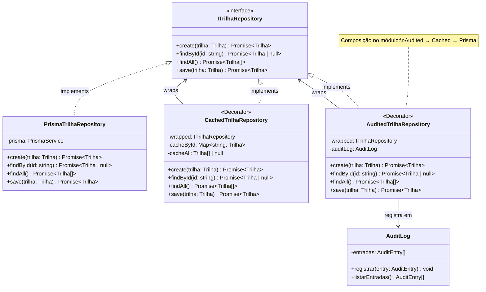

# 3.2.6 Decorator

## Participantes

| Matrícula | Nome                                               | Commits |
| :-------- | :------------------------------------------------- | :------ |
|           | [Ana Luiza](https://github.com/ana-pfeilsticker)   |         |
|           | [Vitor Valério](https://github.com/vitor-hoffmann) |         |

## Introdução

O **Decorator** é um padrão estrutural que adiciona responsabilidades a um objeto dinamicamente, fornecendo uma alternativa flexível ao uso de subclasses. Ele envolve um objeto em outro objeto que implementa a mesma interface, adicionando comportamento antes ou depois de delegar a chamada ao objeto original.

A principal vantagem é a capacidade de compor comportamentos em tempo de execução, combinando múltiplos decorators em cadeia, cada um com uma responsabilidade específica, sem que nenhum deles precise conhecer o código dos outros.

## Quando Aplicar?

- Quando você deseja adicionar responsabilidades a objetos individuais sem afetar outros objetos
- Quando extensão por herança (subclasses) criaria uma explosão combinatória de classes
- Quando as responsabilidades precisam poder ser adicionadas e removidas em tempo de execução
- Quando você deseja adicionar comportamentos transversais como cache, logging ou auditoria de forma transparente
- Quando deseja combinar múltiplos comportamentos de forma independente

## Metodologia

Durante o desenvolvimento do backend do projeto Belezas Naturais Brasileiras, identificamos que o `PrismaTrilhaRepository` cumpria exclusivamente sua responsabilidade de persistência, sem nenhum mecanismo de cache ou rastreamento de operações. Com o crescimento esperado no número de consultas a trilhas (RF02, RF07), a ausência de cache poderia gerar carga desnecessária no banco, e a ausência de auditoria violaria as regras de negócio RN01 e RN07 que exigem registro de alterações.

A solução foi aplicar o padrão **Decorator** para envolver o `PrismaTrilhaRepository` com dois decorators independentes:

- `CachedTrilhaRepository` — armazena em memória o resultado de `findById` e `findAll`, invalidando entradas em mutações
- `AuditedTrilhaRepository` — registra cada operação no `AuditLog` com o tipo de ação, `trilhaId` e timestamp

A cadeia de composição final é: `AuditedTrilhaRepository → CachedTrilhaRepository → PrismaTrilhaRepository`, de forma que toda operação passa primeiro pela auditoria, depois pelo cache e por último (em caso de cache miss) pela persistência.

A implementação seguiu a metodologia **TDD (Test-Driven Development)**, com os arquivos de teste escritos antes da implementação:

1. Escrita dos specs (`CachedTrilhaRepository.spec.ts` e `AuditedTrilhaRepository.spec.ts`) cobrindo cache hit/miss, invalidação e acumulação de entradas de auditoria — fase **RED**
2. Implementação dos decorators e do `AuditLog` para fazer os testes passarem — fase **GREEN**
3. Atualização do `TrilhasModule` com `useFactory` compondo a cadeia de decorators — fase **REFACTOR**

## Estrutura e Participantes

| Classe                    | Papel no Padrão           | Responsabilidade                                                                                                                         |
| :------------------------ | :------------------------ | :--------------------------------------------------------------------------------------------------------------------------------------- |
| `ITrilhaRepository`       | **Component** (interface) | Define o contrato `create`, `findById`, `findAll`, `save` — implementado por todos os participantes da cadeia                            |
| `PrismaTrilhaRepository`  | **Concrete Component**    | Implementação concreta base; realiza operações diretamente no banco via Prisma                                                           |
| `CachedTrilhaRepository`  | **Concrete Decorator**    | Envolve um `ITrilhaRepository`; armazena resultados de leitura em `Map<string, Trilha>` e `Trilha[] \| null`; invalida cache em mutações |
| `AuditedTrilhaRepository` | **Concrete Decorator**    | Envolve um `ITrilhaRepository`; registra cada operação no `AuditLog` com `acao`, `trilhaId` e `registradoEm`                             |
| `AuditLog`                | **Supporting Service**    | Serviço injectable que armazena `AuditEntry[]` em memória; fornece `registrar()` e `listarEntradas()` para consulta                      |

## Diagrama de Classes

## Descrição das Classes

### `CachedTrilhaRepository`

**Caminho no Projeto:** [`backend/src/modules/trilhas/infrastructure/persistence/CachedTrilhaRepository.ts`](../../../backend/src/modules/trilhas/infrastructure/persistence/CachedTrilhaRepository.ts)

Decorator que adiciona uma camada de cache em memória ao repositório de trilhas. Evita consultas redundantes ao banco de dados para leituras repetidas da mesma trilha ou da lista completa. O cache é invalidado automaticamente em qualquer operação de escrita, garantindo consistência de dados.

#### Métodos

| Método       | Parâmetros       | Retorno                   | Descrição                                                                                      |
| :----------- | :--------------- | :------------------------ | :--------------------------------------------------------------------------------------------- |
| `findById()` | `id: string`     | `Promise<Trilha \| null>` | Retorna do `cacheById` se disponível; caso contrário, delega ao wrapped e armazena o resultado |
| `findAll()`  | —                | `Promise<Trilha[]>`       | Retorna de `cacheAll` se disponível; caso contrário, delega ao wrapped e armazena o resultado  |
| `create()`   | `trilha: Trilha` | `Promise<Trilha>`         | Delega ao wrapped e invalida `cacheAll` para forçar atualização na próxima listagem            |
| `save()`     | `trilha: Trilha` | `Promise<Trilha>`         | Delega ao wrapped e invalida a entrada específica em `cacheById` e o `cacheAll`                |

---

### `AuditedTrilhaRepository`

**Caminho no Projeto:** [`backend/src/modules/trilhas/infrastructure/persistence/AuditedTrilhaRepository.ts`](../../../backend/src/modules/trilhas/infrastructure/persistence/AuditedTrilhaRepository.ts)

Decorator que adiciona rastreamento de operações ao repositório de trilhas. Registra cada operação no `AuditLog` com a ação realizada, o identificador da trilha e o timestamp exato. Satisfaz os requisitos RN01 e RN07 sem modificar nenhuma lógica de negócio existente.

#### Métodos

| Método       | Parâmetros       | Retorno                   | Descrição                                                                             |
| :----------- | :--------------- | :------------------------ | :------------------------------------------------------------------------------------ |
| `create()`   | `trilha: Trilha` | `Promise<Trilha>`         | Delega ao wrapped; registra entrada com `acao: 'created'` e `trilhaId` do resultado   |
| `save()`     | `trilha: Trilha` | `Promise<Trilha>`         | Delega ao wrapped; registra entrada com `acao: 'updated'`, `trilhaId` e novo `status` |
| `findById()` | `id: string`     | `Promise<Trilha \| null>` | Delega ao wrapped; registra entrada com `acao: 'read'` e `trilhaId`                   |
| `findAll()`  | —                | `Promise<Trilha[]>`       | Delega ao wrapped; registra entrada com `acao: 'readAll'`                             |

---

### `AuditLog`

**Caminho no Projeto:** [`backend/src/modules/trilhas/domain/services/AuditLog.ts`](../../../backend/src/modules/trilhas/domain/services/AuditLog.ts)

Serviço injectable que mantém um registro em memória das operações realizadas sobre o repositório de trilhas. Pertence à camada de domínio por não possuir dependências de infraestrutura.

#### Interface `AuditEntry`

| Campo          | Tipo                                            | Descrição                                               |
| :------------- | :---------------------------------------------- | :------------------------------------------------------ |
| `acao`         | `'created' \| 'updated' \| 'read' \| 'readAll'` | Tipo da operação realizada                              |
| `trilhaId`     | `string` (opcional)                             | Identificador da trilha afetada                         |
| `detalhes`     | `Record<string, unknown>` (opcional)            | Metadados adicionais (ex: novo `status` após `updated`) |
| `registradoEm` | `Date`                                          | Timestamp da operação                                   |

## Vídeo de Demonstração

[Adicionar link para o vídeo de demonstração do padrão em funcionamento]

## Rotas Relacionadas

Todas as rotas do módulo de trilhas passam pelo `ITrilhaRepository`, portanto todas são auditadas e beneficiam-se do cache:

| Rota                     | Método | Descrição                      | Operação no Repositório | Efeito no Decorator                                                    |
| :----------------------- | :----- | :----------------------------- | :---------------------- | :--------------------------------------------------------------------- |
| `/trilhas`               | `GET`  | Listar todas as trilhas        | `findAll()`             | Cache hit na 2ª chamada; auditoria com `readAll`                       |
| `/trilhas`               | `POST` | Criar nova trilha              | `create()`              | Invalida `cacheAll`; auditoria com `created`                           |
| `/trilhas/:id/finalizar` | `POST` | Finalizar trilha (organizador) | `findById()` + `save()` | Cache hit em `findById`; invalida cache em `save`; auditoria `updated` |

## Declaração de Uso de IA

Este documento e a implementação foram desenvolvidos com o auxílio do Claude para otimizar a estrutura, apresentação do conteúdo e codificação. Todas as decisões de implementação, modelagem de classes e escolhas arquiteturais foram realizadas pela equipe com senso crítico e autoridade própria.

O Claude foi utilizado como ferramenta de suporte em duas frentes:

**Documentação:**

- Otimização da estrutura e apresentação do padrão
- Refinamento da apresentação técnica
- Geração de exemplos e descrições

**Codificação:**

- Auxílio na criação da estrutura base do código
- A equipe utilizou de arquivos de especificação (specs) bem definidos para garantir que o Claude seguisse fielmente o planejamento
- As escolhas arquiteturais foram realizadas EXCLUSIVAMENTE pela equipe
- O Claude auxiliou na implementação mantendo todos os parâmetros e restrições estabelecidas pelo grupo

## Histórico de versões

| Versão | Data       | Descrição                                                                              | Autor                                            | Revisor | Detalhamento da Revisão |
| :----- | :--------- | :------------------------------------------------------------------------------------- | :----------------------------------------------- | :------ | :---------------------- |
| `1.0`  | 18/05/2026 | Criação do documento com estrutura base, introdução, quando aplicar e metodologia TDD. | [Ana Luiza](https://github.com/ana-pfeilsticker) |         |                         |
| `1.1`  | 18/05/2026 | Implementação completa: specs, decorators, AuditLog e wiring no módulo.                | [Ana Luiza](https://github.com/ana-pfeilsticker) |         |                         |
