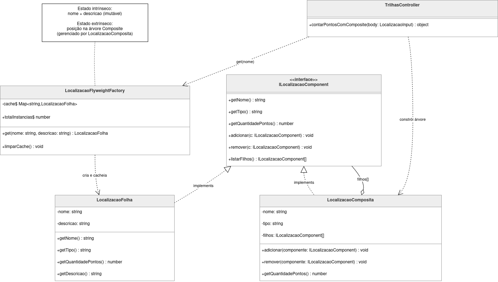

# 3.2.6 Flyweight

## Participantes

| Matrícula | Nome                                             | Commits                                                                                                                                                    |
| :-------- | :----------------------------------------------- | :--------------------------------------------------------------------------------------------------------------------------------------------------------- |
| 222015060 | [Ana Luiza](https://github.com/ana-pfeilsticker) | [bfefa72](https://github.com/UnBArqDsw2026-1-Turma01/2026.1-T01-_G5_BelezasNaturaisBrasileiras_Entrega_03/commit/d19271087f34af222d45b3a45ff65d69cbfefa72) |
| 211062320 | [Miguel Arthur](https://github.com/zlimaz) | [bfefa72](https://github.com/UnBArqDsw2026-1-Turma01/2026.1-T01-_G5_BelezasNaturaisBrasileiras_Entrega_03/commit/d19271087f34af222d45b3a45ff65d69cbfefa72) |

## Introdução

O **Flyweight** é um padrão estrutural de otimização de memória que compartilha objetos com estado intrínseco idêntico em vez de criar instâncias duplicadas. O padrão separa o estado do objeto em duas partes:

- **Estado intrínseco:** imutável, independente do contexto; pode ser compartilhado entre múltiplos objetos.
- **Estado extrínseco:** varia por contexto; é fornecido pelo cliente no momento do uso.

Uma fábrica centralizada (FlyweightFactory) garante que apenas uma instância por combinação de estado intrínseco exista em memória, retornando a instância cacheada quando solicitada novamente.

## Quando Aplicar?

- Quando o sistema cria um número muito grande de objetos com dados repetidos, consumindo memória excessiva
- Quando a maior parte do estado de um objeto pode ser tornada extrínseca (fornecida pelo contexto de uso)
- Quando vários objetos distintos compartilham dados idênticos e não precisam de identidade própria
- Quando a identidade de referência dos objetos não é importante para a aplicação
- Quando o custo de criação de novos objetos é considerável e o conteúdo é frequentemente repetido

## Metodologia

O padrão Flyweight foi aplicado à estrutura de **localização geográfica de trilhas**, que utiliza o padrão Composite com `LocalizacaoFolha` (pontos turísticos individuais) e `LocalizacaoComposita` (estados, cidades, regiões).

**Problema identificado:** O endpoint `POST /trilhas/localizacao/pontos` reconstrói a árvore geográfica a cada requisição. Nomes de pontos como "Chapada dos Veadeiros", "Parque Nacional de Brasília" ou "Serra da Canastra" aparecem em inúmeras trilhas. Sem o Flyweight, cada requisição cria `new LocalizacaoFolha("Chapada dos Veadeiros")` — um objeto distinto com o mesmo estado intrínseco, multiplicando instâncias desnecessárias em memória.

**Solução:** A `LocalizacaoFlyweightFactory` mantém um `Map<string, LocalizacaoFolha>` estático como cache. A chave é `"${nome}::${descricao}"`. Ao solicitar um ponto via `LocalizacaoFlyweightFactory.get(nome)`:

1. Se a chave já existe no cache → retorna a instância existente.
2. Se não existe → cria, armazena no cache e retorna.

O `TrilhasController`, que antes instanciava `new LocalizacaoFolha(nome)` diretamente, agora delega para a fábrica. A `LocalizacaoFolha` em si não foi alterada.

**Estado intrínseco vs. extrínseco neste contexto:**

- **Intrínseco (na instância Flyweight):** `nome` e `descricao` do ponto turístico — imutáveis e compartilhados.
- **Extrínseco (no cliente):** a posição do ponto na árvore Composite de cada trilha — gerenciada pela `LocalizacaoComposita` que recebe a instância como filho.

## Estrutura e Participantes

| Classe                        | Papel no Padrão      | Responsabilidade                                                                                                |
| :---------------------------- | :------------------- | :-------------------------------------------------------------------------------------------------------------- |
| `LocalizacaoFolha`            | ConcreteFlyweight    | Encapsula o estado intrínseco (nome, descricao); instâncias são compartilhadas via factory                      |
| `LocalizacaoFlyweightFactory` | FlyweightFactory     | Cache estático `Map<string, LocalizacaoFolha>`; cria ou retorna instância existente por chave `nome::descricao` |
| `TrilhasController`           | Client               | Usa `LocalizacaoFlyweightFactory.get(nome)` em vez de `new LocalizacaoFolha(nome)`; gerencia estado extrínseco  |
| `LocalizacaoComposita`        | Context (extrínseco) | Armazena as referências às folhas como filhos; define a posição de cada ponto na hierarquia de cada trilha      |

## Diagrama de Classes



## Descrição das Classes

**`LocalizacaoFolha`** (`trilhas/domain/localizacao/LocalizacaoFolha.ts`)

Classe Flyweight concreto. Contém apenas estado intrínseco: `nome` (nome do ponto turístico) e `descricao` (descrição opcional). Implementa `ILocalizacaoComponent` com `getTipo()` retornando `"ponto"` e `getQuantidadePontos()` retornando `1`. Esta classe não foi modificada — o Flyweight é transparente à implementação da folha.

**`LocalizacaoFlyweightFactory`** (`trilhas/domain/localizacao/LocalizacaoFlyweightFactory.ts`)

Fábrica central do padrão. Mantém um `Map<string, LocalizacaoFolha>` estático como cache de instâncias. O método `get(nome, descricao?)` compõe a chave `"${nome}::${descricao}"`, verifica o cache e cria a instância apenas se necessário. Expõe `totalInstancias` (getter) para monitoramento e `limparCache()` para uso em testes.

**`TrilhasController`** (`trilhas/interface/controllers/TrilhasController.ts`)

Cliente do padrão. No método `contarPontosComComposite`, substitui `new LocalizacaoFolha(nome)` por `LocalizacaoFlyweightFactory.get(nome)`. O estado extrínseco — a posição de cada folha na árvore — é gerenciado pela `LocalizacaoComposita` que recebe as instâncias via `cidade.adicionar(folha)`.

## Trechos de Código

### `LocalizacaoFlyweightFactory` — fábrica com cache estático

> [`backend/src/modules/trilhas/domain/localizacao/LocalizacaoFlyweightFactory.ts`](https://github.com/UnBArqDsw2026-1-Turma01/2026.1-T01-_G5_BelezasNaturaisBrasileiras_Entrega_01/blob/main/backend/src/modules/trilhas/domain/localizacao/LocalizacaoFlyweightFactory.ts)

```typescript
export class LocalizacaoFlyweightFactory {
  private static readonly cache = new Map<string, LocalizacaoFolha>();

  static get(nome: string, descricao: string = ""): LocalizacaoFolha {
    const chave = `${nome}::${descricao}`;
    if (!this.cache.has(chave)) {
      this.cache.set(chave, new LocalizacaoFolha(nome, descricao));
    }
    return this.cache.get(chave)!;
  }

  static get totalInstancias(): number {
    return this.cache.size;
  }

  static limparCache(): void {
    this.cache.clear();
  }
}
```

### `TrilhasController` — cliente usando a fábrica

> [`backend/src/modules/trilhas/interface/controllers/TrilhasController.ts`](https://github.com/UnBArqDsw2026-1-Turma01/2026.1-T01-_G5_BelezasNaturaisBrasileiras_Entrega_01/blob/main/backend/src/modules/trilhas/interface/controllers/TrilhasController.ts)

```typescript
// Antes (sem Flyweight):
// c.pontos.forEach((nome) => cidade.adicionar(new LocalizacaoFolha(nome)));

// Depois (com Flyweight):
// Pontos turísticos idênticos em requisições distintas reutilizam a mesma instância.
c.pontos.forEach((nome) =>
  cidade.adicionar(LocalizacaoFlyweightFactory.get(nome)),
);
```

## Vídeo de Demonstração

[Adicionar link para o vídeo de demonstração do padrão em funcionamento]

## Rotas Relacionadas

| Rota                               | Método | Descrição                                                                                                              | Como Testar                                                                                                                       |
| :--------------------------------- | :----- | :--------------------------------------------------------------------------------------------------------------------- | :-------------------------------------------------------------------------------------------------------------------------------- |
| `POST /trilhas/localizacao/pontos` | `POST` | Constrói árvore Composite usando instâncias Flyweight; pontos repetidos entre requisições reutilizam a mesma instância | Enviar duas requisições com os mesmos nomes de pontos — internamente, a factory retornará a instância cacheada na segunda chamada |

**Exemplo de payload:**

```json
{
  "estado": "Goiás",
  "cidades": [
    {
      "nome": "Alto Paraíso",
      "pontos": ["Chapada dos Veadeiros", "Vale da Lua"]
    },
    {
      "nome": "Cavalcante",
      "pontos": ["Chapada dos Veadeiros", "Poço Azul"]
    }
  ]
}
```

Neste exemplo, `"Chapada dos Veadeiros"` aparece em duas cidades. Com o Flyweight, ambas as `LocalizacaoComposita` recebem **a mesma instância** de `LocalizacaoFolha`, economizando memória.

## Declaração de Uso de IA

Este documento e a implementação foram desenvolvidos com o auxílio do Claude para otimizar a estrutura, apresentação do conteúdo e codificação. Todas as decisões de implementação, modelagem de classes e escolhas arquiteturais foram realizadas pela equipe com senso crítico e autoridade própria.

O Claude foi utilizado como ferramenta de suporte em duas frentes:

**Documentação:**

- Otimização da estrutura e apresentação do padrão
- Refinamento da apresentação técnica
- Geração de exemplos e descrições

**Codificação:**

- Auxílio na criação da estrutura base do código
- A equipe utilizou de arquivos de especificação (specs) bem definidos para garantir que o Claude seguisse fielmente o planejamento
- As escolhas arquiteturais foram realizadas EXCLUSIVAMENTE pela equipe
- O Claude auxiliou na implementação mantendo todos os parâmetros e restrições estabelecidas pelo grupo

Cada implementação, diagrama e decisão foi revisado e alterado conforme as necessidades do projeto. A equipe mantém total responsabilidade pelas escolhas implementadas.

## Referências Bibliográficas

> Gamma, E., Helm, R., Johnson, R., & Vlissides, J. (1994). Design Patterns: Elements of Reusable Object-Oriented Software. Addison-Wesley.

> Refactoring Guru. Flyweight. Disponível em: https://refactoring.guru/design-patterns/flyweight. Acesso em: 21 mai. 2026.

> Freeman, E., Freeman, E., Kathy, S., & Bates, B. (2004). Head First Design Patterns. O'Reilly Media.

## Histórico de versões

| Versão | Data       | Descrição                                                                       | Autor                                            | Revisor | Detalhamento da Revisão |
| :----- | :--------- | :------------------------------------------------------------------------------ | :----------------------------------------------- | :------ | :---------------------- |
| `1.0`  | 21/05/2026 | Criação do documento com implementação completa do padrão Flyweight no projeto. | [Ana Luiza](https://github.com/ana-pfeilsticker) |         |                         |
| `1.1`  | 22/05/2026 | Revisão do padrão Flyweight | [Miguel Arthur](https://github.com/zlimaz) |         | Documento analisado. Estrutura, diagramas UML e código condizem perfeitamente com o padrão Flyweight aplicado ao módulo de Localizações. |
